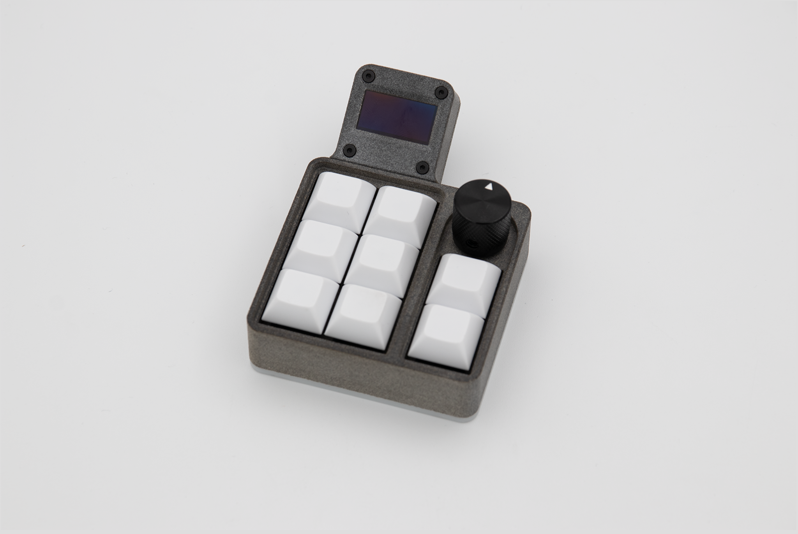

## Assembly

This is how you will receive your 1337. As you can see everything is already put together apart from the switches and keycaps.

 The 1337 also has a hotswap PCB. So you will be able to just push your switches into the PCB.

 After that you just have to push on your keycaps.

And you are done with your macro pad!!!

## Software

The 1337 comes preinstalled with VIAL. If you have never used VIAL please read [this]() guide and install it on your computer or open the web version.

 When you have the software open your macro pad should pop right up.

 Now you can play around with all of the features VIAL has to offer.

 The two buttons on the right are for the layer navigation. With the two buttons you can cylce up or down through the layers.

 Here you can see all buttons that are for the encoder. With the two round buttons you can decide, what should be done, when turning the encoder left or right. With the top right square button you can decide what should be done when pressing the encoder.

## OLED

One of the best features of the 1337 is of course the OLED screen.

 By default it will display things like the layer you are on and if NUM or CAPS lock are enabled.

 When CAPS lock is enabled your underglow LEDs will also turn red.

 A hidden feature of the 1337 is the preinstalled game we have added! Press this key combination to access the game layer.
