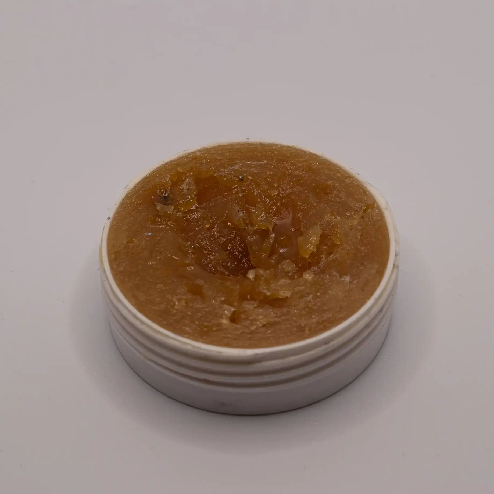
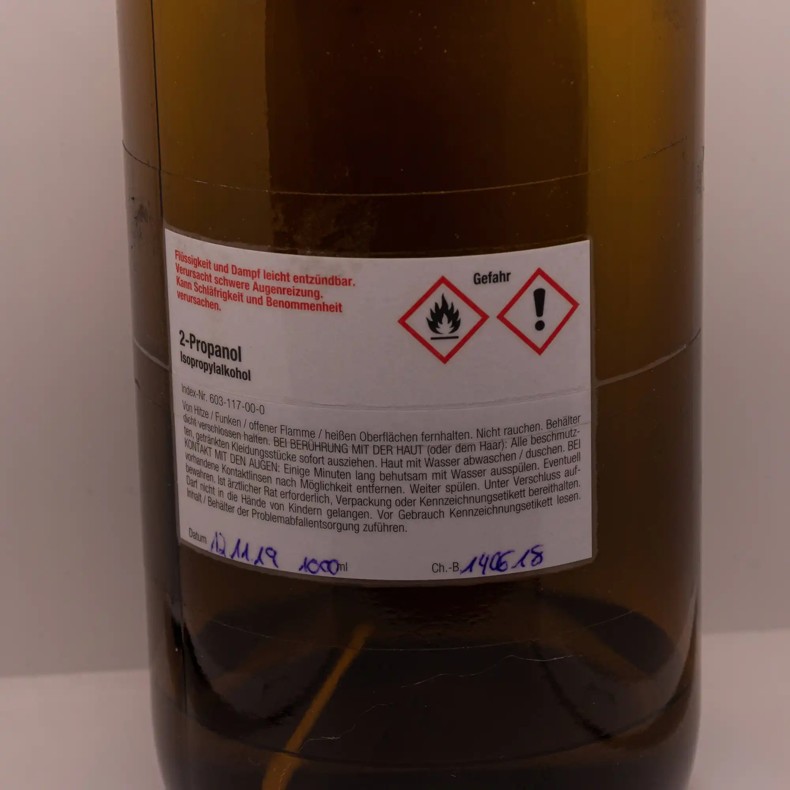
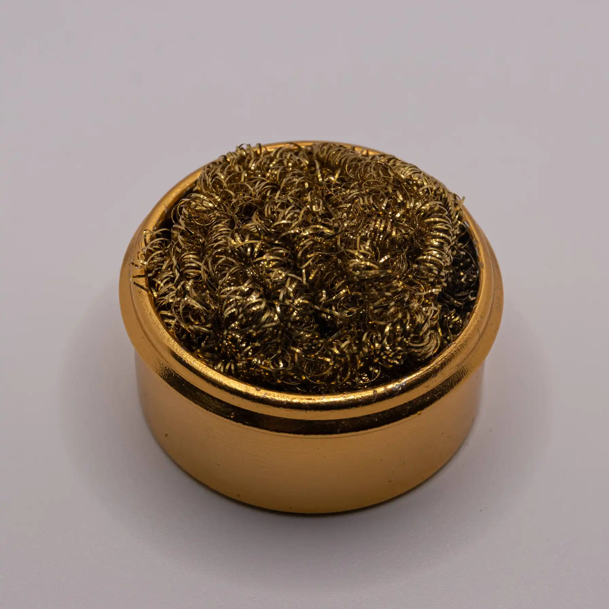

| Image                              | Part                            | Description                                                                                                                                                                                                          |
| ---------------------------------- | ------------------------------- | -------------------------------------------------------------------------------------------------------------------------------------------------------------------------------------------------------------------- |
|                                    |                                 |                                                                                                                                                                                                                      |
|                  | extra flux / flux pen           | Extra Flux can be helpful when soldering. Flux makes the solder flow better into the cavities and generally helps get a good solder joint.                                                                           |
|                    | isopropyl alcohol / PCB cleaner | IPA or PCB Cleaner is super cool to make the PCB look good after you are done soldering.                                                                                                                             |
|  | brass sponge                    | With a brass sponge you can clean the tip of the soldering iron. A brass sponge is a small investement but surely a good one! It makes soldering that much easier when you can work with a clean soldering iron tip! |