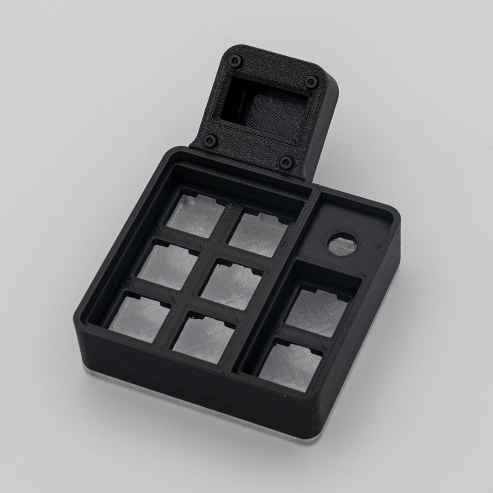
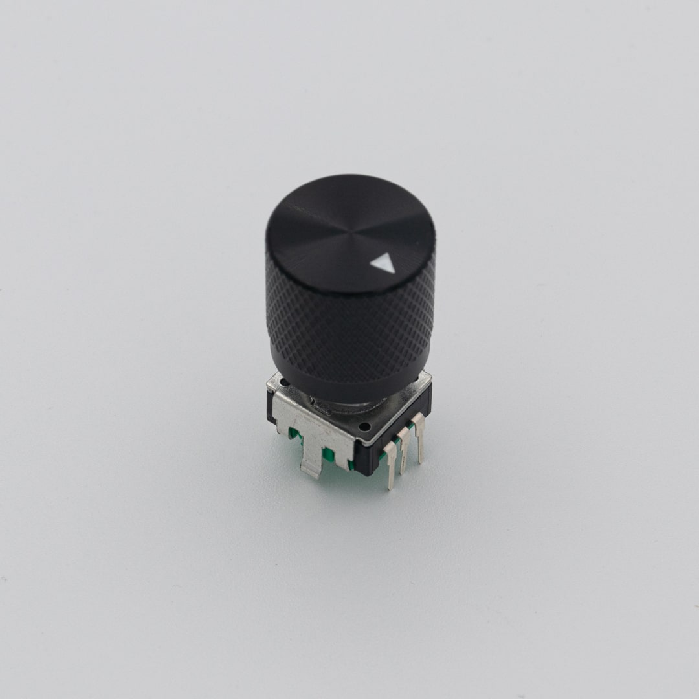
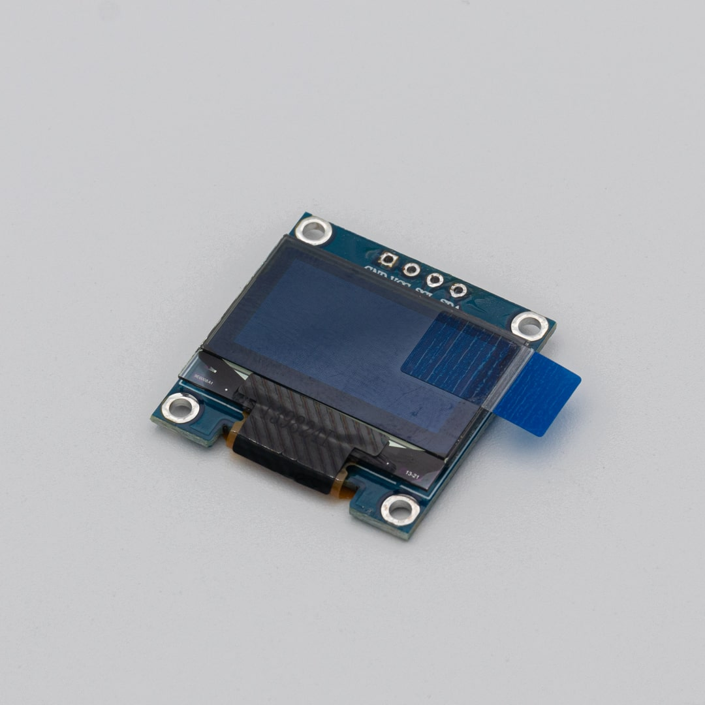
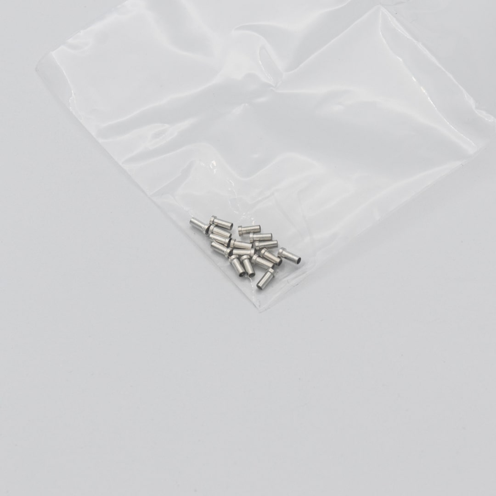
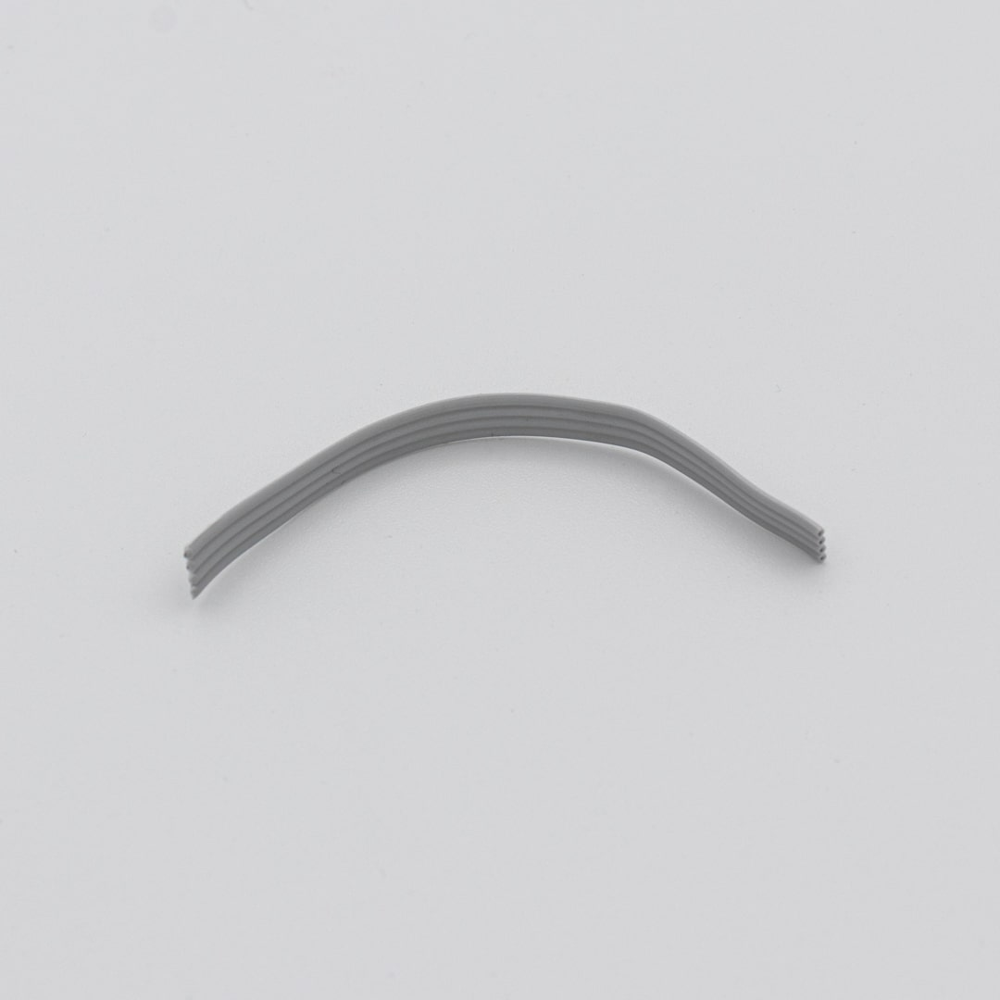
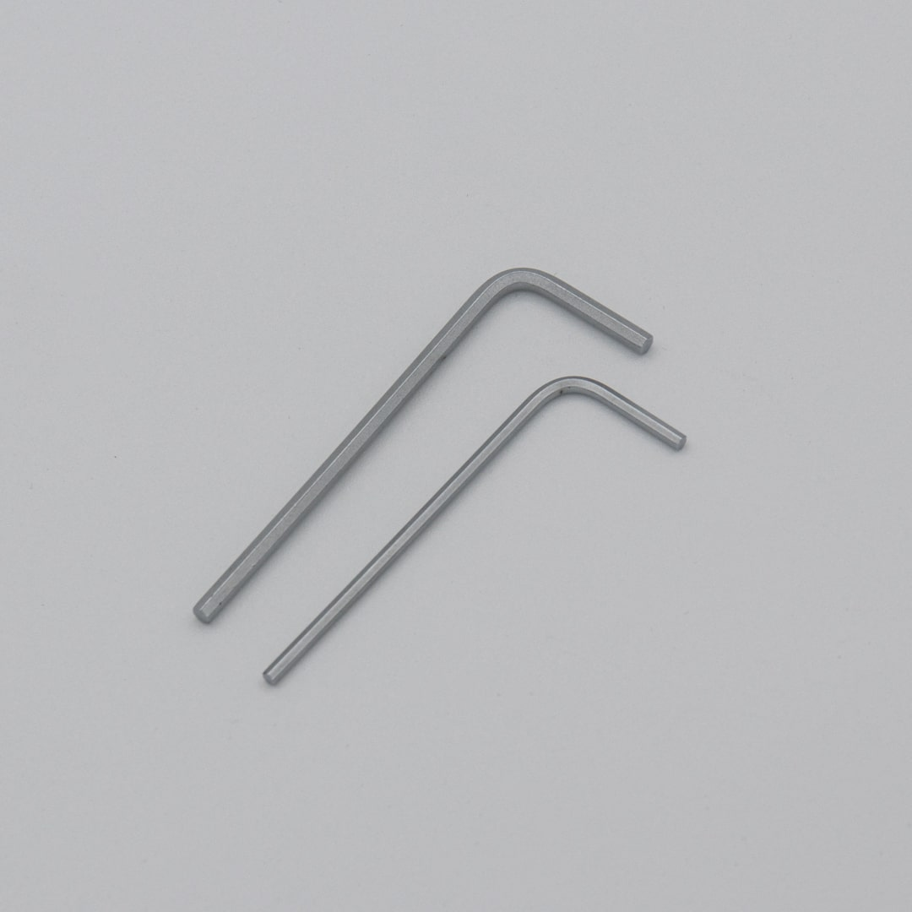

| Image                     | Description                                                                               | Quantity |
| ------------------------- | ----------------------------------------------------------------------------------------- | -------- |
|                           |
|          | 3D Printed Assembly   This inludes all 3D printed parts, M2 screws and rubber feet. | 1        |
|            | PCB  all components presoldered                                                     | 1        |
|    | rotary encoder with knob                                                                  | 1        |
|          | OLED Screen                                                                               | 1        |
|    | Mill-Max Sockets  enough to build one macro pad                                     | 1        |
|      | ribbon cable                                                                              | 1        |
|  | Allen Keys                                                                                | 1        |
