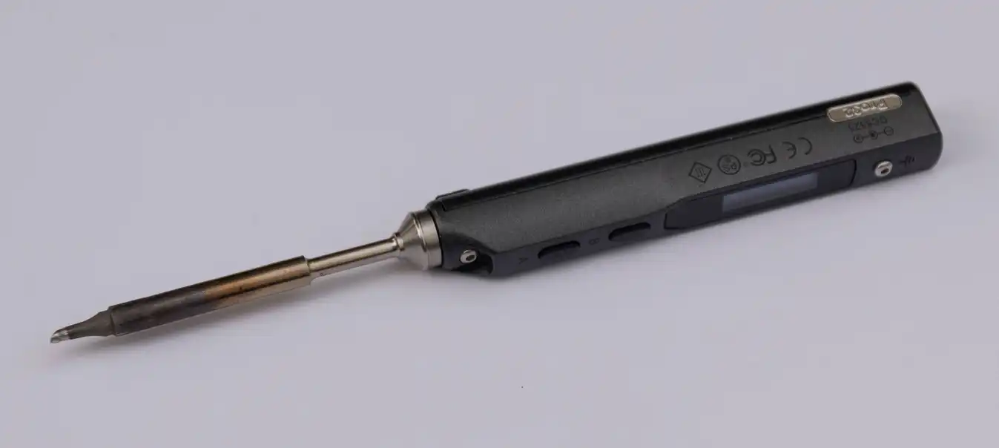

| Image                                  | Part           | Description                                                                                                           |
| -------------------------------------- | -------------- | --------------------------------------------------------------------------------------------------------------------- |
|                                        |                |                                                                                                                       |
|    | Flush Cutters  | You will need these to cut the wires needed for the OLED.                                                             |
|  | Soldering Iron | We recomment a good soldering iron! Don't expect a challenge tho, the soldering on the 1337 is rather simple.         |
|                  | Solder         | Please use high quality solder (flux core or apply flux externally) to make your life easier when soldering this kit! |