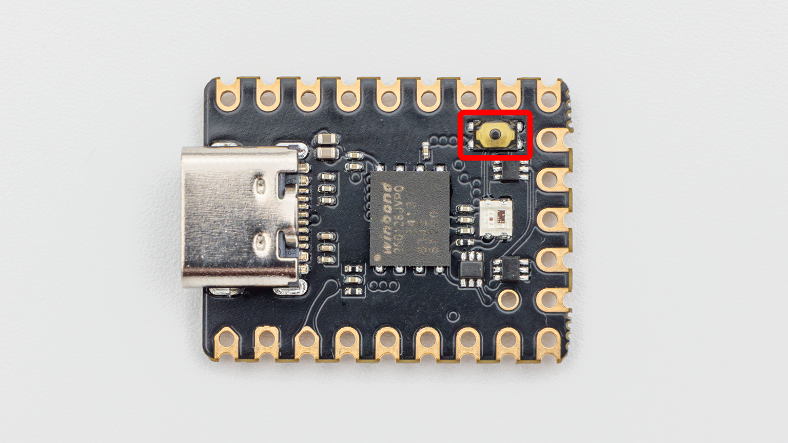
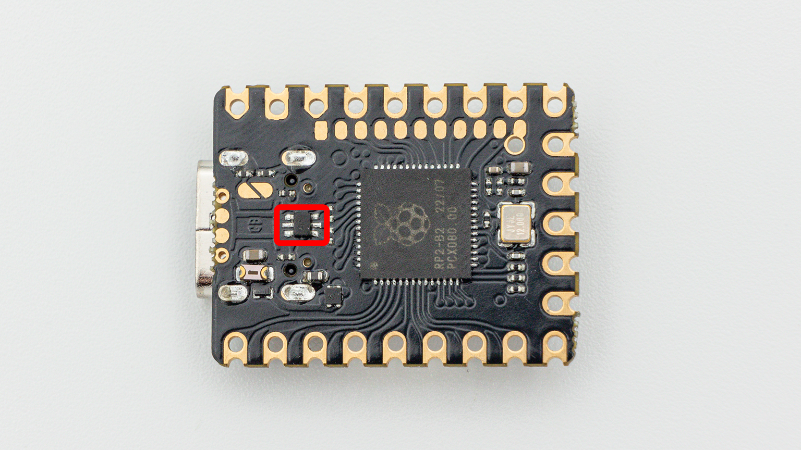
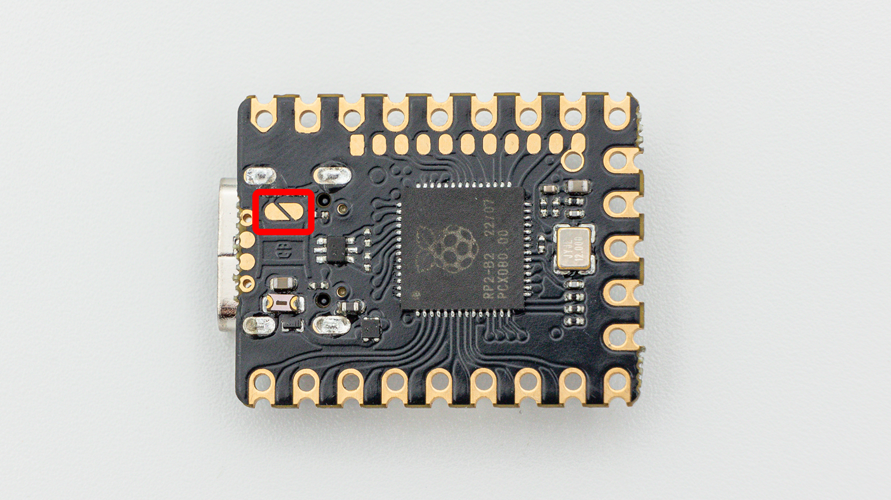
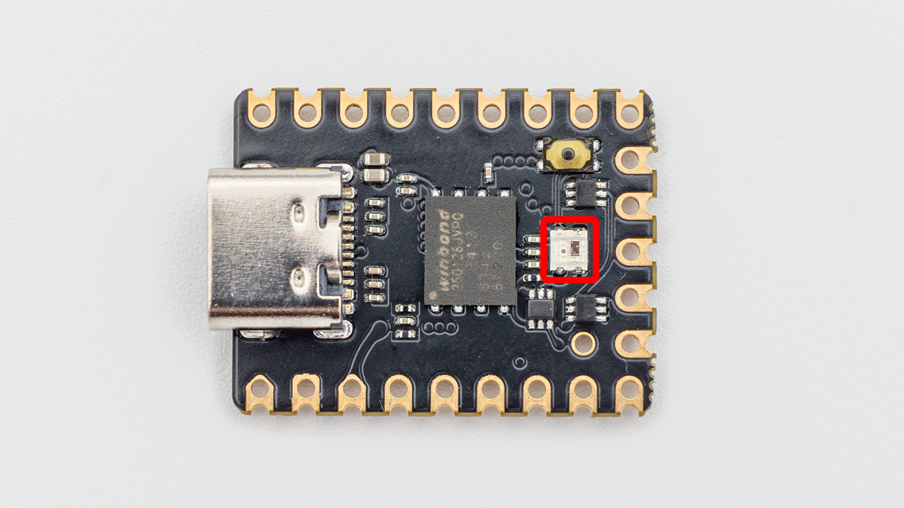
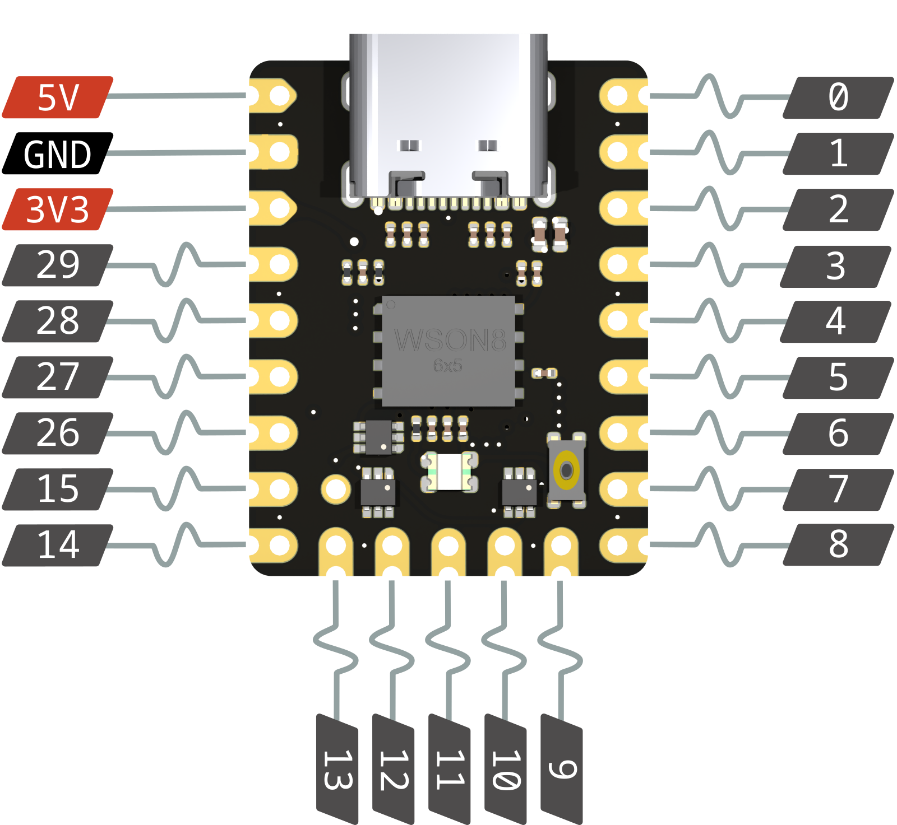
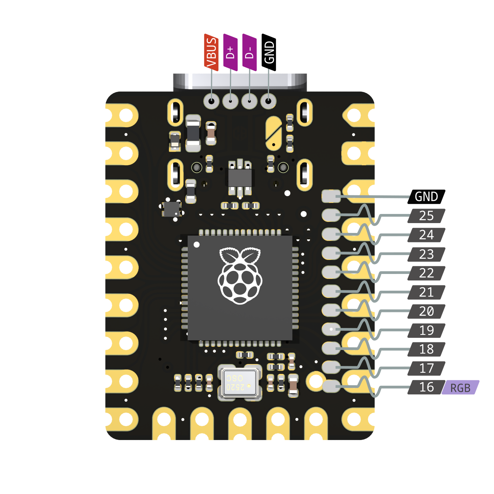

## Flashing

The reset button will be the first thing you have to use when getting your Gemini. You can reset the board with a short click and enter the bootloader with a long (>500ms) click of the button.

## ESD protection

Gemini has an ESD protection chip onboard. This way your controller is protected against electrostatic discharge. The D+ and D- pads can also be used while maintaining ESD protection by using all 4 pads under the usb port to connect an external usb port.

## Split capability

Gemini also supports VBUS detection for split keyboards by connecting the jumper and sensing on GP19. Read more about that [here](https://github.com/qmk/qmk_firmware/blob/master/docs/feature_split_keyboard.md).

## LEDs

It features a aRGB LED, that you can program yourself. It's connected to the 3.3V to 5V signal levelshifter ([SN74LVC1T45](https://www.ti.com/product/SN74LVC1T45)) to improve stability and longevity of the LEDs.
If you want to disable the onboard LED and just control the LEDs conneted to GP16 you skip the first LED in firmware.
(RP2040.GP16 -> levelshifter -> onboard LED -> Gemini.GP16)

## Pinout

### Top

### Bottom

### Alternate functions

Each pin on the rp2040 serves multiple purposes - enabling extremely flexible I/O:

| GPIO | F1       | F2        | F3       | F4     | F5  | F6   | F7   | F8           | F9            |
| ---- | -------- | --------- | -------- | ------ | --- | ---- | ---- | ------------ | ------------- |
| 0    | SPI0 RX  | UART0 TX  | I2C0 SDA | PWM0 A | SIO | PIO0 | PIO1 |              | USB OVCUR DET |
| 1    | SPI0 CSn | UART0 RX  | I2C0 SCL | PWM0 B | SIO | PIO0 | PIO1 |              | USB VBUS DET  |
| 2    | SPI0 SCK | UART0 CTS | I2C1 SDA | PWM1 A | SIO | PIO0 | PIO1 |              | USB VBUS EN   |
| 3    | SPI0 TX  | UART0 RTS | I2C1 SCL | PWM1 B | SIO | PIO0 | PIO1 |              | USB OVCUR DET |
| 4    | SPI0 RX  | UART1 TX  | I2C0 SDA | PWM2 A | SIO | PIO0 | PIO1 |              | USB VBUS DET  |
| 5    | SPI0 CSn | UART1 RX  | I2C0 SCL | PWM2 B | SIO | PIO0 | PIO1 |              | USB VBUS EN   |
| 6    | SPI0 SCK | UART1 CTS | I2C1 SDA | PWM3 A | SIO | PIO0 | PIO1 |              | USB OVCUR DET |
| 7    | SPI0 TX  | UART1 RTS | I2C1 SCL | PWM3 B | SIO | PIO0 | PIO1 |              | USB VBUS DET  |
| 8    | SPI1 RX  | UART1 TX  | I2C0 SDA | PWM4 A | SIO | PIO0 | PIO1 |              | USB VBUS EN   |
| 9    | SPI1 CSn | UART1 RX  | I2C0 SCL | PWM4 B | SIO | PIO0 | PIO1 |              | USB OVCUR DET |
| 10   | SPI1 SCK | UART1 CTS | I2C1 SDA | PWM5 A | SIO | PIO0 | PIO1 |              | USB VBUS DET  |
| 11   | SPI1 TX  | UART1 RTS | I2C1 SCL | PWM5 B | SIO | PIO0 | PIO1 |              | USB VBUS EN   |
| 12   | SPI1 RX  | UART0 TX  | I2C0 SDA | PWM6 A | SIO | PIO0 | PIO1 |              | USB OVCUR DET |
| 13   | SPI1 CSn | UART0 RX  | I2C0 SCL | PWM6 B | SIO | PIO0 | PIO1 |              | USB VBUS DET  |
| 14   | SPI1 SCK | UART0 CTS | I2C1 SDA | PWM7 A | SIO | PIO0 | PIO1 |              | USB VBUS EN   |
| 15   | SPI1 TX  | UART0 RTS | I2C1 SCL | PWM7 B | SIO | PIO0 | PIO1 |              | USB OVCUR DET |
| 16   | SPI0 RX  | UART0 TX  | I2C0 SDA | PWM0 A | SIO | PIO0 | PIO1 |              | USB VBUS DET  |
| 17   | SPI0 CSn | UART0 RX  | I2C0 SCL | PWM0 B | SIO | PIO0 | PIO1 |              | USB VBUS EN   |
| 18   | SPI0 SCK | UART0 CTS | I2C1 SDA | PWM1 A | SIO | PIO0 | PIO1 |              | USB OVCUR DET |
| 19   | SPI0 TX  | UART0 RTS | I2C1 SCL | PWM1 B | SIO | PIO0 | PIO1 |              | USB VBUS DET  |
| 20   | SPI0 RX  | UART1 TX  | I2C0 SDA | PWM2 A | SIO | PIO0 | PIO1 | CLOCK GPIN0  | USB VBUS EN   |
| 21   | SPI0 CSn | UART1 RX  | I2C0 SCL | PWM2 B | SIO | PIO0 | PIO1 | CLOCK GPOUT0 | USB OVCUR DET |
| 22   | SPI0 SCK | UART1 CTS | I2C1 SDA | PWM3 A | SIO | PIO0 | PIO1 | CLOCK GPIN1  | USB VBUS DET  |
| 23   | SPI0 TX  | UART1 RTS | I2C1 SCL | PWM3 B | SIO | PIO0 | PIO1 | CLOCK GPOUT1 | USB VBUS EN   |
| 24   | SPI1 RX  | UART1 TX  | I2C0 SDA | PWM4 A | SIO | PIO0 | PIO1 | CLOCK GPOUT2 | USB OVCUR DET |
| 25   | SPI1 CSn | UART1 RX  | I2C0 SCL | PWM4 B | SIO | PIO0 | PIO1 | CLOCK GPOUT3 | USB VBUS DET  |
| 26   | SPI1 SCK | UART1 CTS | I2C1 SDA | PWM5 A | SIO | PIO0 | PIO1 |              | USB VBUS EN   |
| 27   | SPI1 TX  | UART1 RTS | I2C1 SCL | PWM5 B | SIO | PIO0 | PIO1 |              | USB OVCUR DET |
| 28   | SPI1 RX  | UART0 TX  | I2C0 SDA | PWM6 A | SIO | PIO0 | PIO1 |              | USB VBUS DET  |
| 29   | SPI1 CSn | UART0 RX  | I2C0 SCL | PWM6 B | SIO | PIO0 | PIO1 |              | USB VBUS EN   |
