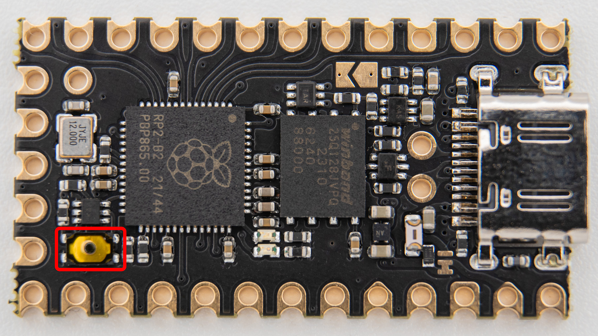
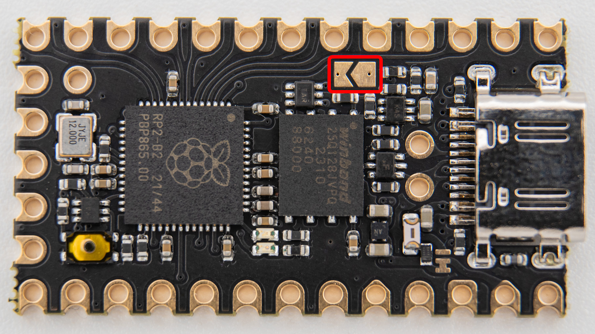
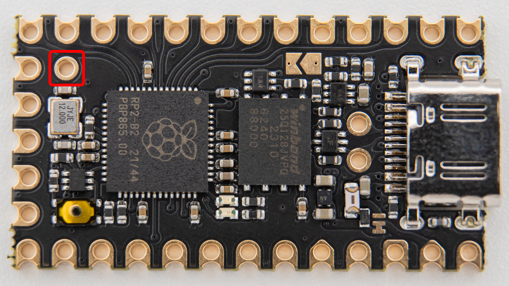
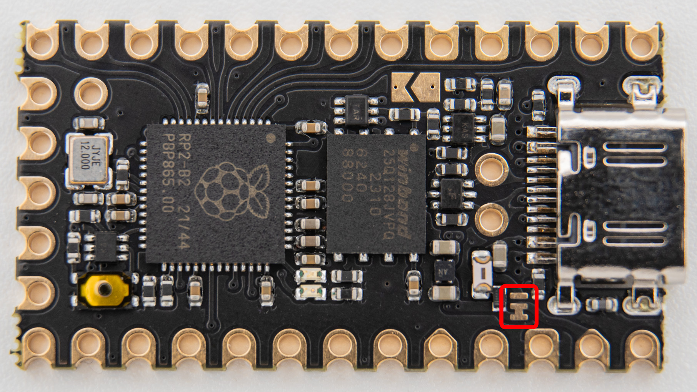

WIP!!!

## Flashing

The reset button will be the first thing you have to use when getting your Helios. You can reset the board with a short click and enter the bootloader with a long (>500ms) click if the buttin. This backwards compatiblility also enables you to use reset buttons on existing keyboards for both functions.

## ESD protection

Helios has an ESD protection chip onboard. This way your controller is protected against shorts. The D+ and D- pads can also be used while maintaining ESD protection.

## Split capability

Helios also supports VBUS detection for split keyboards. Read more about that here. ADD LINK

## LEDs

It features a default off red power LED and a blue user LED, that you can program yourself. The red power LED can be turned on by bridging this jumper:

## Pin 25

pls explain here

## Other Jumper PLS RENAME

pls explain here

## Pinout

