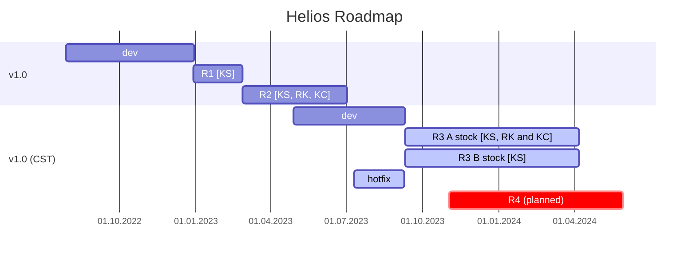

## Vendors

Here are the Vendors, where you can get Helios.

EU:

- KeebSupply ([Link](https://keeb.supply/products/0xcb-helios))
- Keycapsss ([Link](https://keycapsss.com/keyboard-parts/mcu-controller/257/0xcb-helios-pro-micro/elite-c-compatible-microcontroller-with-rp2040))

US:
- RingerKeys ([Link](https://ringerkeys.com/products/0xcb-helios))

## Changelog

---
* v1.0 [First version of Helios]
  * Round 1
    * Supplied A stock to KeebSupply
  * Round 2
    * Supplied A stock to KeebSupply
    * Supplied A stock to RingerKeys
    * Supplied A stock to Keycapsss
---

* v1.0 (CST) [Added castellated pads]
  * Round 3
    * Supplied A stock to KeebSupply
    * Supplied B stock to KeebSupply due to manufacturing issues
    * Supplied A stock to RingerKeys
    * Supplied A stock to Keycapsss
  * Round 4 [improved manufacturability of the castellated pads]
    * planned
---
