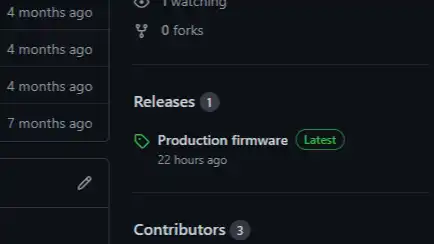
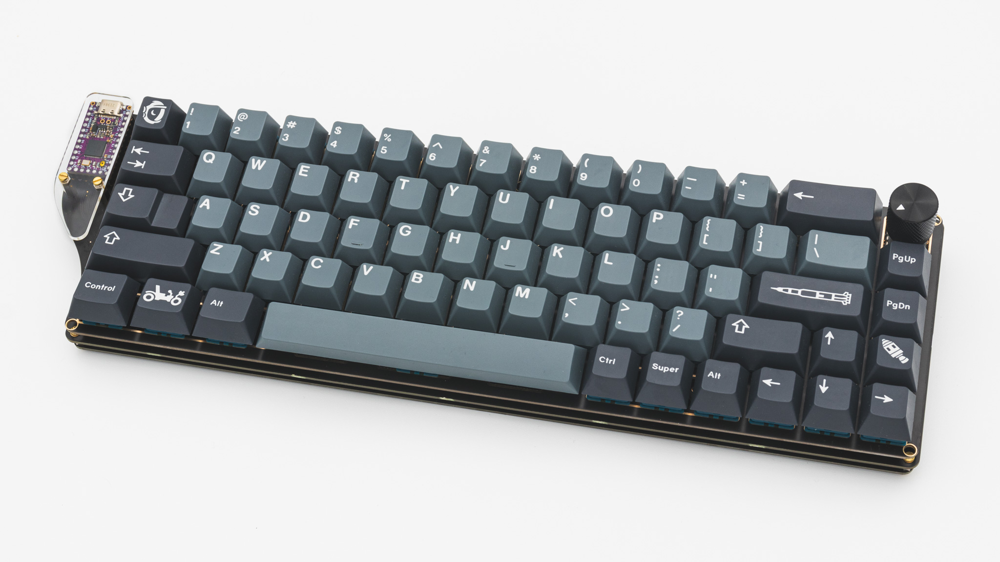

## PCB

Let's start the assembly with the PCB.

 If you want to solder in MillMax-Sockets you should do that now! You can find instructions for that [here]().

 Please solder in the headers for the controller now. You can find instructions for that [here]().

 If you want to install a rotary encoder into your PCB you can also do this now. You can find instructions for that [here]().

 The PCB also supports a speaker. If you want you can also solder one in now. You can find information on speakers [here]().

 This is everything you need to solder for now!

### Controller

Let's get your controller ready!

 You have to flash the controller. You can find the firmware <a href="https://github.com/0xCB-dev/0xCB-NewHorizons/releases" >here<a>. And instructions on how to flash a controller [here](). 

  Plug in your controller now and see if it pops up in [VIAL]().

 If your controller is working, you can solder it in. Instructions on how to do that can be found [here](). When you have the PCB in front of you so that you can read the text on it, the USB port should go to the top of the PCB. You should not see the components of the micro controller, when it is sitting in the PCB.

 When you have your controller soldered in, it is good practice to do a [matrix test]().

 If all keys are working your PCB assembly is finised for now.

  And you are done with your 0xCB New Horizons!
