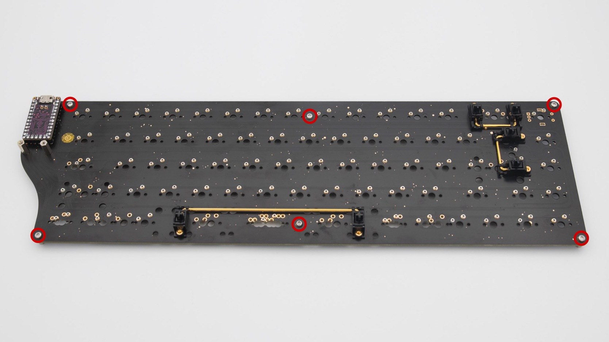
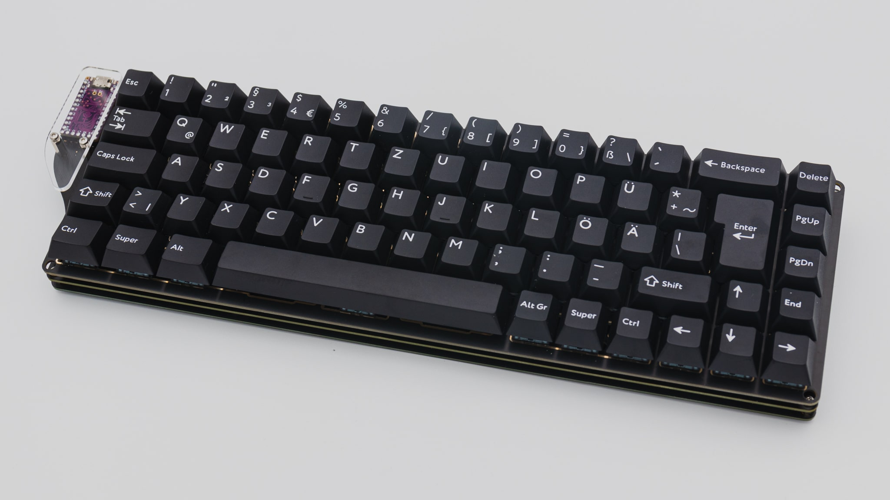

## PCB

Let's start the assembly with the PCB.

### Controller

Before soldering anything on the PCB we should get your controller ready.

 You have to flash the controller. You can find the firmware <a href="https://files.keeb.supply/firmware/NewHorizons/" >here<a>. And instructions on how to flash a controller [here](). 

  Plug in your controller now and see if it pops up in [VIAL]().

 If it does you have successfully flashed your controller and can move on.

### Soldering

There are a few things you absolutely need to solder and a few which are optional. The PCB comes with presoldered SMD components, so the amount of soldering is kept to a minimum.

#### required

Please solder in the headers for the controller. You can find instructions for that [here](). The headers go on the front. That is the side without a graphic.

 If your controller is working, you can solder it in. Instructions on how to do that can be found [here](). When you have the PCB in front of you, the USB port should go to the top of the PCB. You should not see the components of the micro controller, when it is sitting in the PCB.

 When you have your controller soldered in, it is good practice to do a [matrix test]().

 You also need to solder in switches, but we will go over those once we get to the point later in the assembly process.

#### optional



 You can solder in MillMax-Sockets. You can find instructions for that [here]().

 You can solder in a rotary encoder. You can find instructions for that [here](). The encoder goes on the top right of the PCB where your delete key would be located.

 The PCB also supports a speaker. You can find information on speakers [here](). The speaker is located on the back of the PCB around the controller area.

 This is everything you need to solder for now!

## Assembly

### Bottom Plate

Let's start assembling the bottom plate with the acrylic feet. Place the feet on the side with the graphic. Use the M2x12mm screws for these and sandwich one big and one small foot together.

 From the other side of the bottom plate take the M2 nuts and screw them in.

 Do this for both sides of the bottom plate.

 Now just add the rubber feet onto the acryl feet and at the bottom onto the PCB and you are done.

If you don't want a typing angel you can also just leave the acryl feet so that you have a 0 degree typing angle.

### PCB assembly

If you are beginning this step we expect you have a fully working PCB in front of you.

 For the next steps it's probably useful to open the KLE so you can check where you want everything layout wise. You can find it [here](http://www.keyboard-layout-editor.com/##@@_y:0.25&x:15.75%3B&=BkSpc&\_c=%23274C77%3B&=Insert%3B&@\_y:0.25&x:2.75%3B&=ESC&\_c=%23cccccc%3B&=!%0A1&=%2F@%0A2&=%23%0A3&=$%0A4&=%25%0A5&=%5E%0A6&=%2F&%0A7&=\*%0A8&=(%0A9&=)%0A0&=%2F_%0A-&=+%0A%2F=&\_c=%23274C77&w:2%3B&=Backspace&\_c=%23cccccc%3B&=Delete%3B&@\_x:2.75&c=%23274C77&w:1.5%3B&=Tab&\_c=%23cccccc%3B&=Q&=W&=E&=R&=T&=Y&=U&=I&=O&=P&=%7B%0A%5B&=%7D%0A%5D&\_c=%23274C77&w:1.5%3B&=%7C%0A%5C&\_c=%23cccccc%3B&=PgUp&\_x:1.25&c=%23274C77&w:1.25&h:2&w2:1.5&h2:1&x2:-0.25%3B&=Enter%3B&@\_x:0.25&w:1.25&w2:1.75&l:true%3B&=Caps%20Lock&\_x:1.25&w:1.25&w2:1.75%3B&=Caps%20Lock&\_x:0.5&c=%23cccccc%3B&=A&=S&=D&=F&=G&=H&=J&=K&=L&=%2F:%0A%2F%3B&=%22%0A'&\_c=%23274C77&w:2.25%3B&=Enter&\_c=%23cccccc%3B&=PgDn&\_x:0.25%3B&=%7C%0A%5C%3B&@\_x:0.25&c=%23274C77&w:1.25%3B&=Shift&\_c=%23cccccc%3B&=%3E%0A%3C%0A%0A%7C&\_x:0.25&c=%23274C77&w:2.25%3B&=Shift&\_c=%23cccccc%3B&=Z&=X&=C&=V&=B&=N&=M&=%3C%0A,&=%3E%0A.&=%3F%0A%2F%2F&\_c=%23274C77&w:1.75%3B&=Shift&\_c=%236096BA%3B&=%E2%86%91&\_c=%23cccccc%3B&=End%3B&@\_x:2.75&c=%23274C77&w:1.25%3B&=Ctrl&\_c=%236096BA&w:1.25%3B&=Super&\_c=%23A3CEF1&w:1.25%3B&=Alt&\_c=%238B8C89&a:7&w:2.75%3B&=&\_c=%23E7ECEF&a:4&w:1.25%3B&=Super&\_c=%238B8C89&a:7&w:2.25%3B&=&\_c=%23A3CEF1&a:4%3B&=Alt&\_c=%236096BA%3B&=Super&\_c=%23274C77%3B&=Ctrl&\_c=%236096BA%3B&=%E2%86%90&=%E2%86%93&=%E2%86%92%3B&@\_y:0.25&x:2.75&c=%23274C77&a:7&w:1.25%3B&=&\_c=%236096BA&w:1.25%3B&=&\_c=%23A3CEF1&w:1.25%3B&=&\_c=%238B8C89&w:2.25%3B&=&\_c=%23E7ECEF&w:1.25%3B&=&\_c=%238B8C89&w:2.75%3B&=&\_c=%23A3CEF1%3B&=&\_c=%236096BA%3B&=&\_c=%23274C77%3B&=%3B&@\_x:2.75&w:1.25%3B&=&\_c=%236096BA&w:1.25%3B&=&\_c=%23A3CEF1&w:1.25%3B&=&\_c=%238B8C89&w:6.25%3B&=&\_c=%23A3CEF1%3B&=&\_c=%236096BA%3B&=&\_c=%23274C77%3B&=%3B&@\_x:2.75%3B&=&\_c=%236096BA%3B&=&\_c=%23A3CEF1%3B&=&\_c=%238B8C89&w:7%3B&=&\_c=%23A3CEF1%3B&=&\_c=%236096BA%3B&=&\_c=%23274C77%3B&=%3B&@\_x:2.75%3B&=&\_c=%236096BA%3B&=&\_c=%238B8C89&w:10%3B&=&\_c=%23274C77%3B&=%3B&@\_x:2.75&w:1.25%3B&=&\_c=%236096BA&w:1.25%3B&=&\_c=%23A3CEF1&w:1.25%3B&=&\_c=%238B8C89&w:2.75%3B&=&\_c=%23E7ECEF&w:1.25%3B&=&\_c=%238B8C89&w:2.25%3B&=&\_c=%23A3CEF1&w:1.25%3B&=&\_c=%236096BA&w:1.25%3B&=&\_c=%23aaaaaa&a:4&w:0.5&d:true%3B&=8,6%0A%0A%0A3,5%3B&@\_x:2.75&c=%23274C77&a:7&w:1.25%3B&=&\_c=%236096BA&w:1.25%3B&=&\_c=%23A3CEF1&w:1.25%3B&=&\_c=%238B8C89&w:2.25%3B&=&\_c=%23E7ECEF&w:1.25%3B&=&\_c=%238B8C89&w:2.75%3B&=&\_c=%23A3CEF1&w:1.25%3B&=&\_c=%236096BA&w:1.25%3B&=&\_c=%23aaaaaa&a:4&w:0.5&d:true%3B&=8,6%0A%0A%0A3,6%3B&@\_x:2.75&c=%23274C77&a:7&w:1.25%3B&=&\_c=%236096BA&w:1.25%3B&=&\_c=%23A3CEF1&w:1.25%3B&=&\_c=%238B8C89&w:6.25%3B&=&\_c=%23A3CEF1&w:1.25%3B&=&\_c=%236096BA&w:1.25%3B&=&\_c=%23aaaaaa&a:4&w:0.5&d:true%3B&=8,6%0A%0A%0A3,7%3B&@\_x:2.75&c=%23274C77&a:7%3B&=&\_c=%236096BA%3B&=&\_c=%23A3CEF1%3B&=&\_c=%238B8C89&w:7%3B&=&\_c=%23A3CEF1&w:1.25%3B&=&\_c=%236096BA&w:1.25%3B&=&\_c=%23aaaaaa&a:4&w:0.5&d:true%3B&=8,6%0A%0A%0A3,8).

 You should start with the stabilisers. Depending on the layout you will need to put them in at different spots and in differenty quantities.

 After your stabilisers, you can screw in the M2x10 standoffs for the acryl cover.

 Now please screw in the M2x5 standoffs into the bottom side of the PCB.

 You need to install 6 of these standoffs. One in each corner of the PCB and two in the middle.

 Next you can install your switches. Start by just placing a few of them around the PCB to align the switch plate with it.

 After that you can put all of them in.

 If you MillMaxed your PCB you are done with the installation otherwise you will need to solder in the switches now.

 Put on the acrylic cover with the M2x4mm screws now.

 Now it is also a good time to test your PCB again. Do a matrix test and test out your encoder and LEDs. After that you can screw on the bottom plate.

 As a last step you can put on your keycaps and you are done!

