| Image                               | Description                           | Quantity |
| ----------------------------------- | ------------------------------------- | -------- |
|                                     |
| 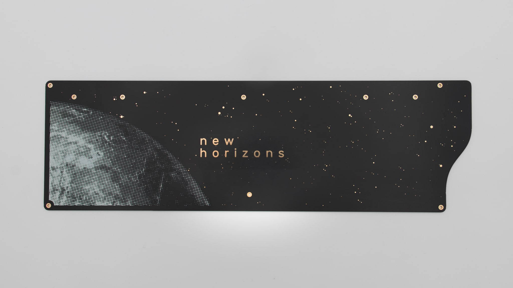     | bottom plate                          | 1        |
| 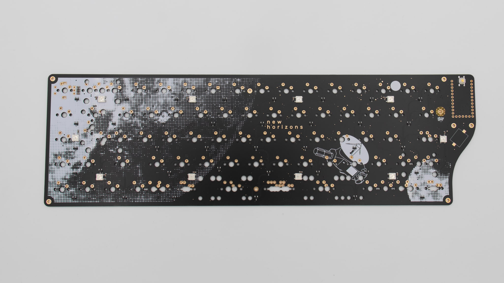                     | PCB  SMD components presoldered | 1        |
| 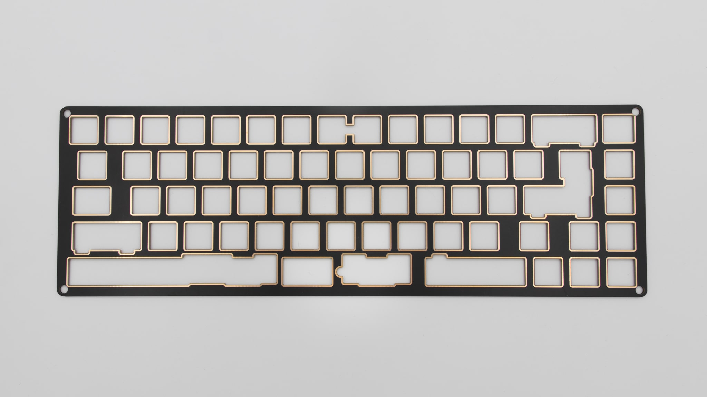     | switch plate                          | 1        |
| 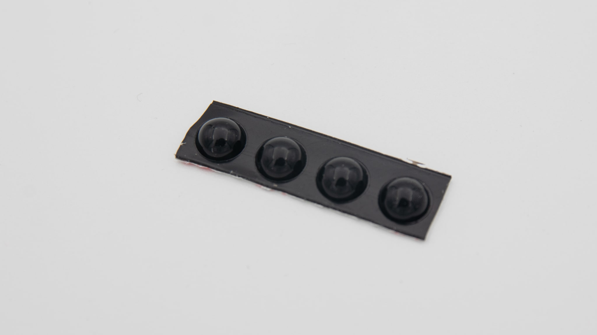       | rubber feet                           | 4        |
| 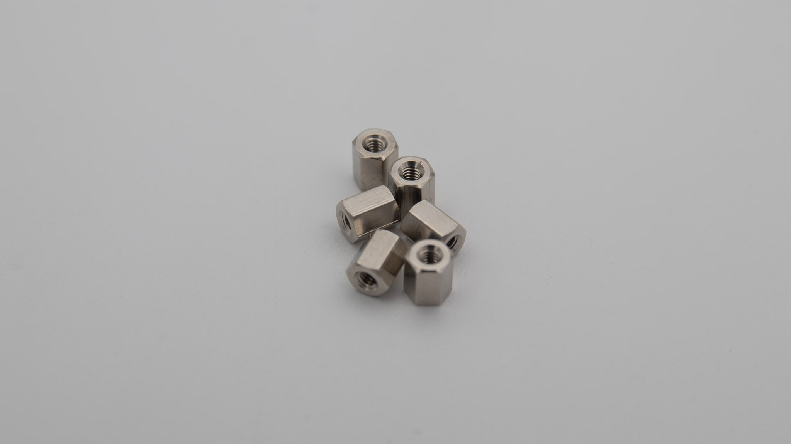   | standoffs (M2x5mm)                    | 6        |
| 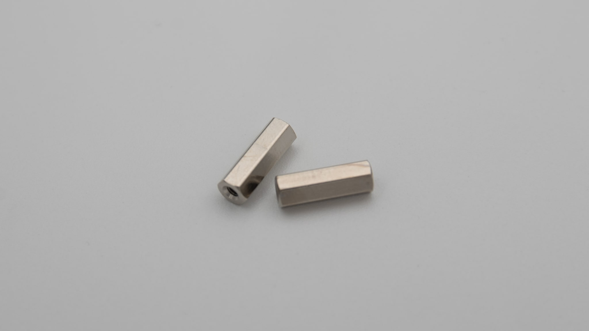 | standoffs (M2x10mm)                   | 2        |
| 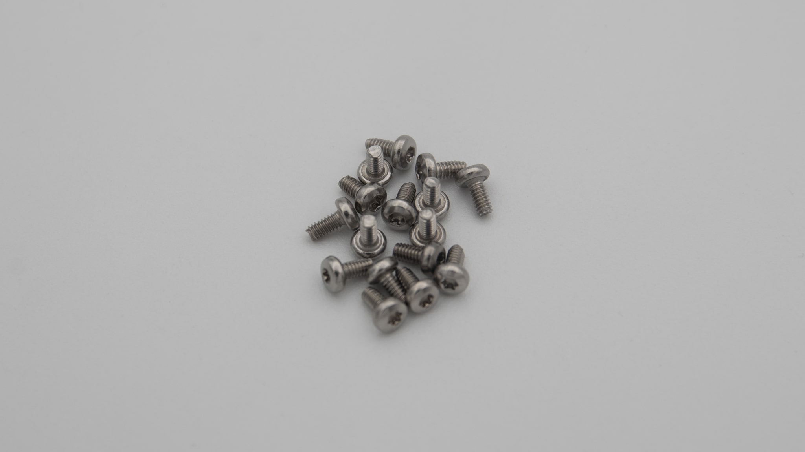         | torx screws (M2x4mm)                  | 16       |
| 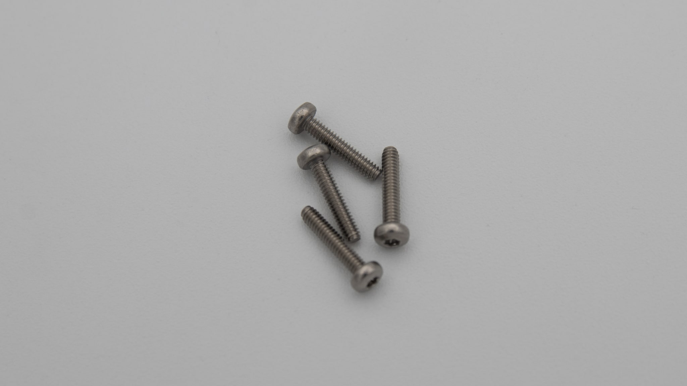       | torx screws (M2x12mm)                 | 4        |
| 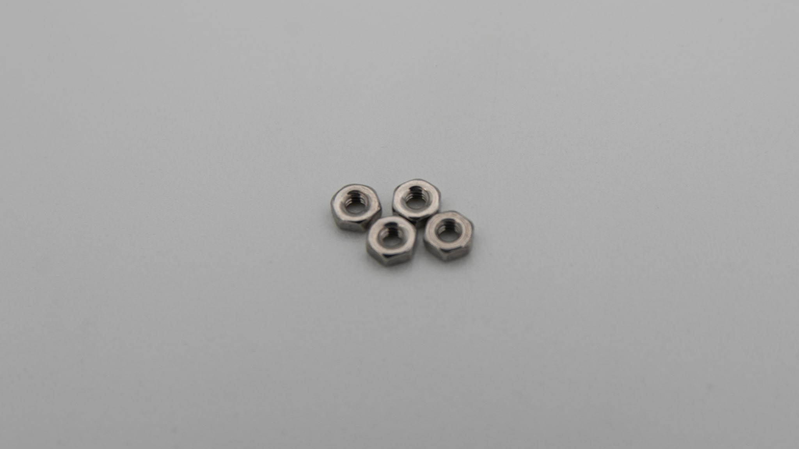                   | nuts (M2)                             | 4        |
| 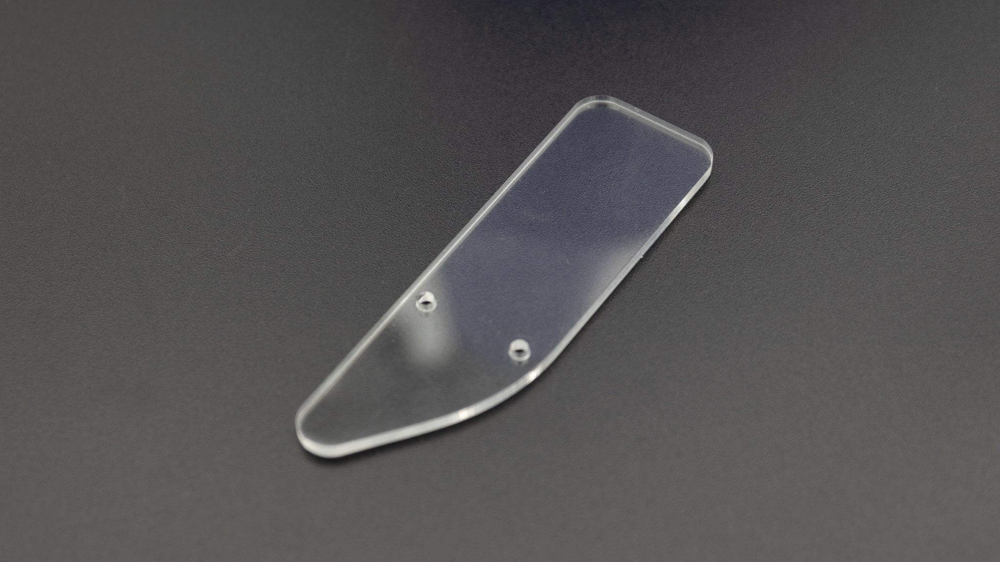       | acrylic cover                         | 1        |
| 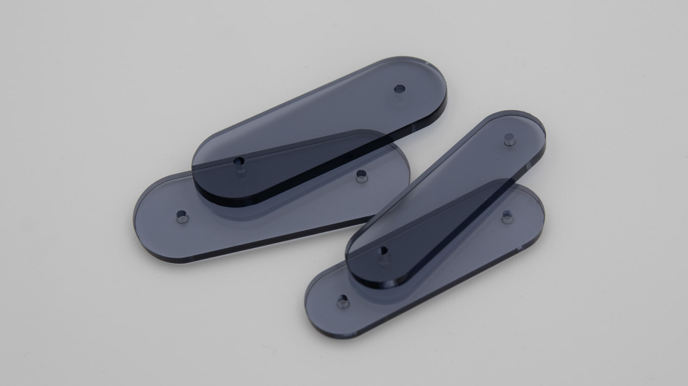         | acrylic feet                          | 2+2      |
| 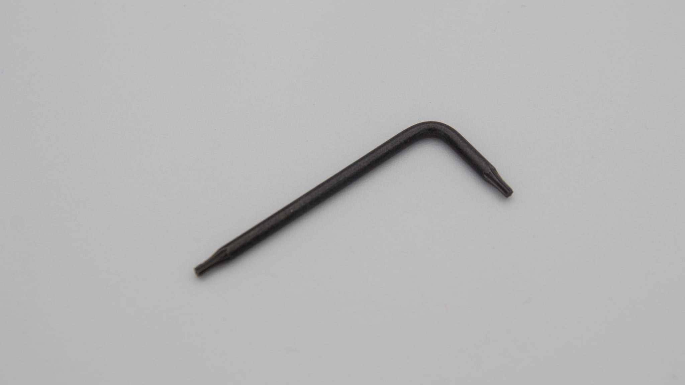         | Torx T6 allen key                     | 1        |