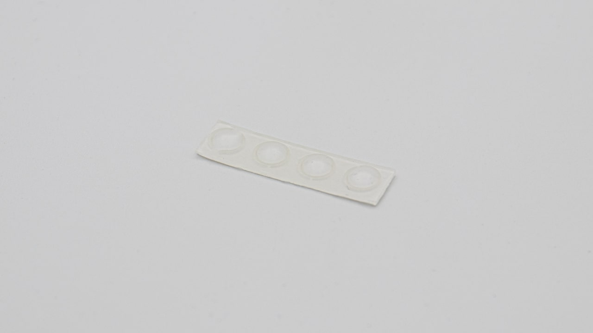

| Image                           | Description                           | Quantity |
| ------------------------------- | ------------------------------------- | -------- |
|                                 |
|                            | bottom plate                          | 1        |
|                            | PCB  SMD components presoldered | 1        |
|                            | switch plate                          | 1        |
|                            | OLED screen                           | 1        |
|  | rubber feet                           | 4        |
|                            | standoffs (M2x5mm)                    | 6        |
|                            | standoffs (M2x12mm)                   | 2        |
|                            | torx screws (M2x4mm)                  | 16       |
|                            | acrylic cover                         | 1        |
|                            | acrylic feet                          | 2+2      |
|                            | Torx T6 allen key                     | 1        |