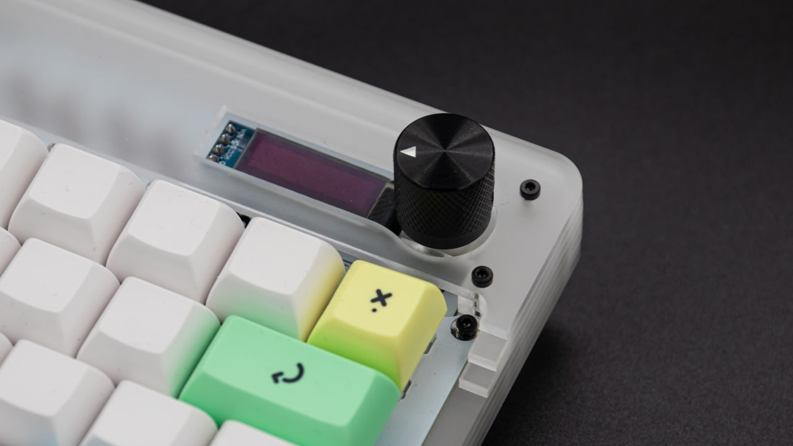

 Firstly, if you have already assembled your Static, you will have to take it apart again! The case was designed with the board partially assembled in mind, which means that you just need to take off the acrylic window and the feet. The main part that you can leave assembled is the PCB with the switches and switch plate. This part will just drop into the case when you're assembling it.

 Grab yourself the feet, standoffs, screws and the first case layer (the bottom plate). The screws and standoffs are the ones you got in your base kit so don't open the extra bag from the case kit yet.

 Now place the feet underneath the bottom plate. Pay attention to the orientation of the bottom plate. The outward corners should be closest to you, and you should be able to read the logo from the bottom. You will use the same standoff placement as with the normal kit; the four 8mm standoffs should be closest to you and the two 12mm should go near the top of the board. If you swap them by accident, you won't be able to completely assemble the case!

 Now add the second layer of the case. Please insert the piece as straight as possible and push it down equally on all sides, otherwise the friction from the plates will be too much and the plate will catch.

 Please get yourself the bag with the extra case kit components and grab the two 12mm standoffs. Place them in the two cutouts at the back (near the USB port) and screw them down with two 5mm screws from the bottom.

 Add the third layer to the stack. Again: please be careful while putting it on!

 Add the fourth acrylic layer. Don't panic: the 8mm standoffs are supposed to be covered by this layer!

 Insert the assembled PCB package into the case. You cannot drop it in from the top though; you need to lift it a little at the back, slide it in and then drop it down.

 Add the fifth layer. This layer consists of the two small pieces. These are only held in by the two cutouts around the USB port. Until the screws are inserted these layers will be unaligned.

 Add the sixth layer to the case. Make sure it's oriented correctly, with the encoder going through the cutout.

 Add the seventh and last layer. If you have the milky frosted case, you can choose between a frosted milky or a translucent cover.

 Now you should screw in all the 12mm screws at the top of the case. Align all the top layers while tightening the screws.

 Get the 8mm screws and put them into the switch plate of the keyboard. Be sure to align the PCB assembly and tighten them fully.

 Screw on the nut for the encoder.

 Finally, put on the knob for the encoder and screw it in from the side.

  And now you are done with your Static acrylic case!
