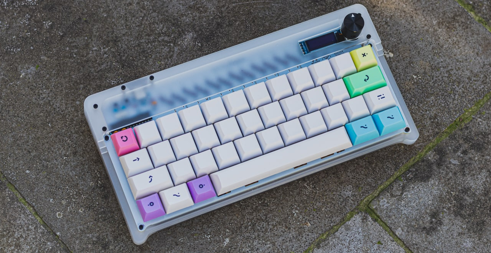
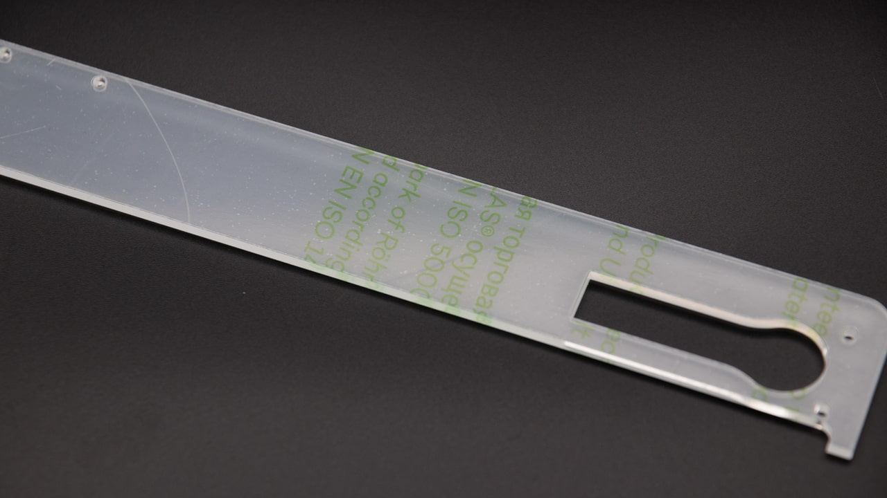
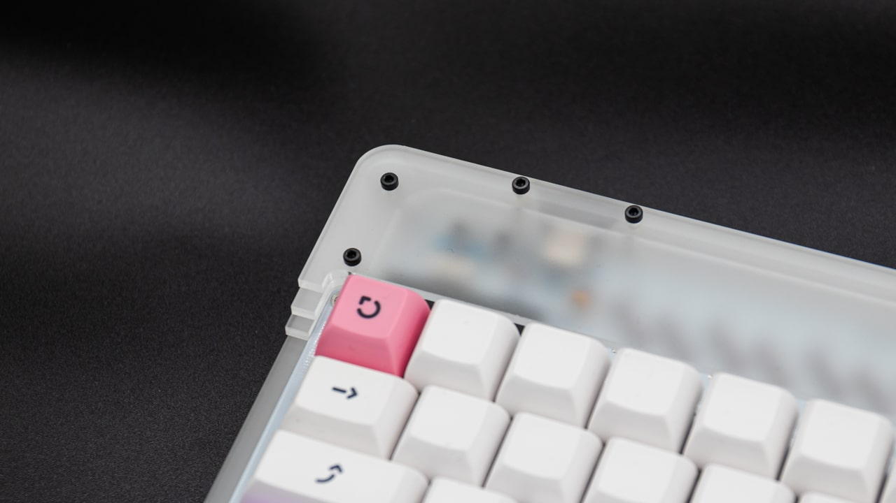

 For the Static case, we use cast acrylic sheets rather than extruded sheets. This means the material is less brittle by nature, but as there are still small parts in the kit you should be careful not to bend the layers too much!

 All the layers come with protective film on both sides! You need to remove this film to ensure a nice fit (and cleaner look afterwards...) This is probably the most satisfying part of the whole process!

 While tightening the screws during the assembly process, be sure to not overtighten them. Just screw them together until you feel a bit of resistance. If you overtighten them, the acrylic will break! It is not as durable as for instance the FR4 plates together with the standoffs included in the base kit.
