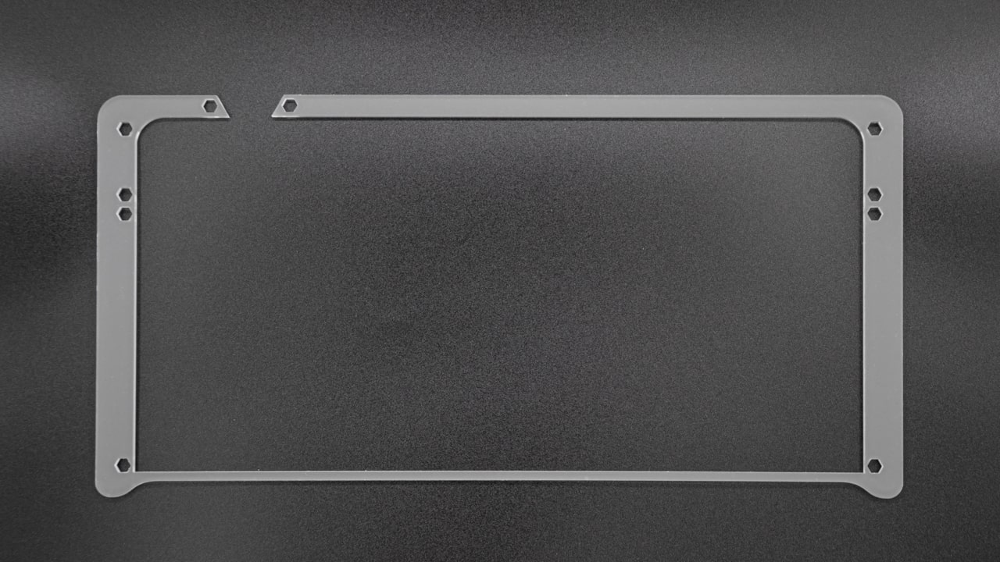
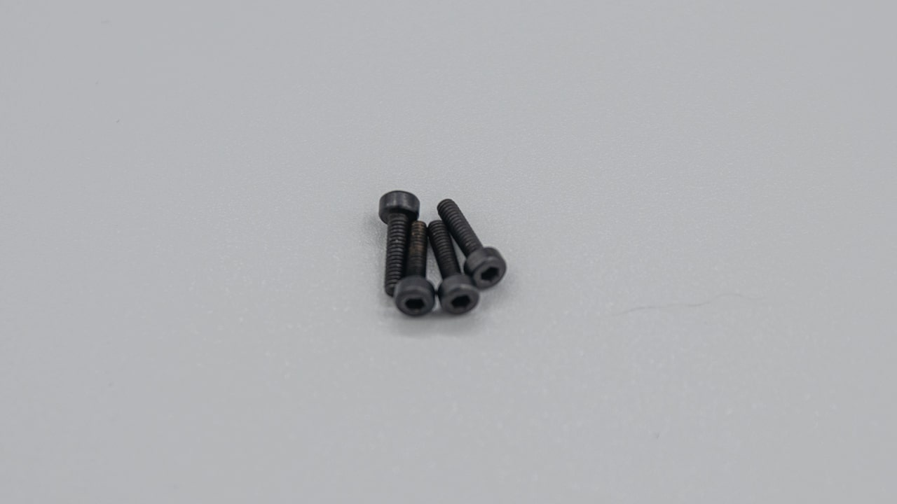

| Image                           | Description              | Quantity |
| ------------------------------- | ------------------------ | -------- |
|                                 |
|            | Layer 1                  | 1        |
|            | Layer 2                  | 1        |
|            | Layer 3                  | 1        |
|            | Layer 4                  | 1        |
|            | Layer 5                  | 1        |
|            | Layer 6                  | 1        |
|            | Layer 7                  | 1        |
|      | standoffs (M2x12mm)   | 2        |
|    | big screws (M2x12mm)  | 6        |
|  | small screws (M2x8mm) | 4        |