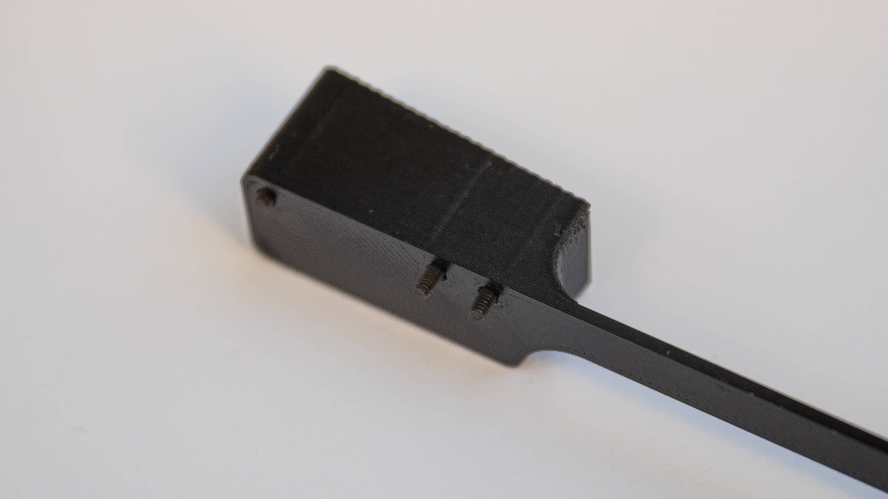

 Here we will go over all the steps you need to follow after you have soldered the PCB! Before you do that please plug in your PCB now and check that everythings works. Please also use the Matrix tester in VIA for that.

 Get your soldered PCB and the switch plate. In the next step we will solder in the switches. So if you plan to Mill-Max your Static please do that now!

 Now is also the right time to put your stabilisers in there!

 Get your switch plate and place 4 switches in the corners. This will help align the switch plate with the PCB.

 Now put the switch plate on top of the PCB and put the Switches in the right holes.

 After that you can put all switches in there. Make sure to kind of pull up on the plate while putting in the switches to lock them in. If you start from the middle that makes it easier. Please refer to our KLE for all the Layouts that are possible here.

 Now that all the Switches are seated you can solder them in. You now have finished the PCB assembly!

 Please take two of the rubber feet now and place them roughly where the red circles are on the bottom of the PCB. This will prevent a bit more flex and in the case of the metal plates prevent any shorts from happening.

 Now onto the bottom half of the Keeb. Start by placing the rubber feet in the little cutouts in the 3D-Printed Feet.

 Now go ahead and put screws in the holes through the feet. They might need a bit of force to get in there, just push them in with the allen key. We wanted it that way.

 You can place the feet below the bottom plate now.

 Make sure the bottom plate is the right way around for that! You should be able to read the CB!

 The cutouts for the feet and the bottom plate should align.

 After that you can screw the standoffs in there. The small ones go to the front while the longer ones go in the back. Orientation of the Standoffs doesn't matter. If you want you can orient them all the same so they look pretty of course.

 Now you are able to put the PCB assembly onto the Standoffs at the bottom.

 After that screw in the 4 screws. Please screw them in lightly first, then align the plate and then tighten them down fully.

 If you did not do it earlier remove the nut from the Encoder now.

 Get yourself the Acrylic cover now and remove the protective film from both sides. After that place it on the 4 longer standoffs.

 Now screw in the 4 screws to tighten it down. Do as before and put them all in before tightening them fully.

 Screw in the nut from the Encoder to secure it in place. Please don't overtighten this just make sure it is seated on there with a bit of force.

 Now just place the rotary knob on the encoder and screw in the little nut with the larger allen key we included.

  And you are done with your Static!
