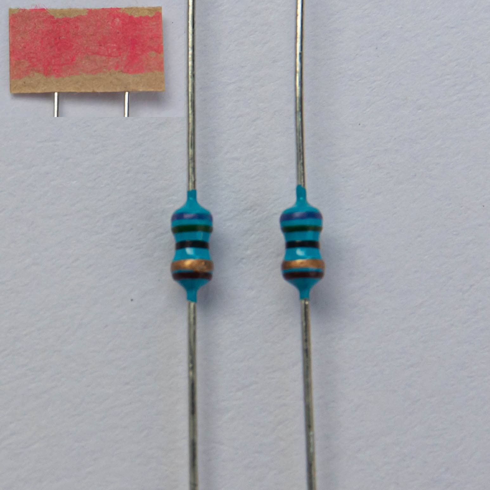

| Image                                   | Description                                                                               | Reference | Quantity          |
| --------------------------------------- | ----------------------------------------------------------------------------------------- | --------- | ----------------- |
|                                         |                                                                                           |           |                   |
|                          | PCB                                                                                       |           | 1                 |
|        | switch plate                                                                              |           | 1                 |
|        | bottom plate                                                                              |           | 1                 |
|            | acryl cover                                                                               |           | 1                 |
|                        | 3D-printed feet                                                                           |           | 1 left 1 right |
|          | rubber feet                                                                               |           | 6                 |
|  | small standoffs  (M2x8mm)                                                              |           | 4                 |
|      | big standoffs  (M2x12mm)                                                               |           | 4                 |
|                    | screws  (M2x16mm)                                                                      |           | 16                |
|                    | OLED screen  The OLED screen is sealed in an antistatic bag upon arrival.           | OL1       | 1                 |
|                        | EC11 rotary encoder                                                                       | MX12      | 1                 |
|          | aluminium rotary encoder knob                                                             |           | 1                 |
|                          | USB-C port                                                                                | J1        | 1                 |
|                    | RESET and BOOT buttons                                                                    | SW1, SW2  | 2                 |
|                    | ATMEGA328P processor                                                                      | U1        | 1                 |
|                      | clock   16MHz                                                                          | Y1        | 1                 |
|                        | fuse 500mA                                                                             | F1        | 1                 |
|            | small diodes 1N4148                                                                    | D1...48   | 48                |
|              | big diode 1N4729                                                                       | D49, D50  | 2                 |
|                      | resistor 75Ohm                                                                         | R3, R4    | 2                 |
|                  | resistor 1.5kOhm                                                                       | R6        | 1                 |
|                  | resistor 5,1kOhm                                                                       | R1, R2    | 2                 |
|                    | resistor 10kOhm                                                                        | R5        | 1                 |
|                | capacitor 20pF                                                                         | C3, C4    | 2                 |
|                  | capacitor 0,1uF                                                                        | C1, C2    | 2                 |
|        | diode bender  Use this diode bender to perfectly bend the diodes to fit in our PCB. |           | 1                 |
|              | allen key                                                                                 |           | 2                 |