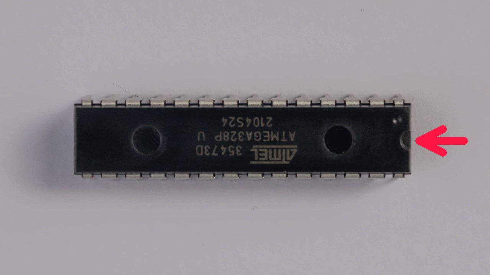
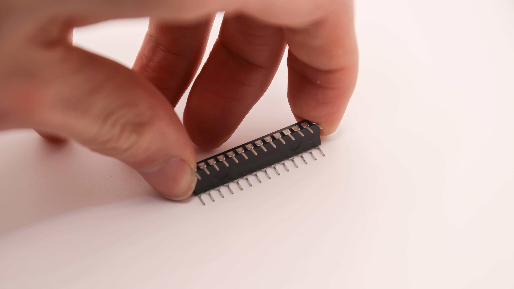
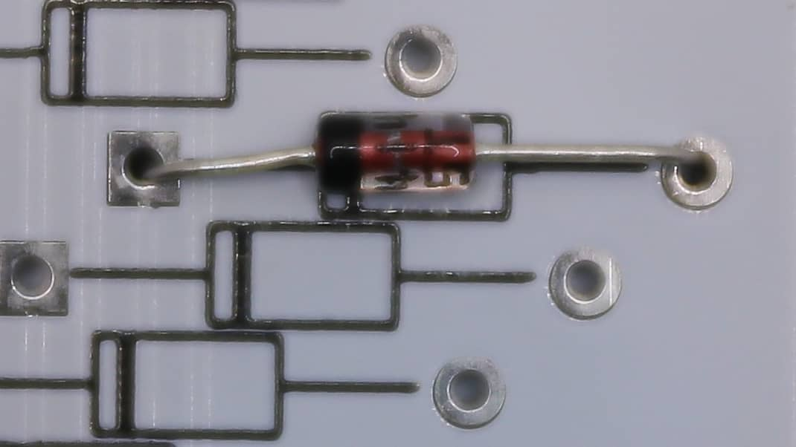

 Please take the time to read these instructions fully at least once before actually starting. If this is your first time soldering a keyboard kit, congratulations on taking the plunge!
 This all may seem overwhelming at first but we promise that if you stay calm and work mindfully, you'll be posting your new Static's sound test in no time at all!
  We have provided pictures of each component in your kit in the [packing list](), by referencing this in combination with our [interactive BOM](https://files.0xcb.dev/0xCB-Static/humanpnp.html) we trust that you'll be able to figure out where everything goes. If for any reason you're unsure of or just want to double-check any part of the build process, please come ask in #buildassistance over at our [Discord](https://discord.gg/WpmFC2NRWV) before proceeding.
  It's always harder to undo something than it is to wait for an answer clarifying it, and we promise to be prompt with our replies. We are always happy to answer any questions you may have, and we think you'll find our community very helpful as well. Please remember that the only stupid question is the one you didn't ask!

## HumanPnP

Please open our HumanPnP [here](https://files.0xcb.dev/0xCB-Static/humanpnp.html).
 We wanted this process to be as easy to understand as possible, and as such have provided you with a super handy interactive bill of materials that also doubles as a 'map' of your PCB. If you click through to it, you will see that on the left you have a BOM that matches your packing list as well as a model of the Static's PCB on the right.
  If you examine the list closely each item has a reference column value that consists of a two character letter/number code (eg. J1, R1, R2, etc.), you can think of these as each component's 'address' on the map. If you look at your physical PCB right now you'll see that these codes are also printed on the board directly, this is especially helpful in figuring out what needs to go where.
  Our interactive BOM goes a step further though, if you simply mouse over any component on the list it's intended location is highlighted in red on the model for your convenience. Please make liberal use of this feature and always double-check before ever touching iron to board, having to desolder something because you were in a rush is no fun at all!

## Orientation of the components

There are only two components on the kit where orientation matters. All the other ones either only fit in one way or the orientaion doesn't matter on those.

### ATMEGA

The controller is the first one. You can see the little half circle on the right. This has to align with the half circle on the PCB.

 While putting in the controller you also need to bend the legs to get it to fit. It is best to bend them all at ones on the table.
  

### Diodes

The other part where orientation matters are the diodes. We have two types in the Kit, two large and 50 small ones. Both function the same tho. You have one black circle on the diode and one black line on the PCB. These should align.
