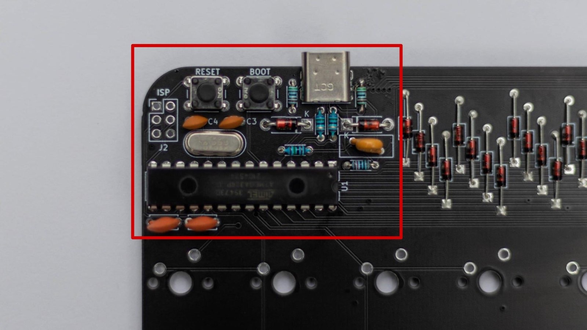
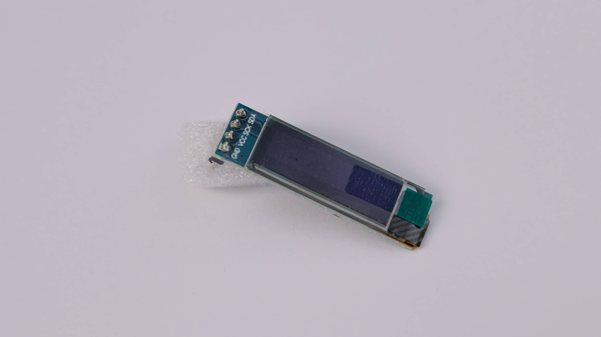
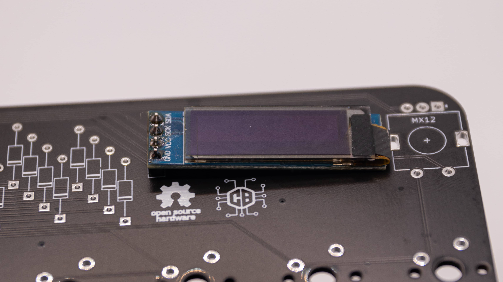
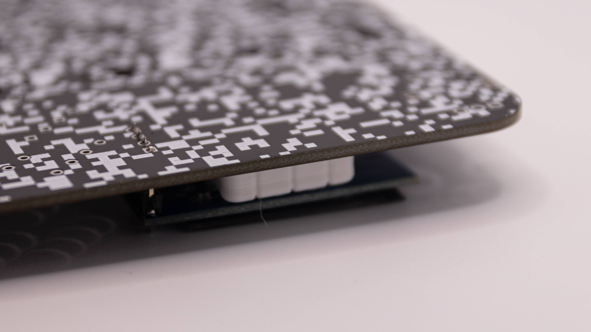
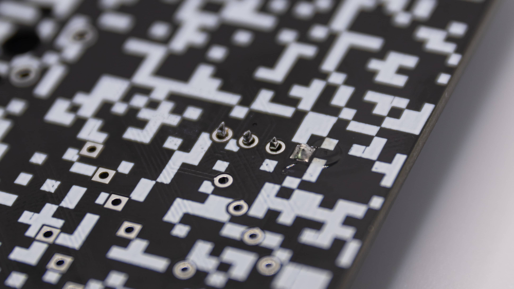
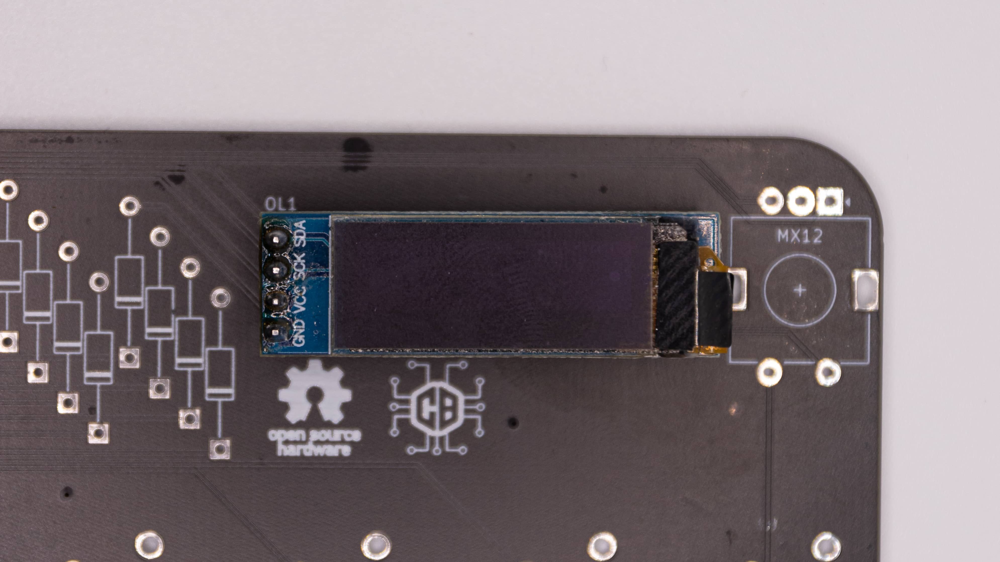
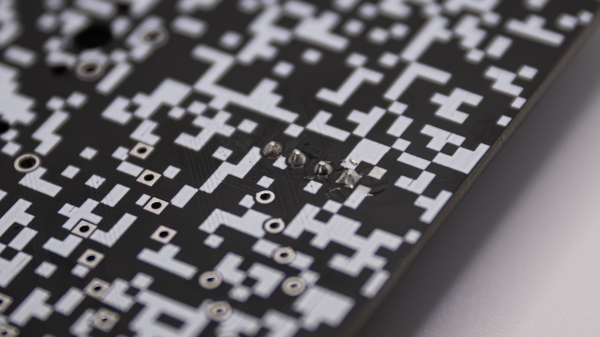
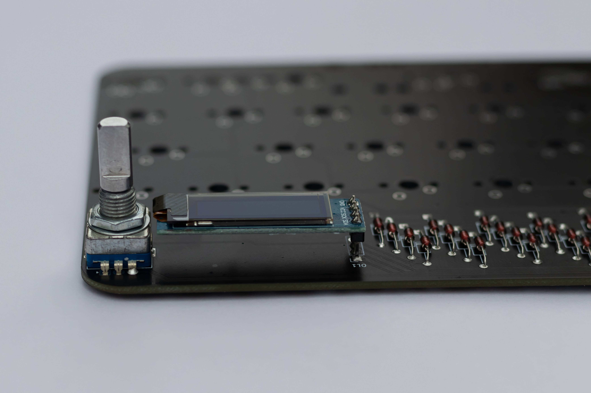

## Preparation

Please take the time to read these instructions fully at least once before actually starting. If this is your first time soldering a keyboard kit, congratulations on taking the plunge!
 This all may seem overwhelming at first but we promise that if you stay calm and work mindfully, you'll be posting your new Static's sound test in no time at all!
  We have provided pictures of each component in your kit in the [packing list](), by referencing this in combination with our [interactive BOM](https://files.0xcb.dev/0xCB-Static/humanpnp.html) we trust that you'll be able to figure out where everything goes. If for any reason you're unsure of or just want to double-check any part of the build process, please come ask in #buildassistance over at our [Discord](https://discord.gg/WpmFC2NRWV) before proceeding.
  It's always harder to undo something than it is to wait for an answer clarifying it, and we promise to be prompt with our replies. We are always happy to answer any questions you may have, and we think you'll find our community very helpful as well. Please remember that the only stupid question is the one you didn't ask!

### HumanPnP

Please open our HumanPnP [here](https://files.0xcb.dev/0xCB-Static/humanpnp.html).
 We wanted this process to be as easy to understand as possible, and as such have provided you with a super handy interactive bill of materials that also doubles as a 'map' of your PCB. If you click through to it, you will see that on the left you have a BOM that matches your packing list as well as a model of the Static's PCB on the right.
  If you examine the list closely each item has a reference column value that consists of a two character letter/number code (eg. J1, R1, R2, etc.), you can think of these as each component's 'address' on the map. If you look at your physical PCB right now you'll see that these codes are also printed on the board directly, this is especially helpful in figuring out what needs to go where.
  Our interactive BOM goes a step further though, if you simply mouse over any component on the list it's intended location is highlighted in red on the model for your convenience. Please make liberal use of this feature and always double-check before ever touching iron to board, having to desolder something because you were in a rush is no fun at all!

### Orientation of the components

There are only two components on the kit where orientation matters. All the other ones either only fit in one way or the orientaion doesn't matter on those.

#### ATMEGA

The controller is the first one. You can see the little half circle on the right. This has to align with the half circle on the PCB.

 While putting in the controller you also need to bend the legs to get it to fit. It is best to bend them all at ones on the table.
  

#### Diodes

The other part where orientation matters are the diodes. We have two types in the Kit, two large and 50 small ones. Both function the same tho. You have one black circle on the diode and one black line on the PCB. These should align.

## Soldering

Now that you know how to work with our HumanPnP and what to look out for, you can go ahead and solder in the components. If you need help soldering, you can find some general soldering advice [here]().

Here's how we would approach soldering the PCB:
1. We would start with the USB-C Port. Click [here]() for instructions on soldering USB ports.
2. Then solder in all the components around the controller. Click [here]() for instructions on basic through hole components.

3. After that please go ahead and try plugging in the keyboard into your computer. It should pop up in [VIA]() already. If it doesn't, please referr to our [troubleshooting guides]().
4. When your PCB is up and running you should solder in the Diodes. Remember the [orientation]()!
5. After that please test your Matrix. Click [here]() for instructions on how to do that.
6. Now it is onto the rotary encoder. Click [here]() for instructions on soldering encoders.
7. The last step is the OLED. Scroll down for instructions on soldering the OLED.
8. Finally you can plug in your PCB and see if the OLED turns on and the encoder works. If they do you have a finished PCB in your hands!

### OLED

Soldering the OLED on the Static is a bit different to other OLEDs, since it has to be raised off of the PCB. So we will go ahead and show you how to solder it here.

 Soldering an OLED Screen is not hard in a soldering kind of way, but it is challenging to get it to sit straight and look good!

 Start by just placing the OLED in there. It should face away from the diodes and to the rotary encoder.

 Now you can place the diode bender under the OLED. This ensures the right distance between the PCB and the OLED.

 Now flip over the PCB and solder one pin of the OLED. Preferably one of the outer ones.

 You can now look if the OLED sits straight. If it does great job! If not you can just bend it a bit in place or heat up the one solder joint again. Be careful with that tho! The OLED is a very fragile part. Be sure to grab it only by the PCB (the blue part) and not on the display itself or the ribbon cable on the right.

 If you are satisfied with the result you can go ahead and solder the other three pins of the OLED.

 You now have a great looking OLED in your Static! If you want you can peel off the little protective film now! You can also wait till you are all done with your Static of course.

