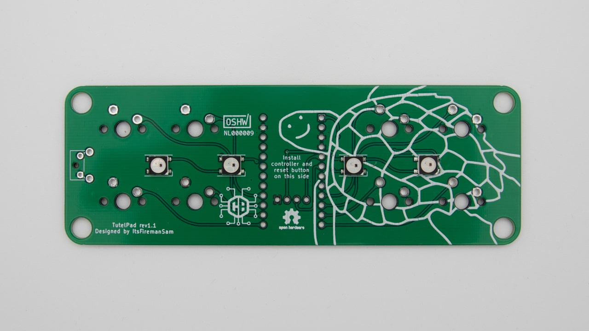
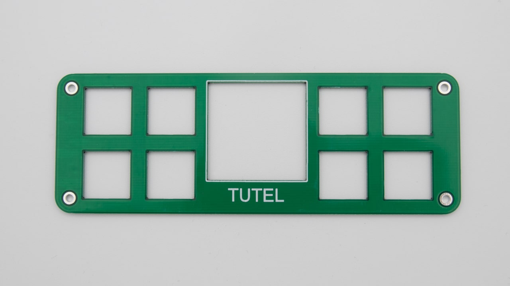
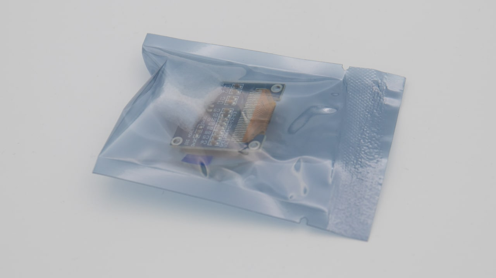
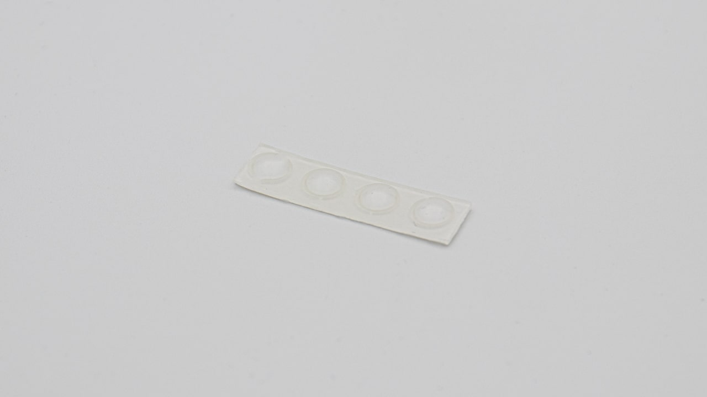
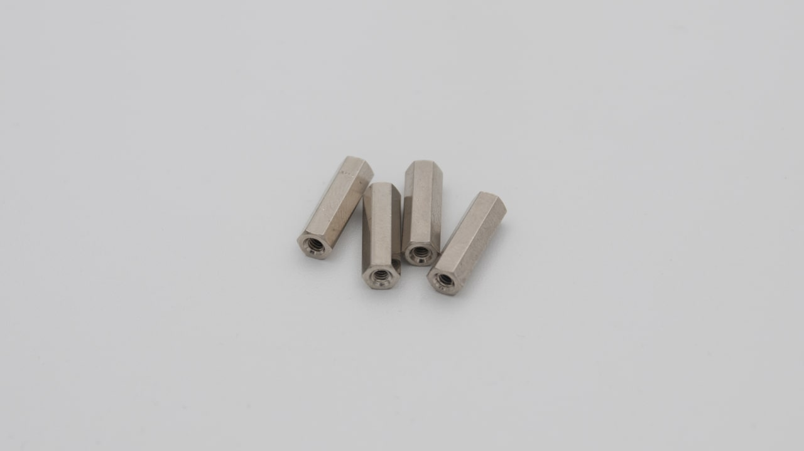
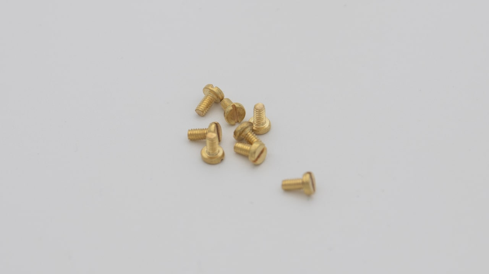
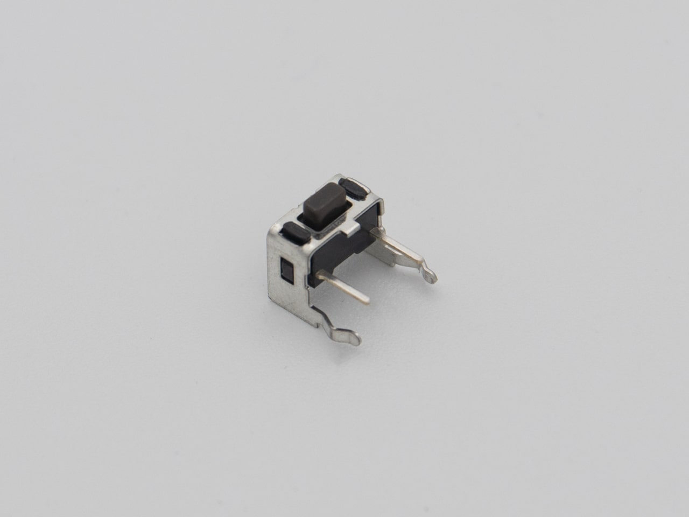

| Image                             | Description                     | Quantity |
| --------------------------------- | ------------------------------- | -------- |
|                                   |
|              | bottom plate                    | 1        |
|                    | PCB  SMD LEDs presoldered | 1        |
|  | switch plate                    | 1        |
|                  | OLED screen                     | 1        |
|    | rubber feet                     | 4        |
|        | standoffs (M2x12mm)             | 4        |
|              | brass screws (M2x5mm)           | 8        |
|              | reset button                    | 1        |