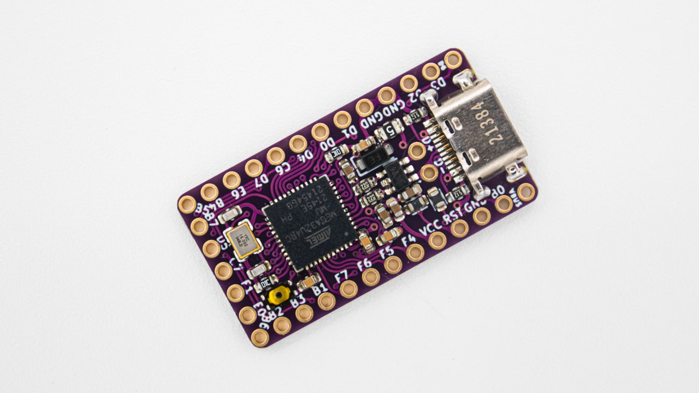
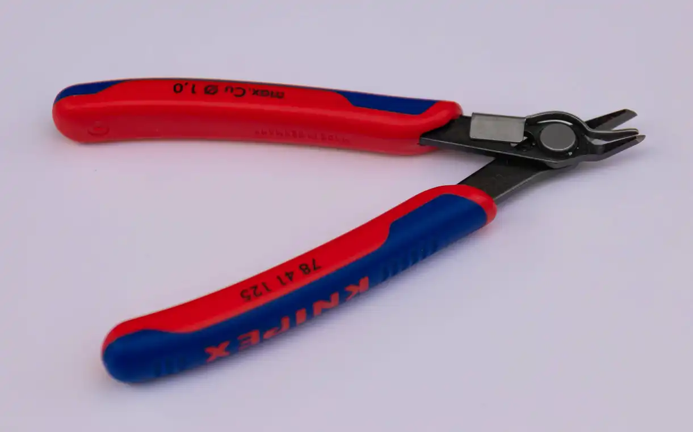
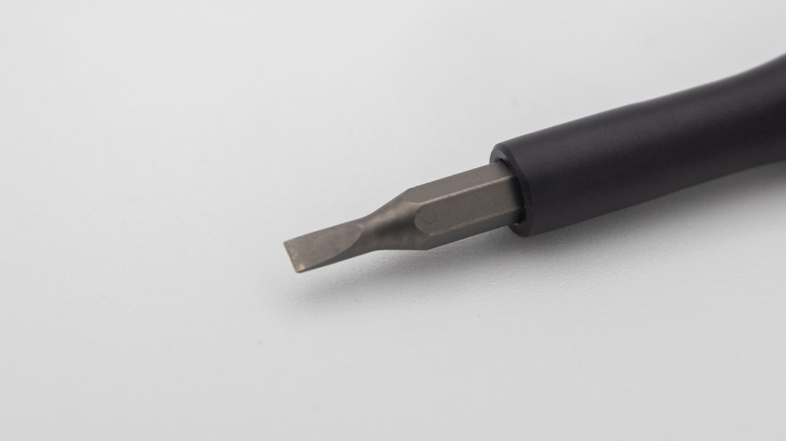

| Image                                  | Part                                 | Description                                                                                                           |
| -------------------------------------- | ------------------------------------ | --------------------------------------------------------------------------------------------------------------------- |
|                                        |                                      |                                                                                                                       |
|                    | ProMicro compatible micro controller | You will need to supply your own micro controller. You can use a ProMicro, Elite-C, Nice-Nano or a Pluto for this.    |
|    | flush cutters                        | You will need these to cut the legs of the OLED.                                                                      |
|             | flat head screwdriver                | You will need a small screw driver for the M2 Screws.                                                                 |
|  | soldering iron                       | We recomment a good soldering iron!                                                                                   |
|                  | solder                               | Please use high quality solder (flux core or apply flux externally) to make your life easier when soldering this kit! |