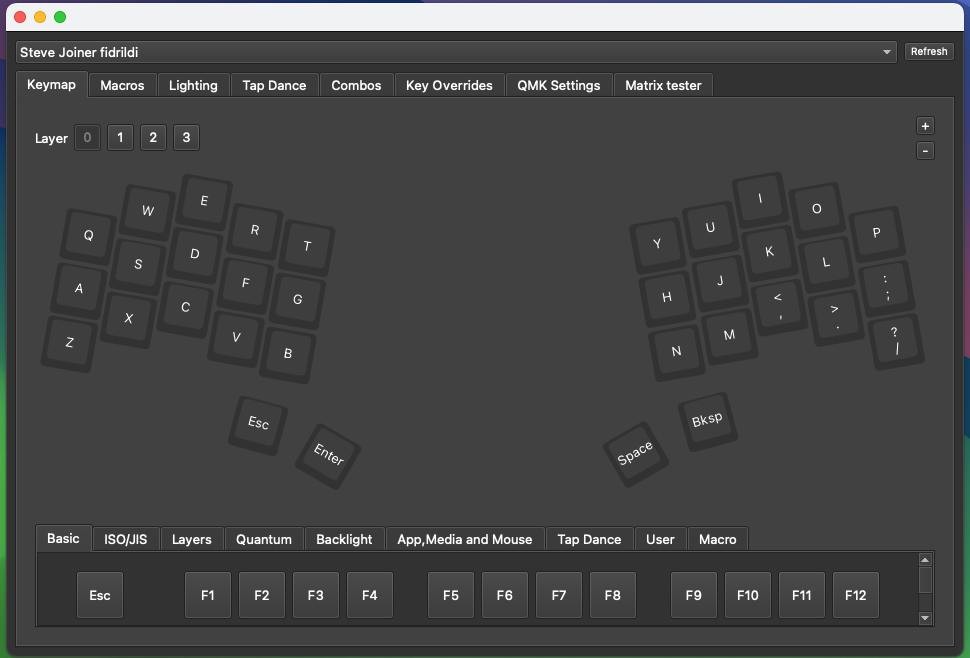
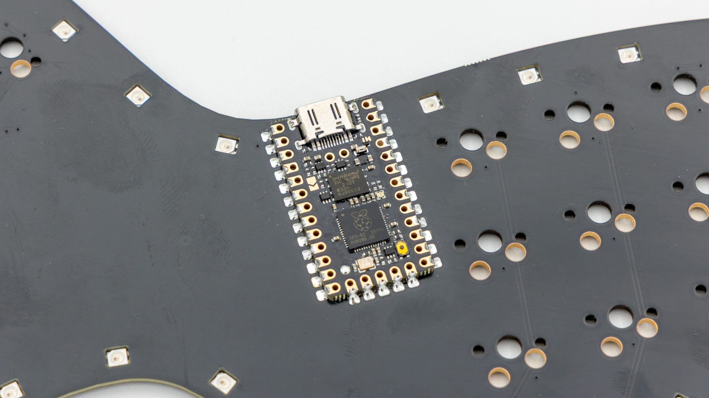
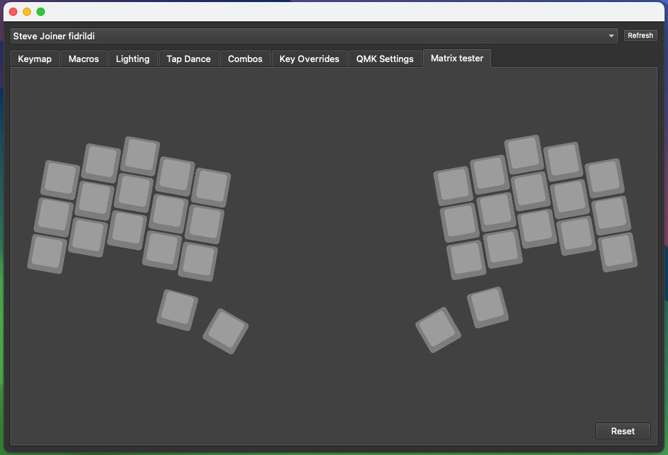
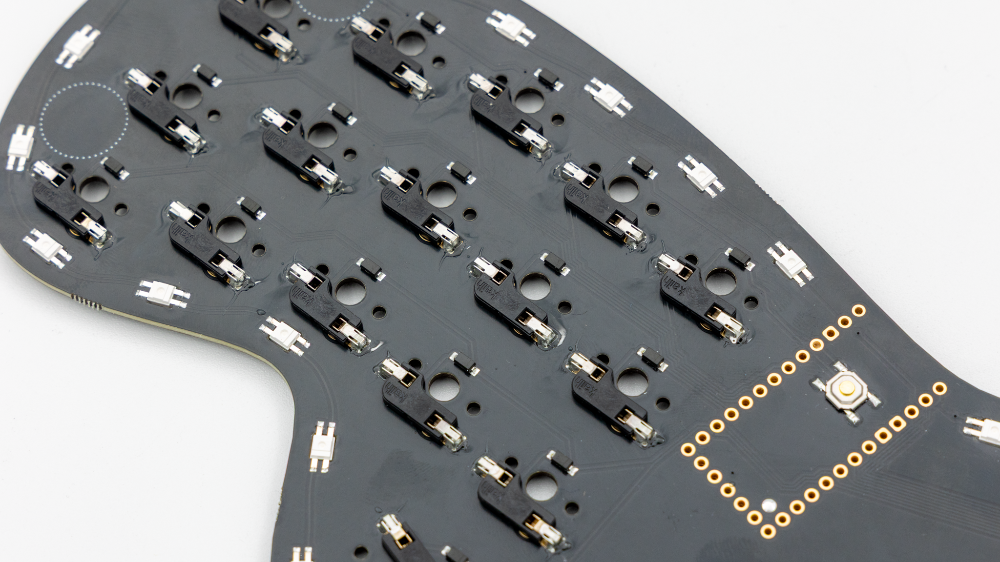
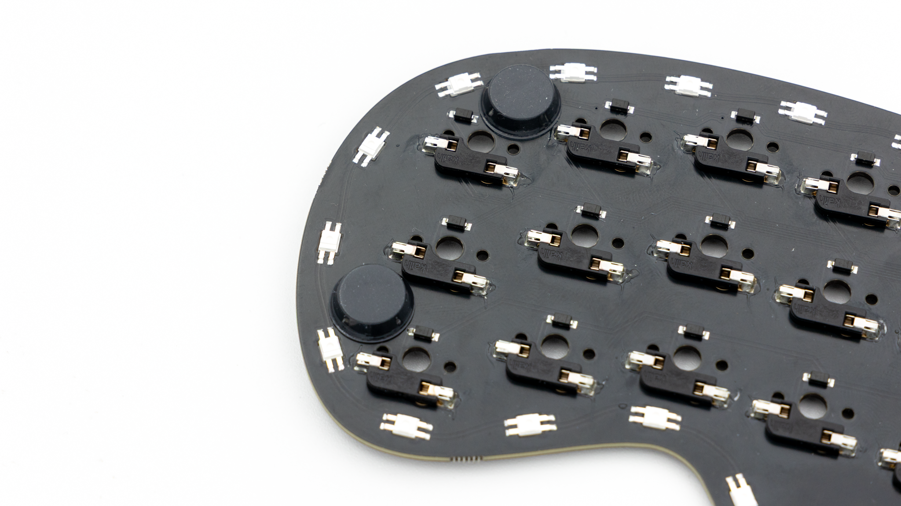
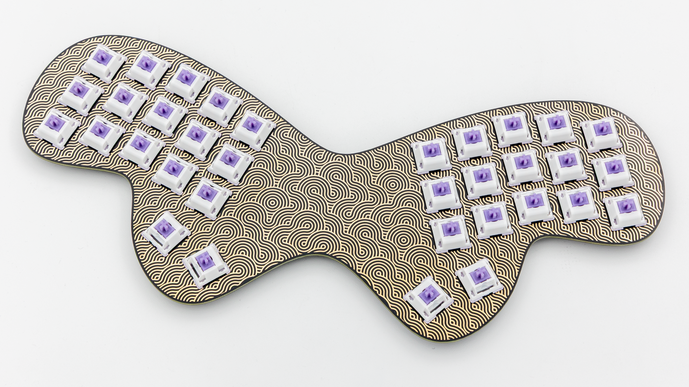
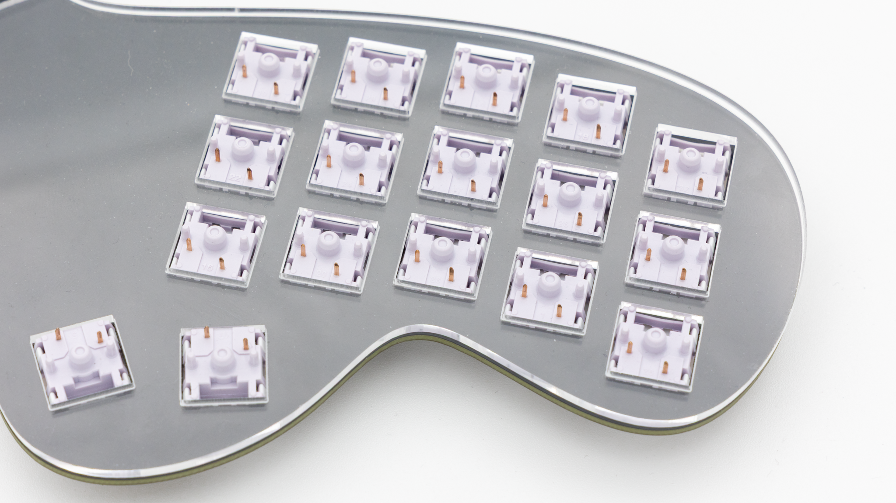
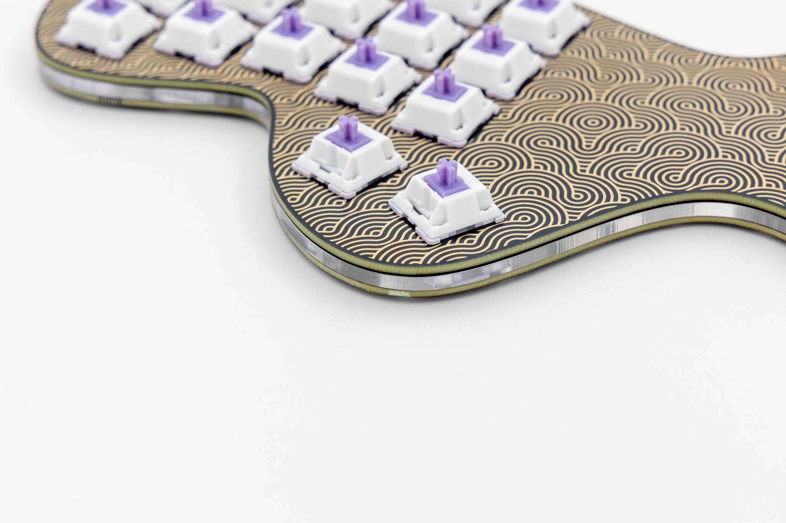
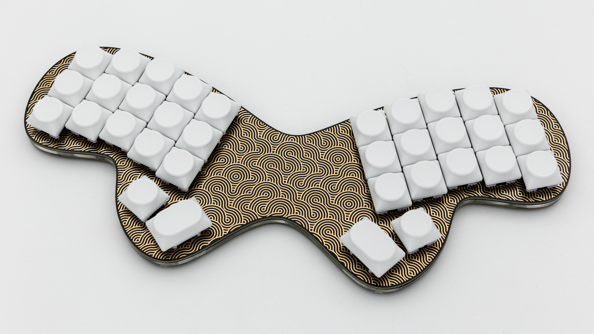

## Soldering

There are only a few components that need to be soldered for this kit since it comes preassembled with LEDs, a reset button and diodes.

### Controller

Before soldering the controller onto the PCB you should check if the correct firmware is on there.

You can find the firmware <a href="https://files.keeb.supply/firmware/fidrildi/" >here<a>. And instructions on how to flash a controller [here]().

Plug in your controller now and see if it pops up in [VIAL]().

 If your controller is working, you can solder it in. Instructions on how to do that can be found [here](). When you have the PCB in front of you, the controller should go to the top of the PCB. You should see the components of the controller, when it is sitting on the PCB. You should not see any electronic components of the PCB itself.


 When you have your controller soldered in, it is good practice to do a [matrix test]() with some tweezers.

### HotSwap Sockets

You should solder in the HotSwap sockets next. You can find instructions for that [here]().

## Final Assembly

Start by putting on the rubber feet. We provide 6 feet which you should place in the marked areas on the pcb.

 After that push the switches into the switch plate.

 Put the acrylic middle layer onto the plate from the bottom.

 After that push the PCB onto the switch and acrylic stack. Make sure the PCB is lying against the acrylic with the side the controller is on.

 Put on your preferred keycaps and your Fiðrildi is done!

