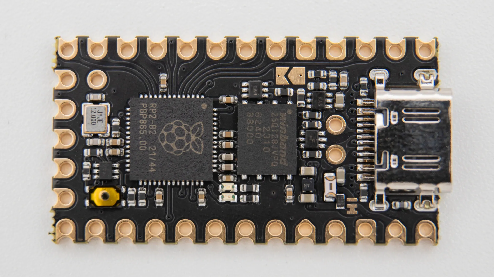

| Image                                  | Part                   | Description                                                                                                           |
| -------------------------------------- | ---------------------- | --------------------------------------------------------------------------------------------------------------------- |
|                                        |                        |                                                                                                                       |
|                   | Helios Microcontroller | You need a Helios microcontroller to be able to use all the LEDs on the board.                                        |
|  | soldering iron         | We recommend a good soldering iron!                                                                                   |
|                  | solder                 | Please use high quality solder (flux core or apply flux externally) to make your life easier when soldering this kit! |
