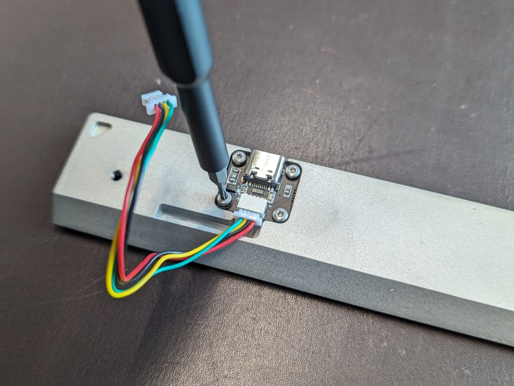
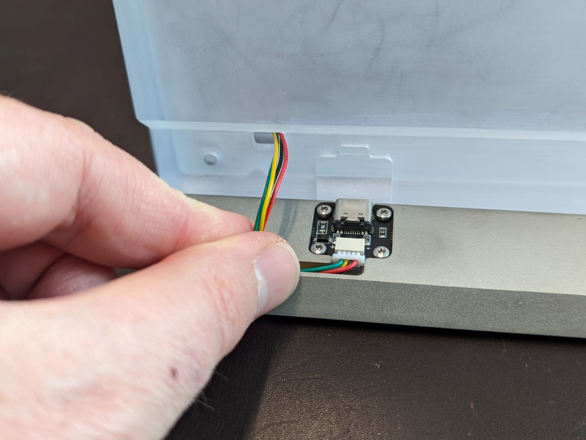
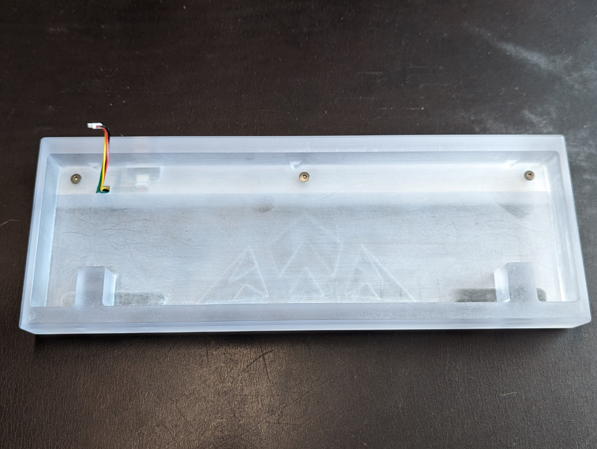
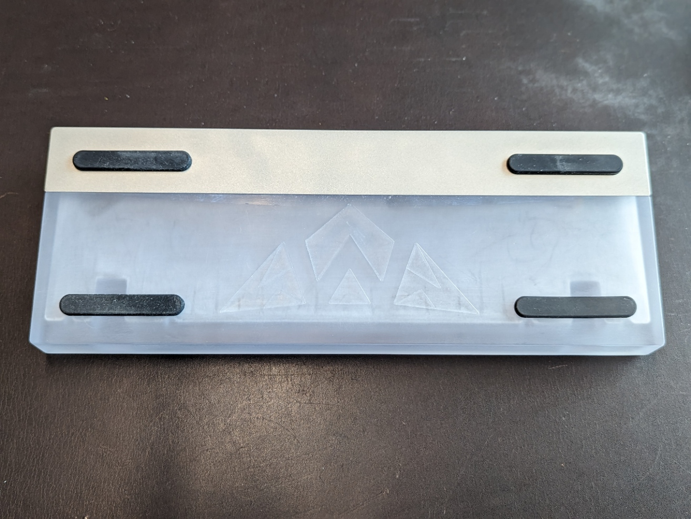
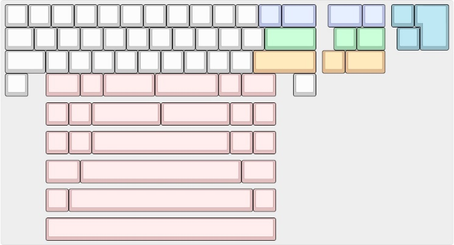
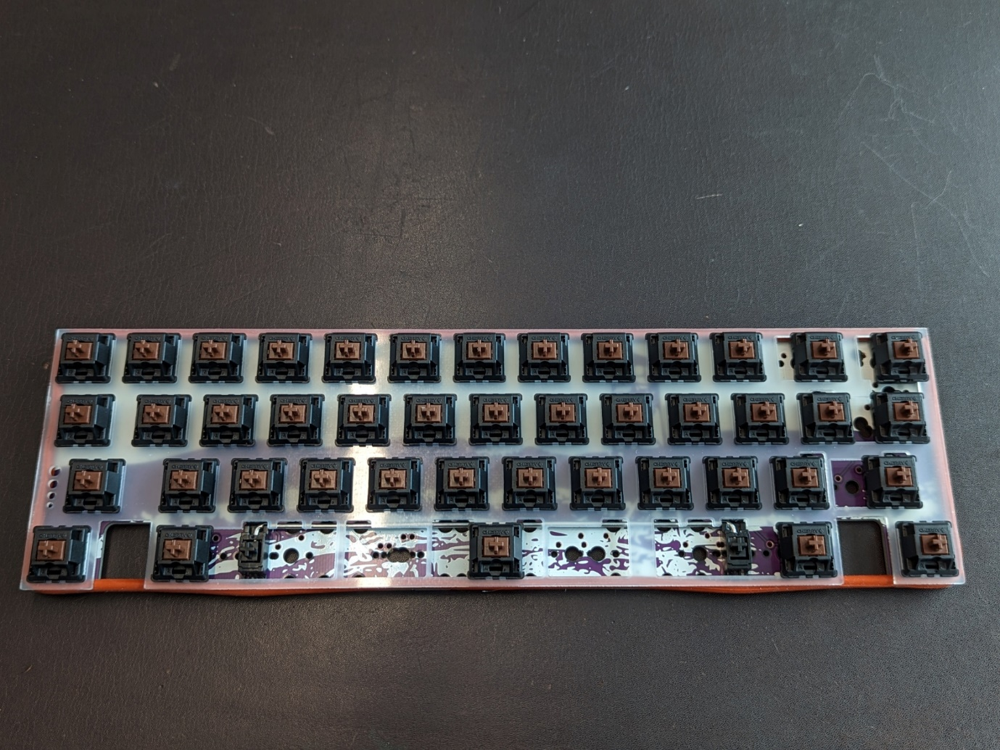
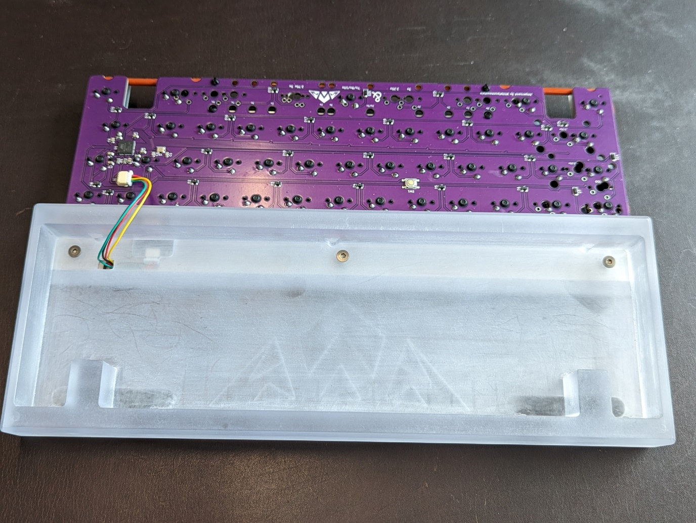
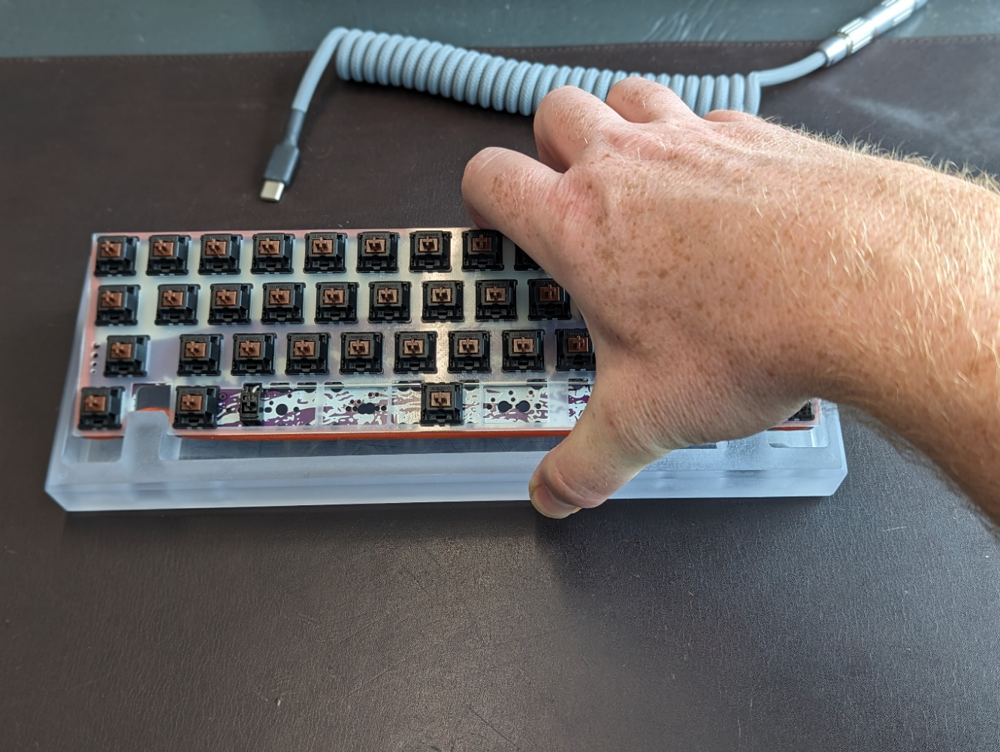
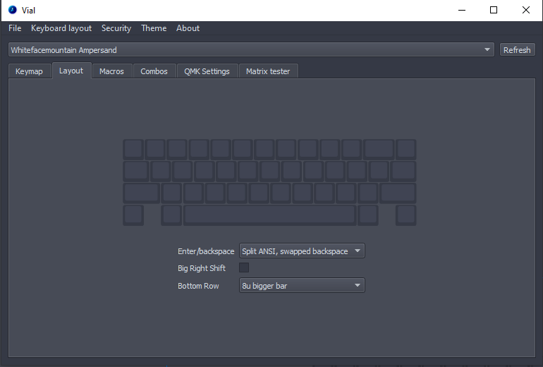

## Install Daughterboard

Use M2 screws to attach daughterboard (components facing up).

## JST Cable

Run JST cable from daughterboard along the channel in the weight and through the cutout into the case.

## Attach Weight to Case

Use M3 screws to attach the weight to the case. Alignment posts ensure the weight cannot move as you are installing it.

## Install Feet

Attach adhesive feet in cutouts on the underside of the board.


## Build PCB

Solder switches into any of the compatible layouts.
You can find Instructions on how to solder [here]().

Stabilizers should be PCB-mounted clip-ins (eg TX stabilizers). Once the PCB is built, the oring can be stretched around the perimeter of the assembly, fitting between the plate and PCB.

## Connect the PCB and Daughterboard

Connect the PCB to the daughterboard using the JST connector.

## Insert PCB assembly into the case

To insert the PCB assembly into the case, pull the assembly towards you and downwards, putting pressure against the blockers. The oring should push up into the PCB/plate. Once the oring along bottom row is sitting on its posts, press the top row down into the case until the oring there is also sitting on its posts.


## Customise layout/keymap in Vial

Download/install/run Vial. Select the layout in which switches were soldered. Customise keymap/QMK settings to taste. See [here]() for help on how to accomplish that.


