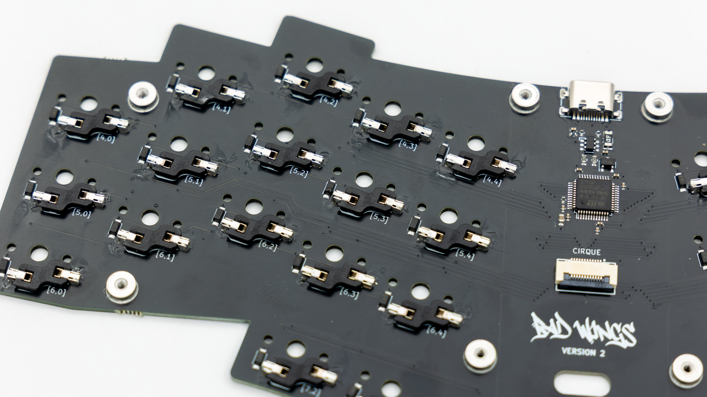
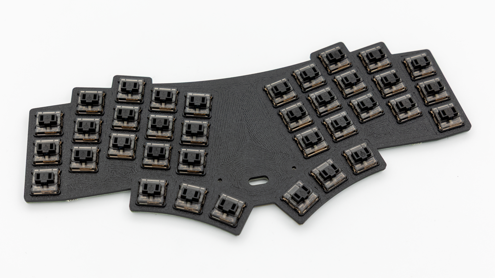
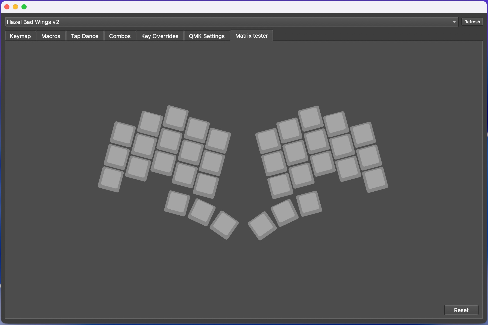
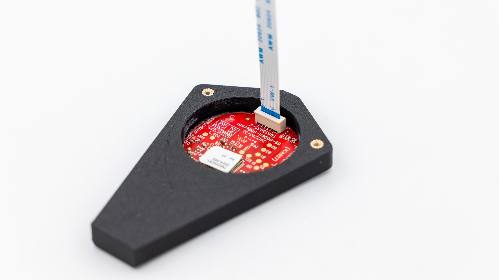
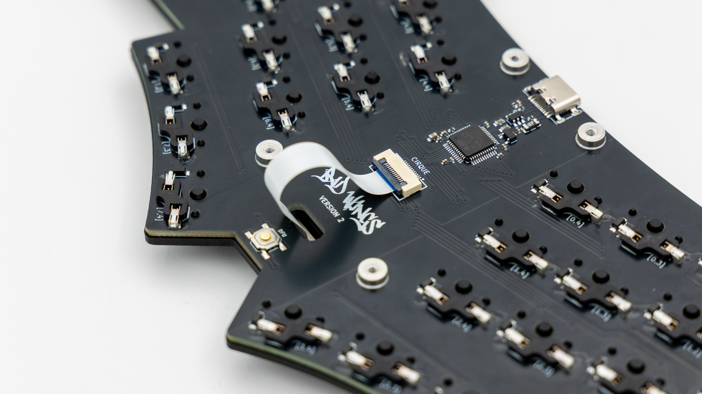
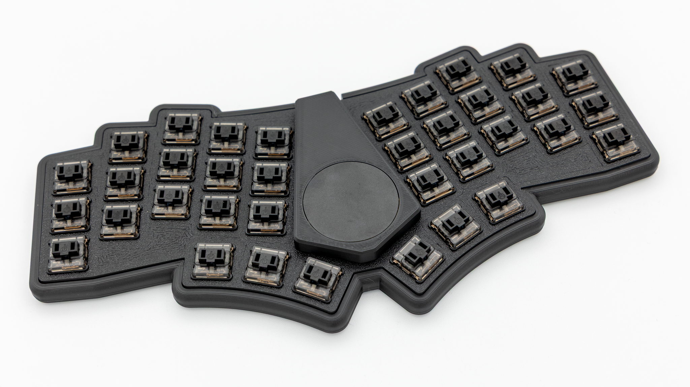
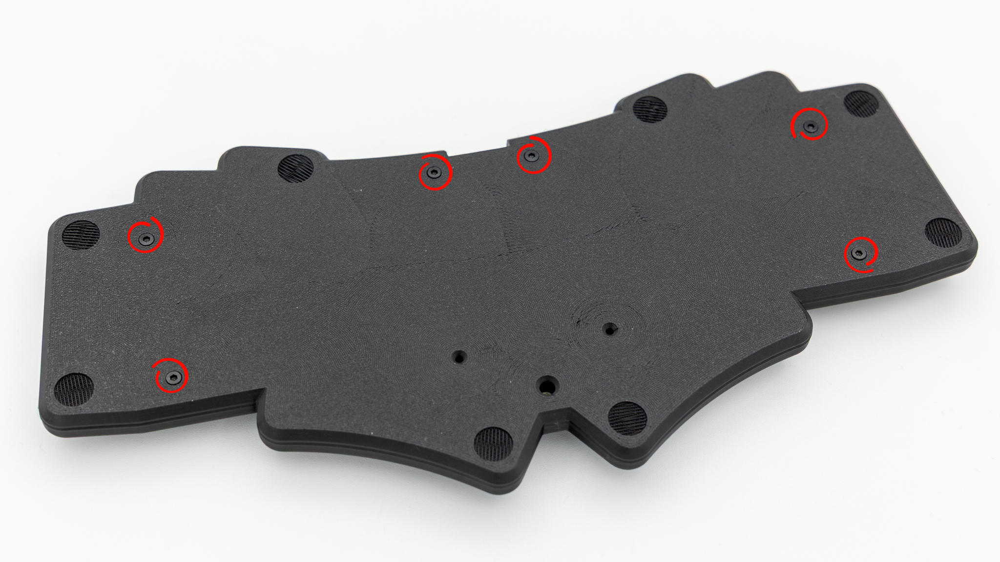
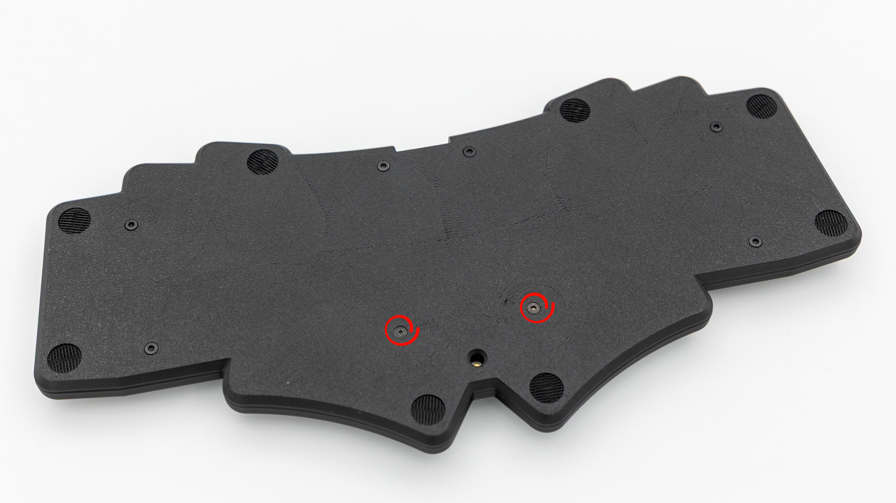
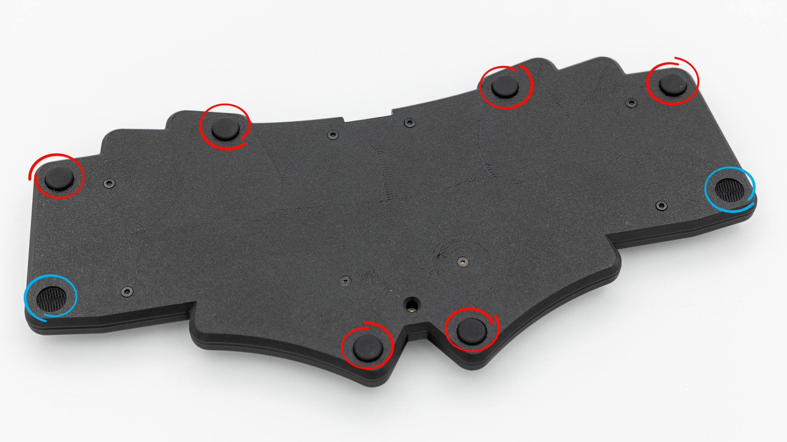
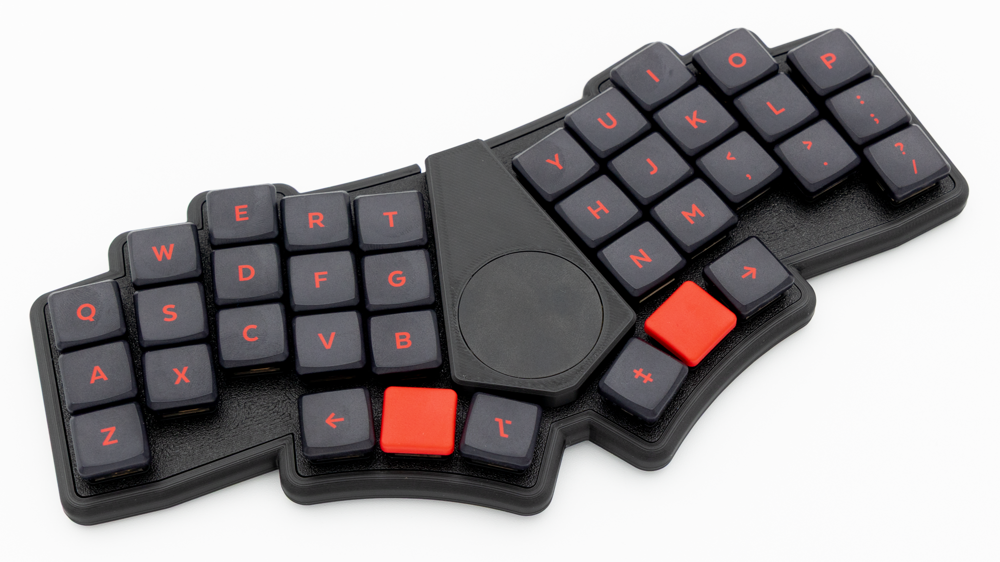

## Soldering

You only need to solder the hotswap sockets for this keyboard. If you do not have experience with soldering, please refer to this [quick start guide]().

### Hotswap Sockets

Solder the hotswap sockets. You can find instructions for that [here]().

## Final Assembly

Start by putting in the switches into the PCB and plate. Push the switches through the plate into the PCB. Make sure to orient the plate correctly. The rough surface of the plate should go on top.

 Before assembling the rest of the keyboard, it is good practice to do a [matrix test](). As the BadWings V2 is preflashed when you purchase the kit from KeebSupply, the correct firmware should already be on there.

 Insert the FPC cable into the Cirque trackpad assembly. The connector on the Cirque is a push-in FPC connector. You can just push the cable into it.


 Push the FPC cable through the plate, and insert it into the connector on the PCB. You do not need to twist the cable to make it fit. Refer to the picture below to see how the cable should be routed.


 Place the PCB assembly into the bottom case.

 Screw the short screws in all of the marked holes.

 Insert the two longer screws into the two leftover holes. Hold the Cirque trackpad assembly onto the plate while screwing. The screws go through the pcb, plate and then into the Cirque trackpad assembly.

 Insert the rubber feet into the cutouts. The red circles indicate mandatory feet, the blue ones are optional.

 Put on your keycaps of choice, and you are done!

