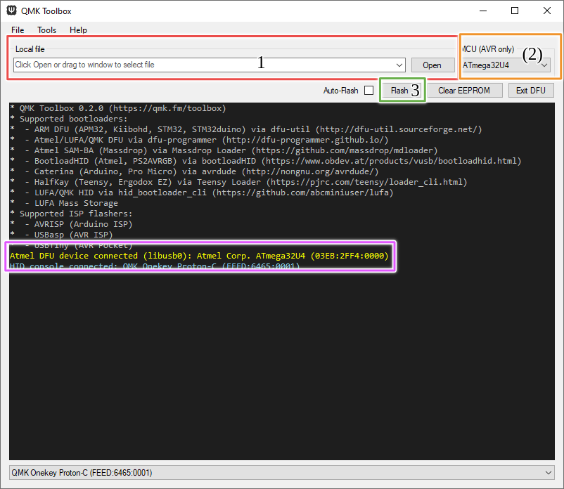

## RP2040

The RP2040 has a u2f bootloader in ROM (etched into the die) meaning it cant be bricked or overwritten which is great news.

### enter bootloader mode

To get RP2040 boards into botloader mode you have to disable the flash on startup. You can acomplish this on [Helios](https://keeb.supply/products/0xcb-helios) by using the reset button / reset pin and pushing it / pulling it to GND for over 500ms (while it's plugged into a PC of course).

For other Boards the method varies, but on the [Pi Pico](https://www.raspberrypi.com/products/raspberry-pi-pico/) for example you can hold the BOOTSEL button while pluggin it in and it should also enter the bootloader.

The controller will reboot and enter the bootloader mode automatically - you will see a flash drive pop up on you PC called **RPI-RP2**

### copy firmware

Now you can take your keyboardfirmware.u2f and copy it to that drive. It will unmount and reboot itself and if flashing succeeded you now have a working keyboard - if not you can just repeat and try again (remember: It can't be bricked so you are very unlikely to break something).

## AVR (Atmega)

### Using QMK Toolbox

Download and install [QMK Toolbox](https://github.com/qmk/qmk_toolbox).
When you open it you can select your keyboardfirmware.hex in the local file dialog (1).
Then select the MCU (2).

Now this part differs per keyboard (different bootloaders, different bootmagic configs), but in general you can hold escape while plugging the board in or press reset while the board is plugged in to enter DFU mode.

You will see a yellow message in the toolbox console stating that a DFU device connected (pink frame).

Now you can press Flash (3) and wait for "Validating... Success"

Your keyboard was flashed succesfully and you are good to go

Consult your keyboard manu for other methods.

### using make

run this command in the qmk code directory and edit the command to relect you keboard and keymap
`make 0xcb/1337:default:flash`

## ARM

Please refer to the [RP2040]() guide for u2f (bootloader not in rom) and to the [AVR]() guide for dfu-util (you dont have to select the mcu for arm).
