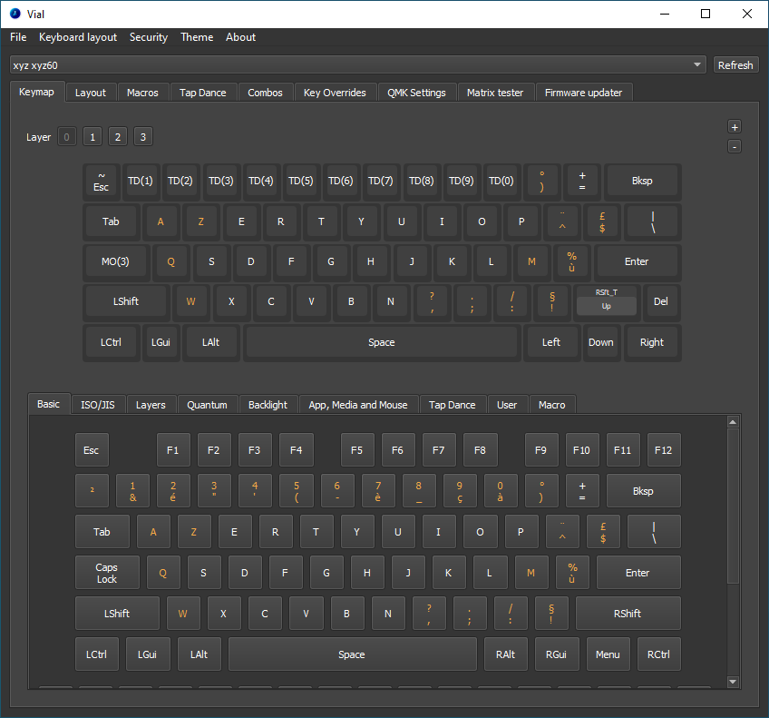
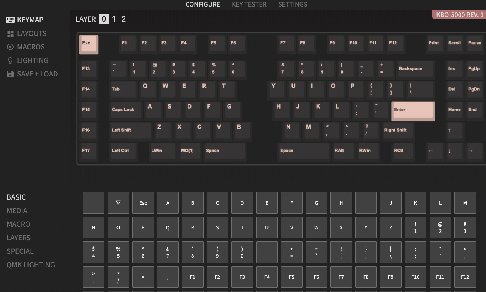
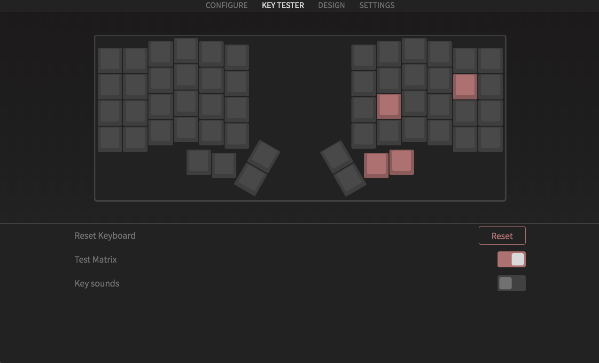

## VIAL

### Overview

VIAL is a great and easy way to modify the mapping of your keyboard without having to reflash every time you edit the keymap.

But VIAL has more features than just remapping keys - to name a few: switching layouts, macros, tap dances, advanced RGB lighting, rotary encoder support, and many more quirks.

You also don't have to submit your keyboard.json to a central GitHub repository, unlike VIA, as it is stored inside the keyboard, which makes development way more enjoyable.

### Quick start guide

- make sure your board has a VIAL firmware [flashed]()

- download VIAL [here](https://get.vial.today/download/) - there is also a web version available [here](https://vial.rocks/)

- open the app and select you board from the dropdown menu

- from here you can explore the numerous features VIAL offers - see VIALs manual for a [full explanation](https://get.vial.today/manual/first-use.html)



### Firmware

If your board has no VIAL firmware available yet, or you'd like to enable/disable specific features, you can port you keyboard with these great [instructions](https://get.vial.today/docs/porting-to-via.html).

## VIA

### Overview

VIA also allows changing keycodes on the fly, macros, combos, basic RGB support, and layout switching.
It does not support QMK magic, rotary encoders, MIDI, and RGB Matrix, unlike VIAL which supports all of these.

VIA also does **not** offer the security provided by VIAL which makes your board vulnerable to the injection of malicious macros that can result in privilege elevation for example.

One aspect favoring VIA right now is, that its userbase is currently larger, making finding firmware with VIA baked in easier.

### Quick start guide

- make sure your board has a VIA firmware [flashed]() ready made ones are available [here](https://www.caniusevia.com/docs/download_firmware)

- download VIA [here](https://github.com/the-via/releases/releases) - there is also a web version available [here](https://usevia.app/#/)

- your board will show up and display it's current mapping

- here you can just click the key you want to remap and then select a new keycode from the bottom menu, where you can cycle through almost all QMK keycodes

- In the left menu you can change your layout, edit macros, control the lighting and backup/ restore your config

### Firmware

If your board has no VIA firmware available yet, or you'd like to enable/disable specific features, you can port you keyboard with these [instructions](https://www.caniusevia.com/docs/specification).



## Matrix Testing

This is the best feature to ensure your PCB is fully functional even before soldering in any switches and we recommend testing your PCB before soldering as this will save you a lot of headaches.

### VIAL

- go to the matrix tester tab

- unlock the keyboard at the bottom right and follow the directions

- test every key and check if every position works



### VIA

- open the key tester from the top menu

- toggle `Test Matrix`

- test every key and check if every position works


