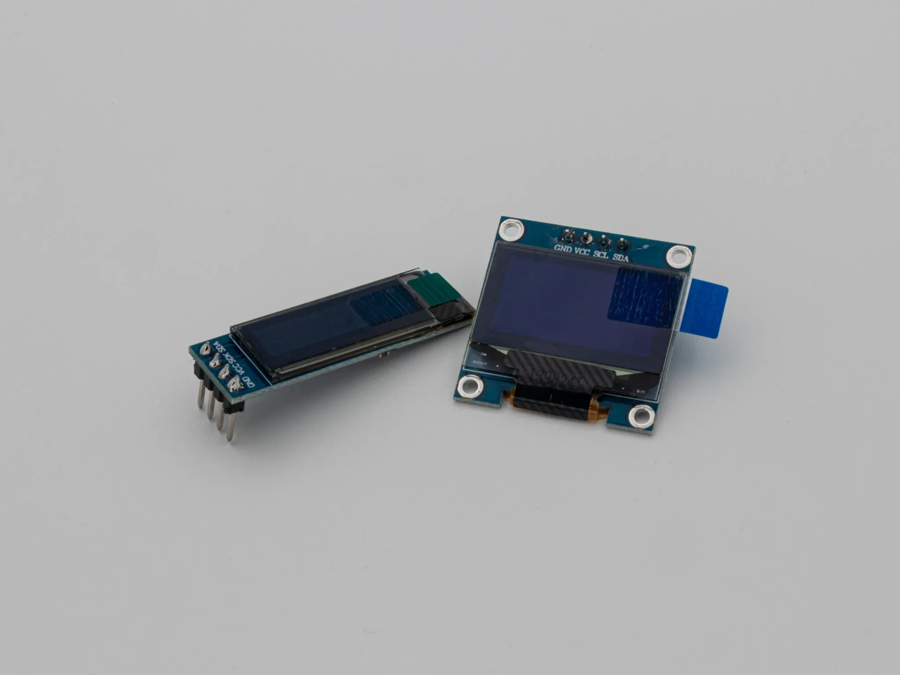

## Overview

Oleds are great to display info about your current layer, indicate CAPS lock and much more. But the most important use case is of course the Bongo Cat ;)

They are available in multiple sizes and aspect ratios - the most common ones are 0.91" 128x32 and 0.96" 128x64.

## Firmware

As always the [QMK docs](https://github.com/qmk/qmk_firmware/blob/master/docs/feature_oled_driver.md) have a full guide with examples to get you started.

You can take this repo as a reference for the [Bongo Cat](https://github.com/nwii/oledbongocat).

If you want to prolong the lifespan of your OLED, make sure to retain a sane screen timout to prevent excessive burn in.

## Soldering

The OLEDs communicate via [I2C](https://learn.sparkfun.com/tutorials/i2c/all) which means you only have to connect 4 wires: GND (negative terminal), VCC (Positive Terminal: 3.3V or 5V), SCL (Clock line) and SDA (Data line)

Keyboards that support OLEDs out of the box have through hole pads in that configuration, so you just plug in the OLED and solder the pins (make sure to connect GND to GND, ...) - you can also use headers to make the OLED hot swappable.

Feel free to check out the general soldering advice [here]().

You can find instructions for OLED soldering [here](/0xcb-static/soldering#oled).