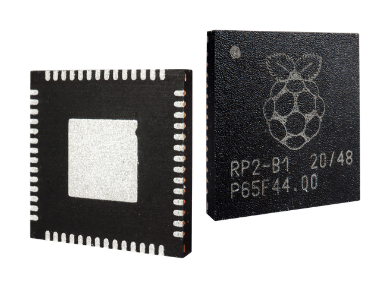
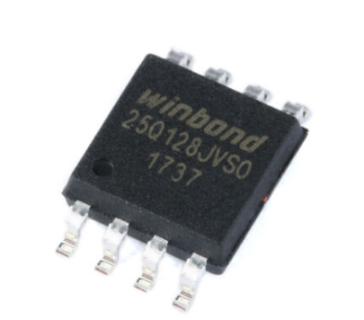

## Overview

This new chip by the Raspberry Pi foundation finally replaces the outdated AVR microcontrollers and expensive/hard-to-get STM32 chips.
It's low cost coming in at just 1$ p.p. and most importantly it's available in high volume!

The RP2040 features two ARM Cortex-M0+ 32-bit CPUs that operate at 133MHz, along with 264Kb of SRAM.
For comparison the atmega32u4 chips used in Pro Micros only feature a single 8-bit RISC core operating at 16MHz, along with 2.5KB SRAM (they also have onboard flash, but sadly only 32KB).

So as you can tell it's a pretty big upgrade from the 32U4 and I/O wise it's also a beast:

- 2 × UART, 2 × SPI controllers, 2 × I2C controllers, 16 × PWM channels
- 1 × USB 1.1 controller and PHY, with host and device support
- 8 × Programmable I/O (PIO) state machines for custom peripheral

The main star is the PIO making the use cases endless. Some options are [ethernet](https://github.com/sandeepmistry/pico-rmii-ethernet), [PIO USB host](https://github.com/sekigon-gonnoc/Pico-PIO-USB) and much, much more.

## Power

The rp2040 needs 3.3V power instead of 5V like the 32u4.

### 3.3V

The easiest way to archive this is by using a 3.3V LDO to step down the 5V from the USB port.

### 1.1V

You might have spotted the voltage regulator in the floorplan image.
it provides 1.1V for the cores. 



## Flash

Because the RP2040 doesn't have built-in storage you need an external 3.3V (Q)SPI flash and you may use up to 128Mb / 16MB of it.

### Recommended Flash Chips

For assembly/reflow soldering:

- W25Q128JVPIQ | 16MB | WSON-8-EP(5x6mm)
- W25Q64JVXGIQ | 8MB | XSON-8-EP(4x4mm)
- W25Q32JVUUIQ | 4MB | USON-8(3x4mm)
- W25Q16JVUXIQ | 2MB | USON-8-EP(2x3mm)

For hand soldering:

- W25Q128JVSIQ | 16MB | SOIC-8-208mil
- W25Q64JVSSIQ | 8MB | SOIC-8-208mil
- W25Q32JVSSIQ | 4MB | SOIC-8-208mil
- W25Q16JVSSIQ | 2MB | SOIC-8-208mil

## Bootloader

The RP2040 comes with a bootloader etched into ROM (Read Only Memory).


After that, a second-stage bootloader takes over and runs code from the flash.

### Entering the bootloader

To enter the bootloader you have to disable the flash chip on startup:

pull and hold QSPI_SS_N low and reset the controller by pulling RUN low.

You will see a new flash drive appear on your computer and you can drag and drop .uf2 files onto it to flash them.

## Pinout

### GPIO functions

Every GPIO can serve multiple functions thanks to the PIO fabric.

This for example enables you to place full duplex split transport almost anywhere on the chip (see col. F2):

| GPIO | F1       | F2        | F3       | F4     | F5  | F6   | F7   | F8           | F9            |
| ---- | -------- | --------- | -------- | ------ | --- | ---- | ---- | ------------ | ------------- |
| 0    | SPI0 RX  | UART0 TX  | I2C0 SDA | PWM0 A | SIO | PIO0 | PIO1 |              | USB OVCUR DET |
| 1    | SPI0 CSn | UART0 RX  | I2C0 SCL | PWM0 B | SIO | PIO0 | PIO1 |              | USB VBUS DET  |
| 2    | SPI0 SCK | UART0 CTS | I2C1 SDA | PWM1 A | SIO | PIO0 | PIO1 |              | USB VBUS EN   |
| 3    | SPI0 TX  | UART0 RTS | I2C1 SCL | PWM1 B | SIO | PIO0 | PIO1 |              | USB OVCUR DET |
| 4    | SPI0 RX  | UART1 TX  | I2C0 SDA | PWM2 A | SIO | PIO0 | PIO1 |              | USB VBUS DET  |
| 5    | SPI0 CSn | UART1 RX  | I2C0 SCL | PWM2 B | SIO | PIO0 | PIO1 |              | USB VBUS EN   |
| 6    | SPI0 SCK | UART1 CTS | I2C1 SDA | PWM3 A | SIO | PIO0 | PIO1 |              | USB OVCUR DET |
| 7    | SPI0 TX  | UART1 RTS | I2C1 SCL | PWM3 B | SIO | PIO0 | PIO1 |              | USB VBUS DET  |
| 8    | SPI1 RX  | UART1 TX  | I2C0 SDA | PWM4 A | SIO | PIO0 | PIO1 |              | USB VBUS EN   |
| 9    | SPI1 CSn | UART1 RX  | I2C0 SCL | PWM4 B | SIO | PIO0 | PIO1 |              | USB OVCUR DET |
| 10   | SPI1 SCK | UART1 CTS | I2C1 SDA | PWM5 A | SIO | PIO0 | PIO1 |              | USB VBUS DET  |
| 11   | SPI1 TX  | UART1 RTS | I2C1 SCL | PWM5 B | SIO | PIO0 | PIO1 |              | USB VBUS EN   |
| 12   | SPI1 RX  | UART0 TX  | I2C0 SDA | PWM6 A | SIO | PIO0 | PIO1 |              | USB OVCUR DET |
| 13   | SPI1 CSn | UART0 RX  | I2C0 SCL | PWM6 B | SIO | PIO0 | PIO1 |              | USB VBUS DET  |
| 14   | SPI1 SCK | UART0 CTS | I2C1 SDA | PWM7 A | SIO | PIO0 | PIO1 |              | USB VBUS EN   |
| 15   | SPI1 TX  | UART0 RTS | I2C1 SCL | PWM7 B | SIO | PIO0 | PIO1 |              | USB OVCUR DET |
| 16   | SPI0 RX  | UART0 TX  | I2C0 SDA | PWM0 A | SIO | PIO0 | PIO1 |              | USB VBUS DET  |
| 17   | SPI0 CSn | UART0 RX  | I2C0 SCL | PWM0 B | SIO | PIO0 | PIO1 |              | USB VBUS EN   |
| 18   | SPI0 SCK | UART0 CTS | I2C1 SDA | PWM1 A | SIO | PIO0 | PIO1 |              | USB OVCUR DET |
| 19   | SPI0 TX  | UART0 RTS | I2C1 SCL | PWM1 B | SIO | PIO0 | PIO1 |              | USB VBUS DET  |
| 20   | SPI0 RX  | UART1 TX  | I2C0 SDA | PWM2 A | SIO | PIO0 | PIO1 | CLOCK GPIN0  | USB VBUS EN   |
| 21   | SPI0 CSn | UART1 RX  | I2C0 SCL | PWM2 B | SIO | PIO0 | PIO1 | CLOCK GPOUT0 | USB OVCUR DET |
| 22   | SPI0 SCK | UART1 CTS | I2C1 SDA | PWM3 A | SIO | PIO0 | PIO1 | CLOCK GPIN1  | USB VBUS DET  |
| 23   | SPI0 TX  | UART1 RTS | I2C1 SCL | PWM3 B | SIO | PIO0 | PIO1 | CLOCK GPOUT1 | USB VBUS EN   |
| 24   | SPI1 RX  | UART1 TX  | I2C0 SDA | PWM4 A | SIO | PIO0 | PIO1 | CLOCK GPOUT2 | USB OVCUR DET |
| 25   | SPI1 CSn | UART1 RX  | I2C0 SCL | PWM4 B | SIO | PIO0 | PIO1 | CLOCK GPOUT3 | USB VBUS DET  |
| 26   | SPI1 SCK | UART1 CTS | I2C1 SDA | PWM5 A | SIO | PIO0 | PIO1 |              | USB VBUS EN   |
| 27   | SPI1 TX  | UART1 RTS | I2C1 SCL | PWM5 B | SIO | PIO0 | PIO1 |              | USB OVCUR DET |
| 28   | SPI1 RX  | UART0 TX  | I2C0 SDA | PWM6 A | SIO | PIO0 | PIO1 |              | USB VBUS DET  |
| 29   | SPI1 CSn | UART0 RX  | I2C0 SCL | PWM6 B | SIO | PIO0 | PIO1 |              | USB VBUS EN   |

### QMKs naming for GPIO

To reference the RP2040s GPIO you use GP* where * is the GPIO number (not the pin number).

## Die Shot

Look at this beauty:

