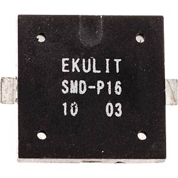

## Overview

These little Piezo speakers are a great and fun addition to any keyboard.

## Firmware

You can use them to play click sounds per key press, or play melodies on startup / shutdown of you keeb - please check the [QMK docs](https://github.com/qmk/qmk_firmware/blob/master/docs/feature_audio.md) for a full guide with examples.

One more advanced feature is outputting [MIDI](https://github.com/qmk/qmk_firmware/blob/master/docs/feature_midi.md).

## Soldering

They're really easy to solder. You just have to solder the two exposed legs to the pads on the PCB (like soldering kailh hotswap sockets) **orientation does not matter**.

Feel free to check out the general soldering advice [here]().
