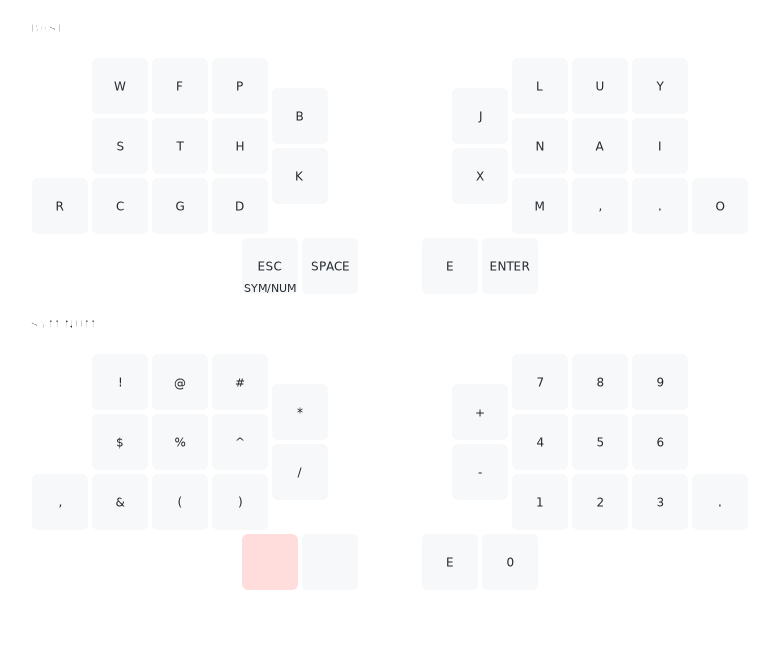

## How to use less keys?
All of the different features here aim at one goal:
Making the keys we have more powerful.

For this, each key will serve multiple purposes.
How exactly this is achieved best is very much a matter of personal preference.
We will show some well-liked options below.

 

### Layers
Most small keyboard users work with layers.
A layer is a set of behaviors for all keys of a keyboard.
Typically, the default layer contains (most of) the letters, a bit of common punctuation, and some special keys like modifiers (such as shift, control, etc).
Additional layers might be used for numbers, symbols, function keys, navigation, etc.
A well-known layer-like behavior from normal keyboards is the shift function.
When the shift button is held (or with caps lock activated), each key of the keyboard will produce different output.

Layer documentations in common firmwares:
- [QMK](https://docs.qmk.fm/#/feature_layers)
- [ZMK](https://zmk.dev/docs/behaviors/layers)
- [KMK](https://github.com/KMKfw/kmk_firmware/blob/master/docs/en/layers.md)

#### Example

In the image below, you can see an example layout with a default/base layer and an additional layer, that can be accessed by holding the `Esc` key.
While it is held, every other key on the keyboard changes its function.

 

### Hold-Taps
Hold-tap (or tap-hold) refers to a behavior where a keypress results in different things depending on how long the key is pressed.
Usually this is used to differentiate between *taps* (short presses with immediate release) and *holds* (holding the key down for some time before releasing).
Common use cases include home-row mods (see example below) and layer-taps, where a given layer is activated while the key is pressed, but when tapped quickly, the key produces some other output.

Hold-tap documentations in common firmwares:
- [QMK](https://docs.qmk.fm/#/tap_hold)
- [ZMK](https://zmk.dev/docs/behaviors/hold-tap)
- [KMK](https://github.com/KMKfw/kmk_firmware/blob/master/docs/en/holdtap.md)

#### Example
A quich explanation of home-row mods ([in-depth information](https://precondition.github.io/home-row-mods)):

For the keys on your fingers' homing position (`a``s``d``f` and `j``k``l``;` on standard Qwerty), each key gets a double function.
When tapped quickly, it simply works as usual.
When held, instead it becomes one of the modifiers `Shift`, `Ctrl`, `Alt`, `Gui` (`Super`, `Cmd`, or `Win`, depending on your OS).
So, for typing "Giant Moose", you'd press the following sequence of keys:
press and hold `j`, `g`, release `j`,  `i`, `a`, `n`, `t`, `Space`, press and hold `f`, `m`, release `f`, `o`, `o`, `s`, `e`.

 

### Combos
Combos produce special results when pressing two (or more) keys at the same time.
Combos are often used to offload less-often used keys from the base layer, but still have some quickly available.

Combo documentations in common firmwares:
- [QMK](https://docs.qmk.fm/#/feature_combo)
- [ZMK](https://zmk.dev/docs/features/combos)
- [KMK](https://github.com/KMKfw/kmk_firmware/blob/master/docs/en/combos.md)

#### Example
An option for quick deletion combos (combo-keys given with respect to default Qwerty as an example):

Press `u`+`i` to delete a character (`Backspace`), `u`+`o` to delete a word (`Ctrl`+`Backspace`), and `u`+`i`+`o` to delete the entire line (`Home`, hold `Shift`, `End` release `Shift`, `Backspace`).

 

### Sequences
Sequences are special versions of combos that allow for arbitrary sequences of keys to result in special behavior.

Special sequence documentations in common firmware is usually non-existent, as the behavior can be achieved via specific combo settings.

#### Example
When you type "@mail", your keyboard types out your mail address instead.

 

### Sticky Keys
Sticky keys and layers (a.k.a. or one-shot keys/mods/layers) work like normal keys but stay pressed until the next keypress.
Sticky keys are a common approach if holding down keys is pain-inducing or you just don't like holding them.

Sticky keys documentations in common firmwares:
- [QMK](https://docs.qmk.fm/#/one_shot_keys)
- [ZMK](https://zmk.dev/docs/behaviors/sticky-key)
- [KMK](https://github.com/KMKfw/kmk_firmware/blob/master/docs/en/oneshot.md)

#### Example
Shift a single letter without holding shift down at the same time.

Activate a layer with common symbols for a single key-press, to easily type `!`, `?`, or `‽`.

Activate a one-shot layer which contains one-shot versions of all common modifier combinations.
Then activate one-shot `Ctrl`+`Alt` from that layer and press `Del`.

 

### Mod-Morph
Mod-morph refers to changing what a key does depending on which modifiers are active.
A common example is making Shift+Backspace result in Delete.

Mod-morph documentations in common firmwares:
- [QMK](https://docs.qmk.fm/#/feature_key_overrides)
- [ZMK](https://zmk.dev/docs/behaviors/mod-morph)
- [KMK (hack by yours truly, not officially supported yet)](https://github.com/KMKfw/kmk_firmware/issues/409#issuecomment-1468757881)

#### Example
While `Shift` is held, the `Backspace` key produces `Delete` instead.

 

### Tap Dance
Tap Dance refers to enabling special behavior when a key is pressed a given number of times.
You could for example make triple pressing E write out your email address, or double pressing Space result in ". " as many mobile keyboards do.

Tap dance documentations in common firmwares:
- [QMK](https://docs.qmk.fm/#/feature_tap_dance)
- [ZMK](https://zmk.dev/docs/behaviors/tap-dance)
- [KMK](https://github.com/KMKfw/kmk_firmware/blob/master/docs/en/tapdance.md)

#### Example
Double tapping `Space` inserts `.`+`Space` and activates one-shot `Shift`.
