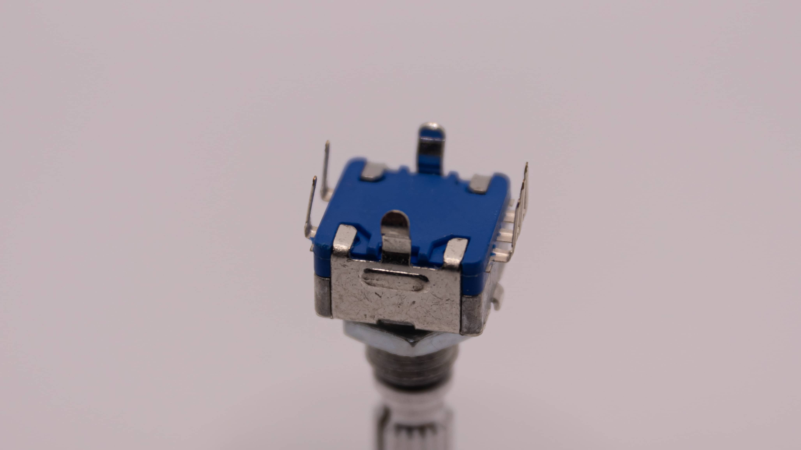
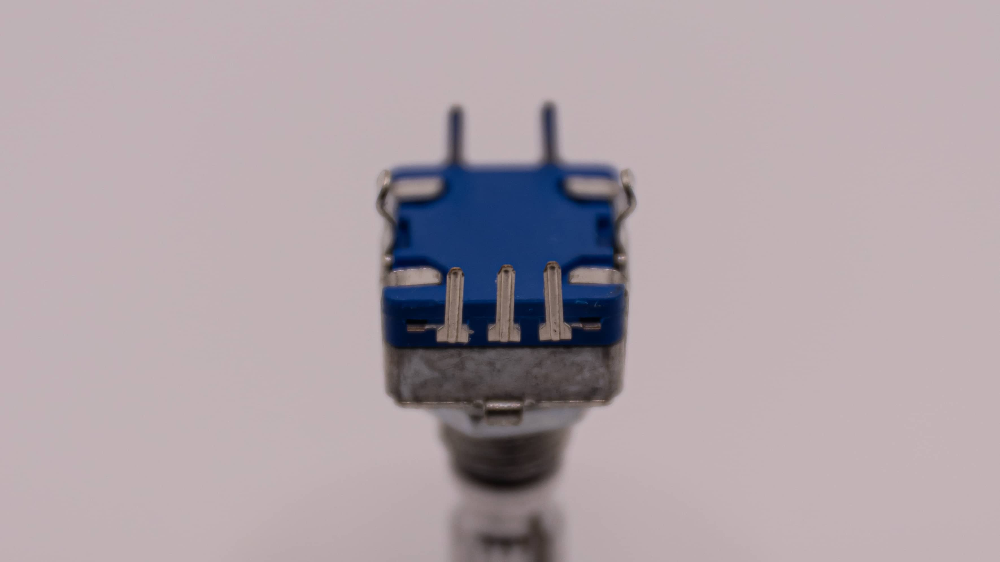
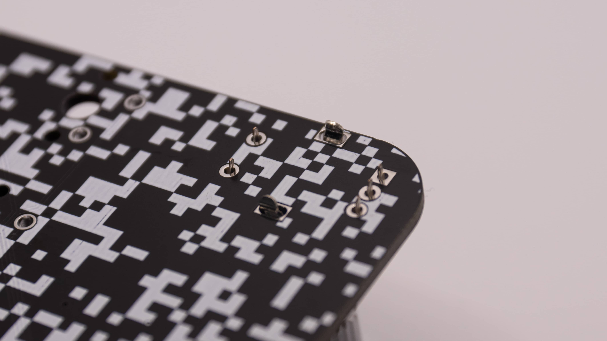
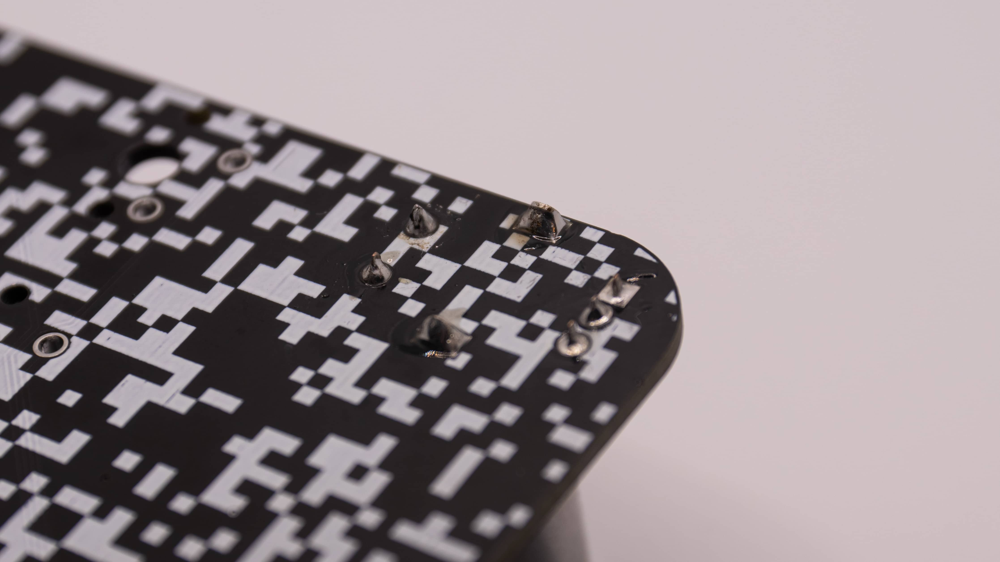
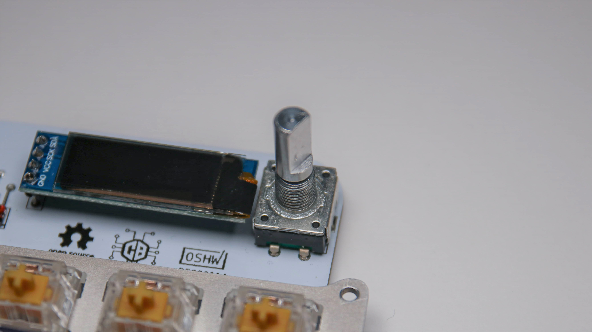

 Soldering an Encoder is just as easy as soldering your switches!

 The Encoder has two big pins on it. Those are just for holding the encoder in there. They also act as ground pins. You will have to bend those two pins outwards to get them to fit the PCB. Don't be scared to break them off, they are pretty sturdy!

 The Encoder also has two small pins on one side and three on the other. This is great, because it means you cannot put the encoder into the PCB the wrong way around!

 So go ahead and do that now. The two big pins should hold it in there good. If some pins are bend during shipping it's really not a problem. Just bend them back carefully so that they look straight again!

 You can now go ahead and solder the big pins forst and then the 5 small pins. The big pins take quite a bit of solder, so just keep feeding solder in there until you see a nice coverage of solder.

 And now you are done with your encoder!
