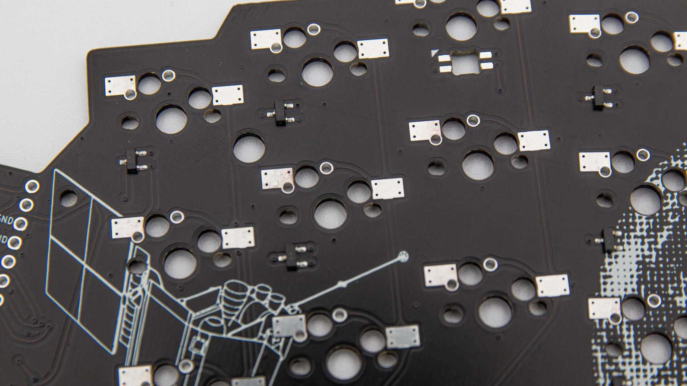
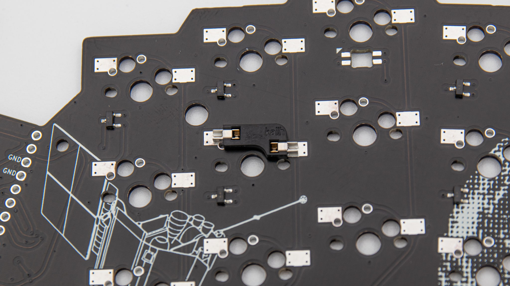
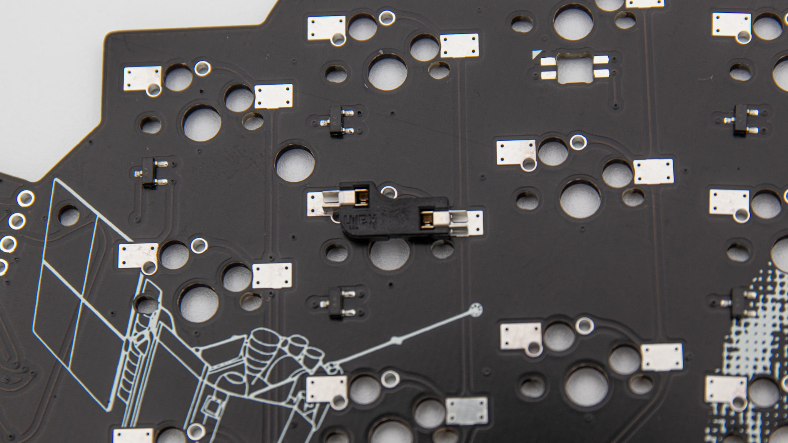
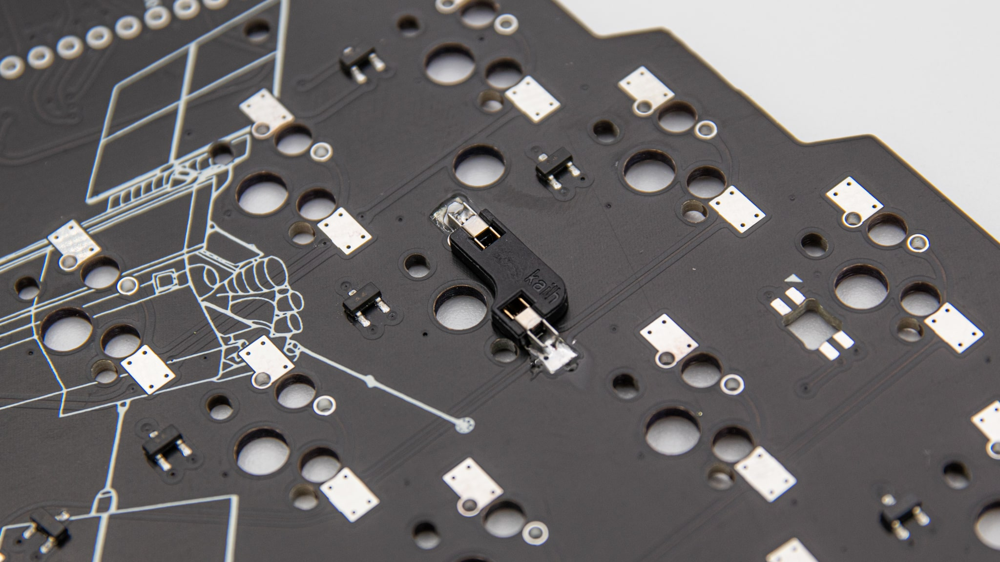
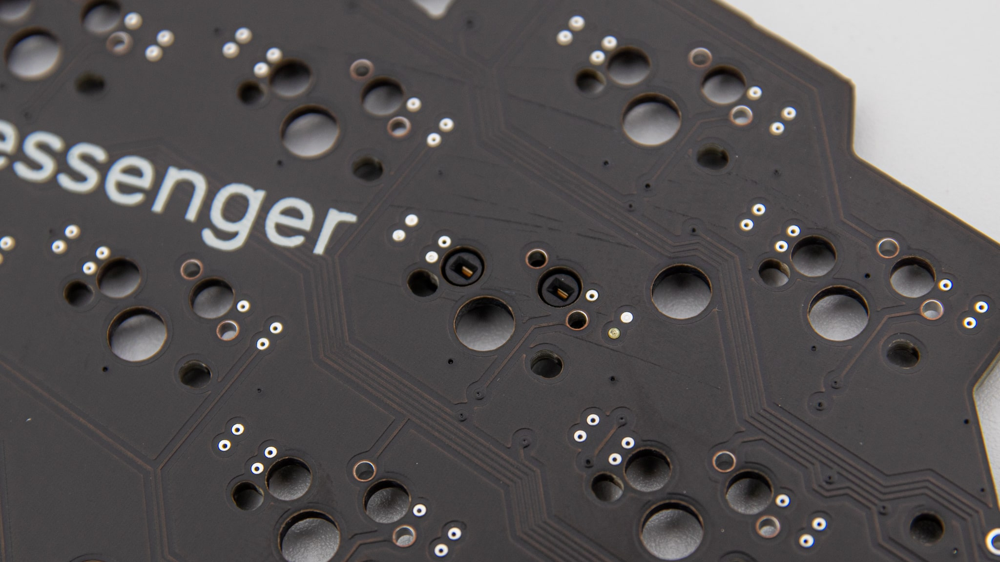
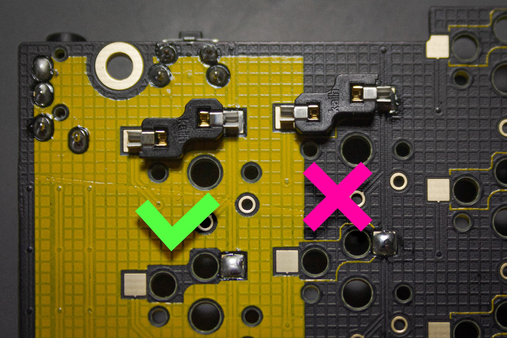

There are two types of sockets out there. MillMax sockets are nice, because you can solder them into a PCB that only supports solder switches. For Kailh style sockets, you need a special footprint or PCB that supports them.

## MillMax

 Get your bag of sockets ready and take them out. Place them all in the holes of the PCB from the top.

 Now you have to secure the sockets so that you can turn around the PCB for soldering. We always use kapton tape for that. You can also use other tapes, just make sure that they are heat resistant.

 Turn around the PCB and solder the sockets. Here it is important that the solder doesn't flow into the hole in the top. So add solder from the side until you have a decent amount. You don't need a lot here, just enough so that it holds itself.

 After you have soldered them, remove the tape and check if your sockets sit nicely in your PCB. You can also put in a switch to test the fitment.

## Kailh

Kailh style hotswap sockets need a special footprint to work. The holes where the switch pins would normally go need to be bigger, and you need special pads at the side of the switch. Here you can see a combo footprint, which you can use to make the PCB MX hotswap or (through the two smaller padded holes) choc soldered.

### MX

 When placing the hotswap sockets into the PCB it is important that you pay close attention to the orientation of the socket! Here you can see the right way around. As you can see the socket forms around the big hole in the center.

 Your socket should not look like this! This is the wrong way around. You are covering two of the switch holes.That way you will not be able to put in your switch.

 After putting in your socket, you can just add solder to the two pads at the side. You probably need to add quite a bit, because of the large area you need to fill.

 This is how the front of your PCB should look. As you can see, the socket fills out the two big holes.

### Choc low profile

Soldering choc low profile sockets is the same as MX sockets. The orientation is not reversible tho! You need to pay close attention as to putting them in the right way in.
