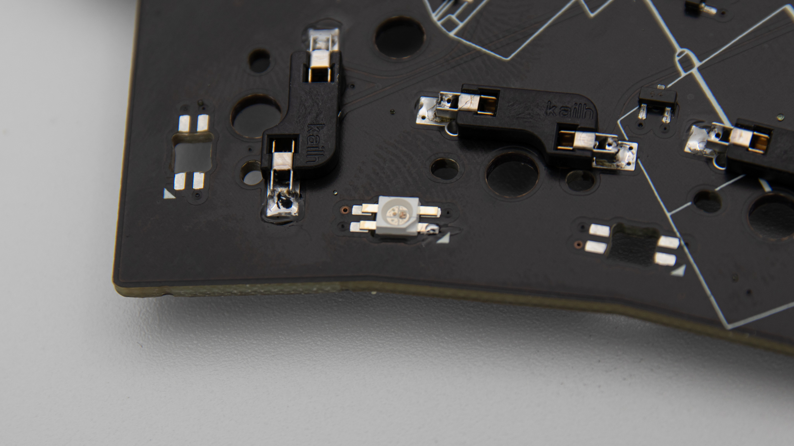

## SK6812 Mini-E

 Here's a closeup of one LED. As you can see, the Leg in the top left has a 45 degree angle. This is important for soldering it in later to get the orientation right.

 When you have your footprint in front of you, you will see that one pad has some sort of marking on it. In this case it is the triangle at the bottom right. You will have to align that triangle with your 45 degree angle from the LED. Now if you put the LED facing down like it is here(used for underglow) or facing up to get per key LED lighting is depending on the keyboard and you should check that first. Most keyboards use this type of LED for per key LED.

