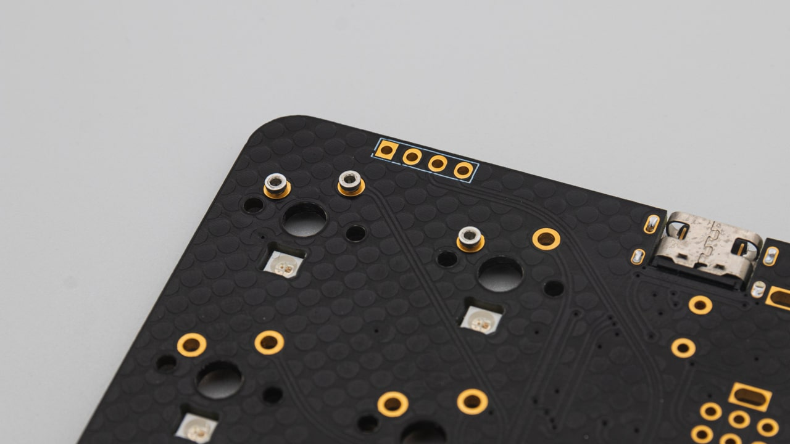

 Get your bag of sockets ready and take them out. Place them all in the holes of the PCB from the top.

 Now you have to secure the sockets so that you can turn around the PCB for soldering. We always use kapton tape for that. You can also use other tapes, just make sure that they are heat resistant.

 Turn around the PCB and solder the sockets. Here it is important that the solder doesn't flow into the hole in the top. So add solder from the side until you have a decent amount. You don't need a lot here, just enough so that it holds itself.

 After you have soldered them, remove the tape and check if your sockets sit nicely in your PCB. You can also put in a switch to test the fitment.