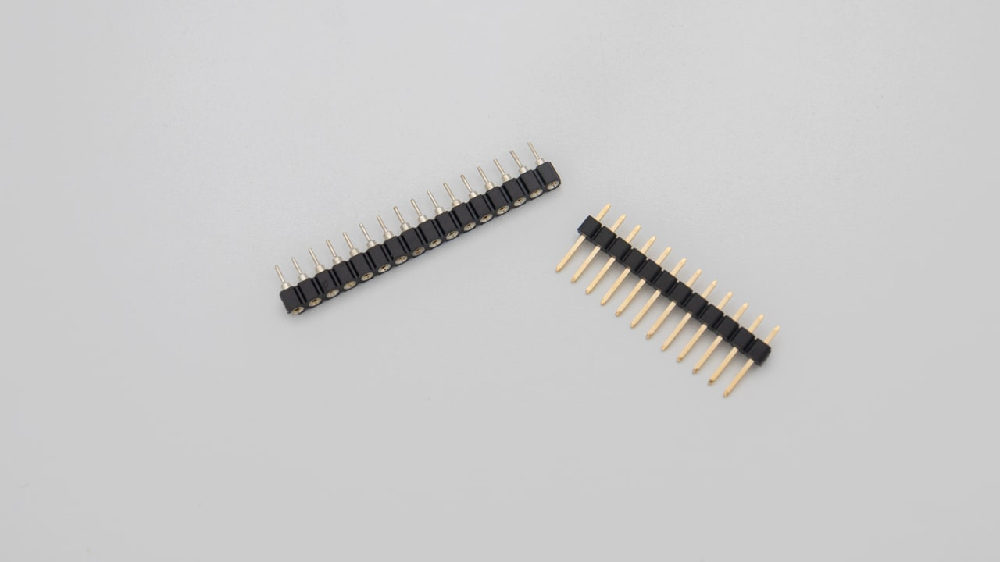
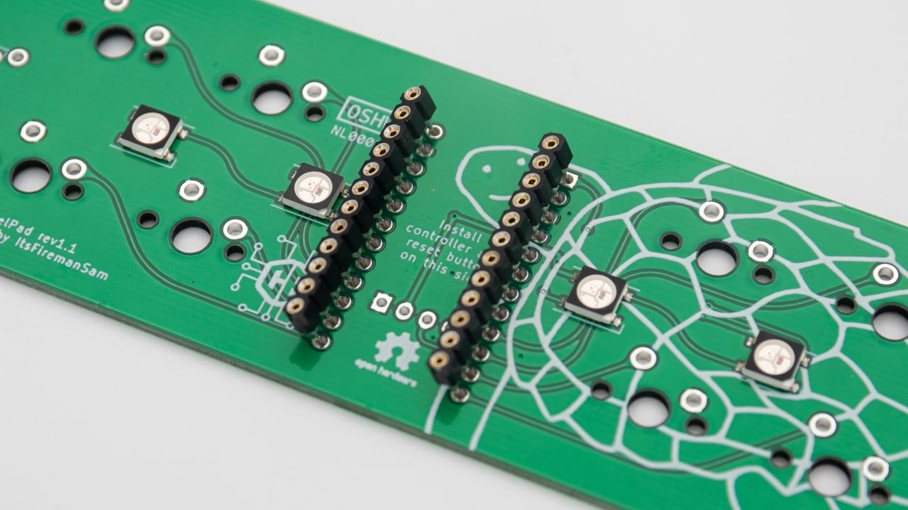
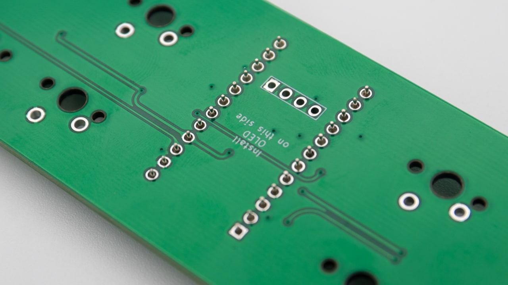
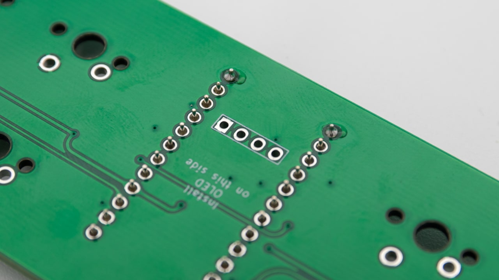
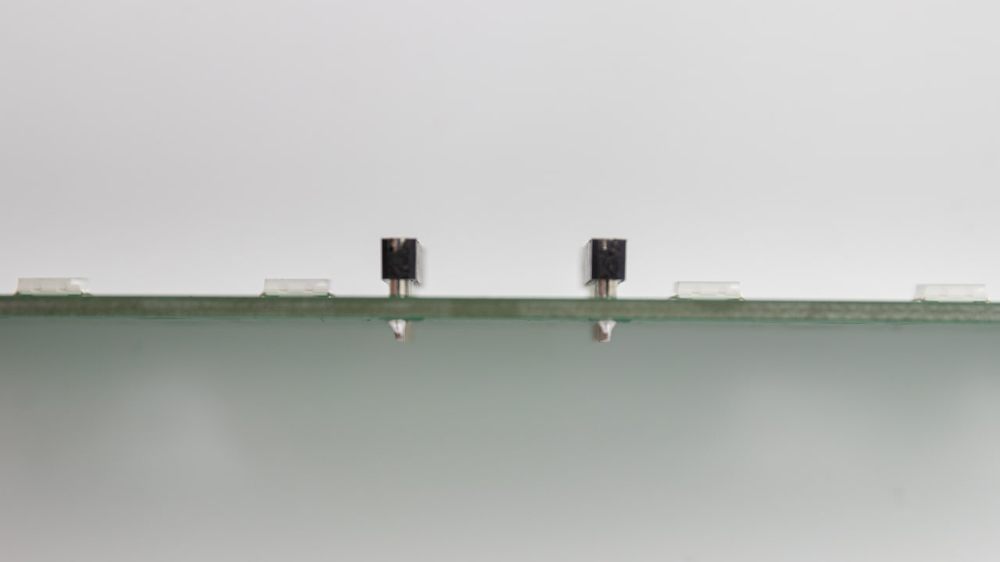
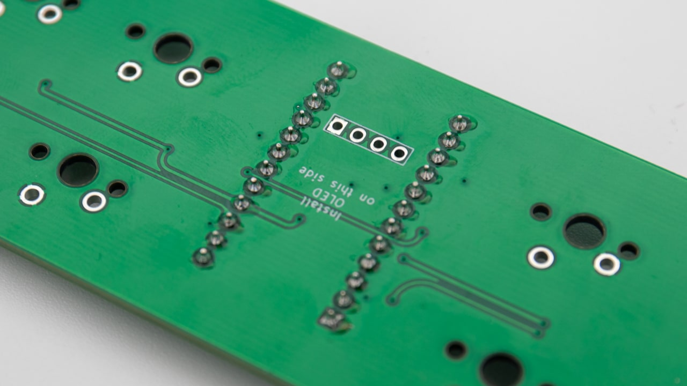

## Header Pins
You can use IC-hotswap sockets or the solder variant that most likely came with your micro controller.

 Place the header pins inside the through holes on the PCB.

 Turn around the PCB. Pay close attention to the straightness of the headers.

 First solder only one pin per header.

 Then check if they are straight and a controller can fit on them. If they are not straight, heat up the one pin and realign them.

 You can go ahead and solder the rest if they are straight.

## ProMicro

### Solder Sockets

### IC Hotswap Sockets