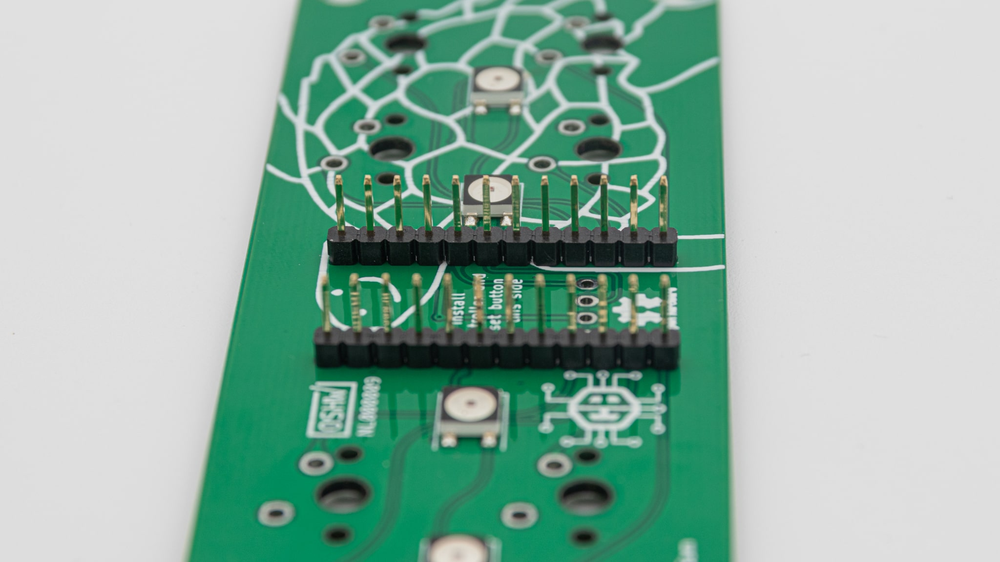
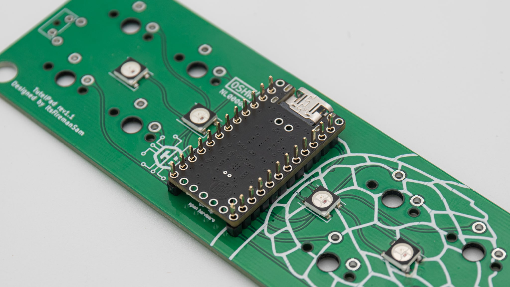
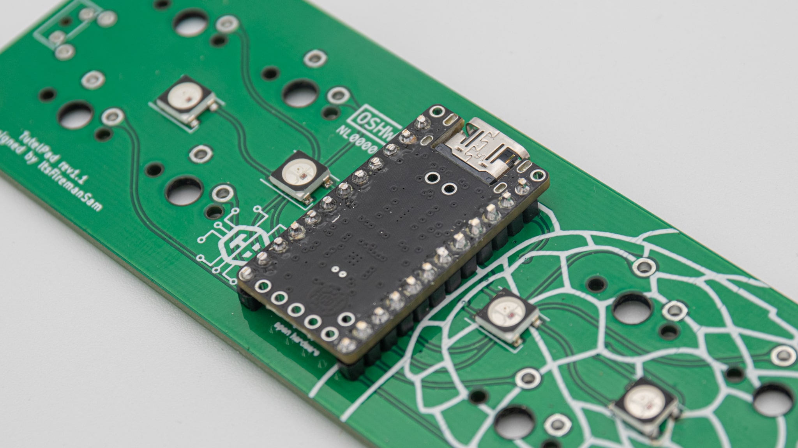
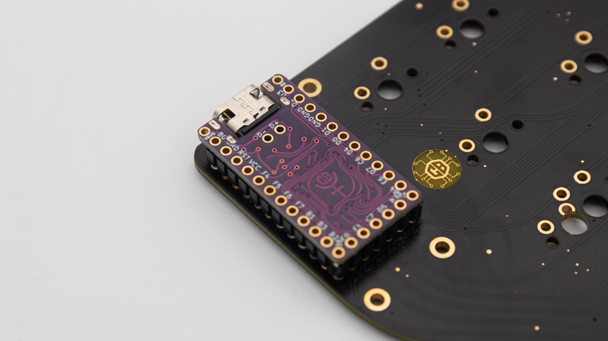
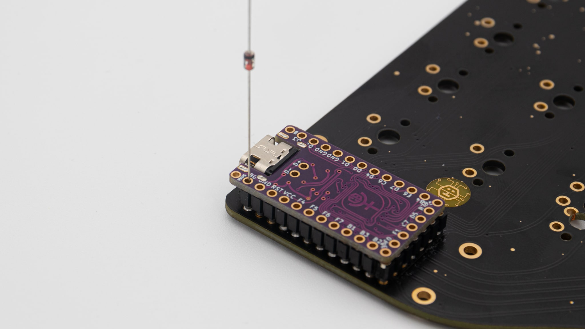
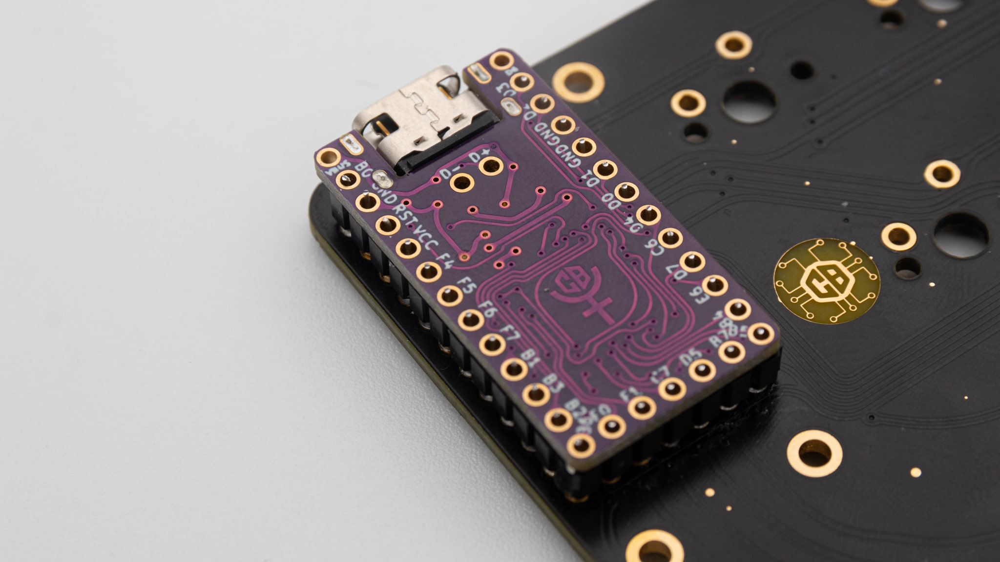
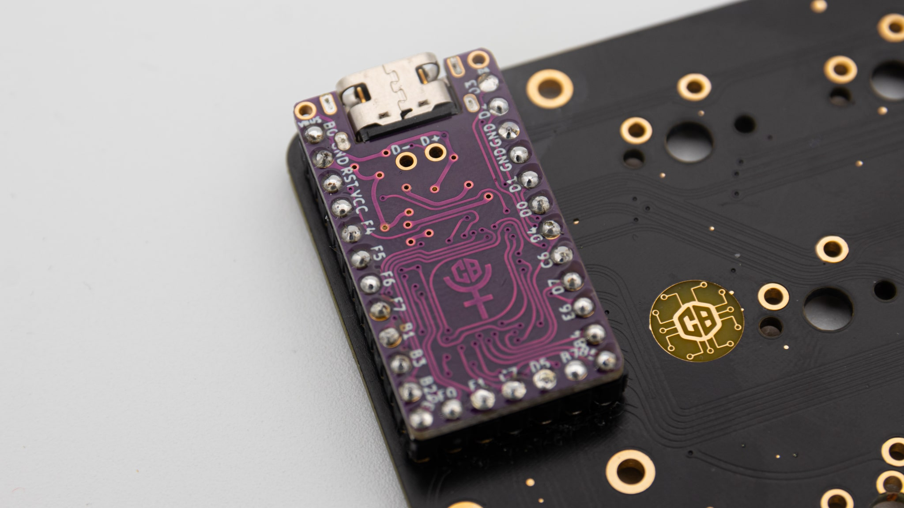
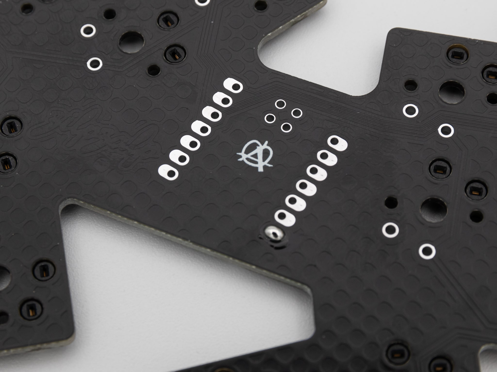
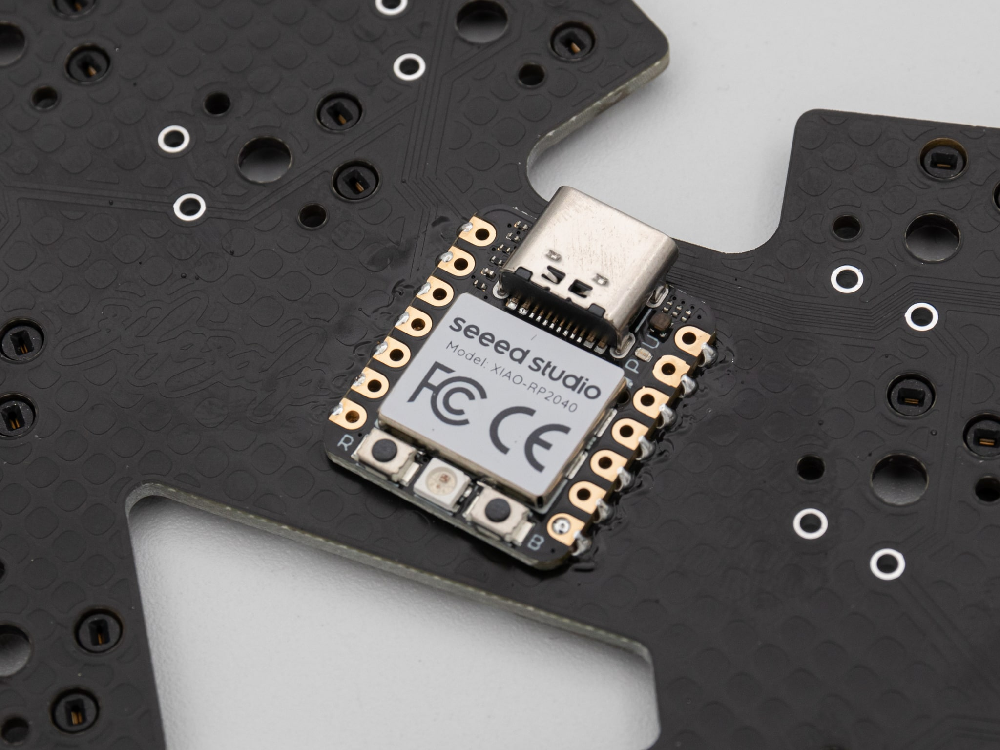

## Header Pins

For every ProMicro controller you will need header pins. So we'll start with those.

You can use IC-hotswap sockets or the solder variant that most likely came with your micro controller.

 Place the header pins inside the through holes on the PCB.

 For solder headers you need to place the short side in the PCB.

 Turn around the PCB. Pay close attention to the straightness of the headers.

 First solder only one pin per header.

 Then check if they are straight and a controller can fit on them. If they are not straight, heat up the one pin and realign them.

 You can go ahead and solder the rest if they are straight.

  Some PCBs might need a smaller header at the bottom. You can follow the same procedure here.

## ProMicro

When you have your header pins soldered, you can go ahead and solder in your controller. Depending on the header pins used, you will need to use two different techniques.

### Solder Sockets

Soldering these sockets is pretty easy and straight forward. Start by placing the controller in the pins. Be aware of the pinout and the orientation of the controller!

 After that just solder all the pins.

 You will probably want to clip of the long pins on top of the controller

### IC Hotswap Sockets

Soldering Hotswap sockets takes a bit more work. Start by just placing your controller ontop of the headers. Be aware of the pinout and the orientation of the controller!

 After that stick a diode leg into one of the holes of the controller. You can also use [these](https://www.mouser.de/ProductDetail/575-3320000150000030) MillMax pins that.

 Clip off that diode flush with the top of the controller.

 Repeat that for all of the pins that you need.

 Now add solder to all of the pins. Be careful to not add too much solder so that it doesn't come out of the other side.

### PCB mount

You can solder some controllers directly to the PCB. Take a look if your controller has castellated holes at the sides. This makes it easy to mount it directly to the PCB. Your controller also needs to have a USB port that is not sticking out of the bottom, so that the controller can lay flat on the PCB.

 Start by adding a good amount of solder to one pad of the footprint. On this picture you can see a footprint that is specially designed for PCB mounting. The pads are larger and stick out of the sides of the controller.

 After that slide the controller onto the pad while heating up the solder with your soldering iron. If the controller does not sit straight afterwords, you can always heat up the solder again and align it.

 Once you are happy with the alignement of your controller, you can solder all the other pads.
