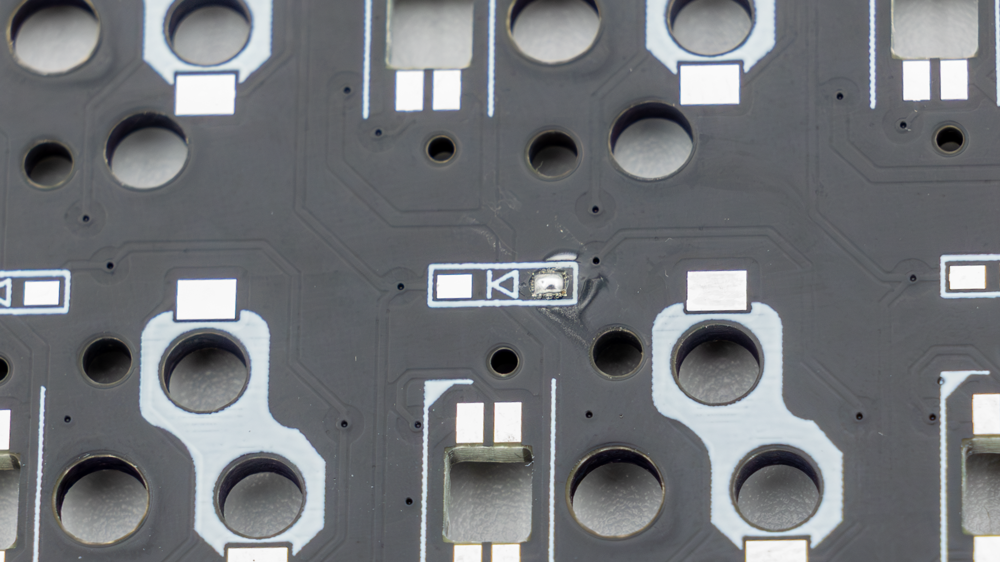
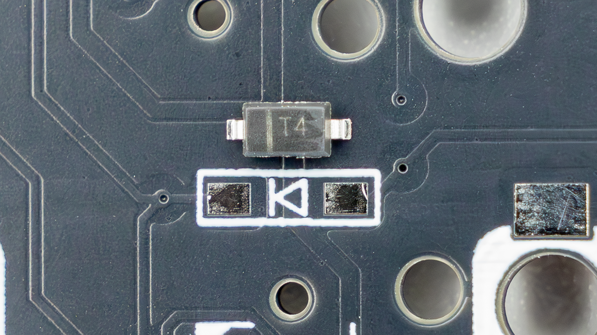
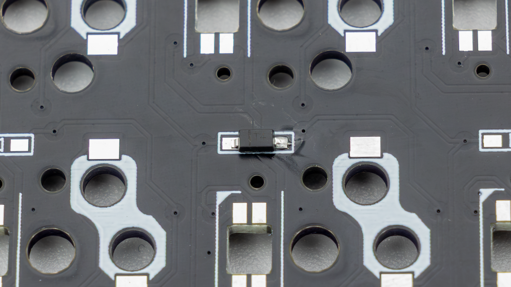
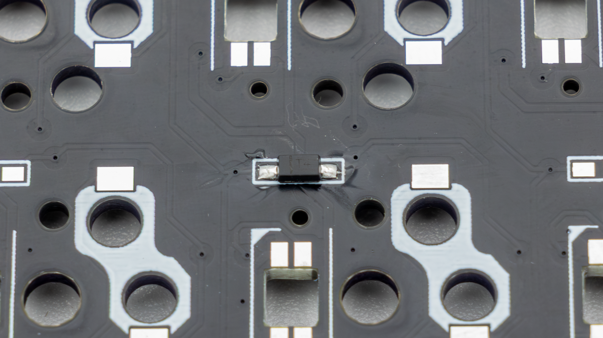
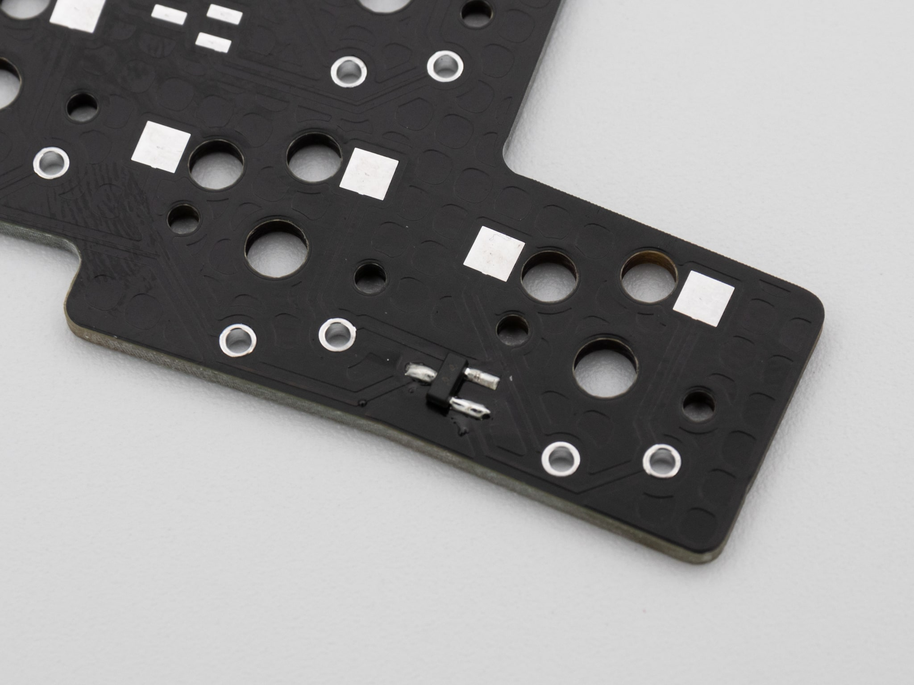

## Diodes

Here we will show you how to solder small diodes. There are single and double diodes which are being used in keyboards.

### Single Diodes

Start by adding solder to one of the pads.

 With single diodes it is important to get the orientation right. Please align the line on the Diode with the marking on the PCB.

 Then just add your component to the pad and heat up the solder again to fix it in place.

 After that just add solder to the remaining leg.

### Double Diodes

With double diodes you cannot really orient them wrong. They should align with the pads. Start by adding solder to one of the pads.

 Then just add your component to the pad and heat up the solder again to fix it in place.

 After that just add solder to the remaining legs.

