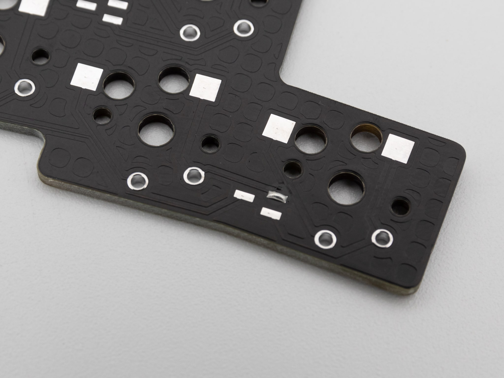
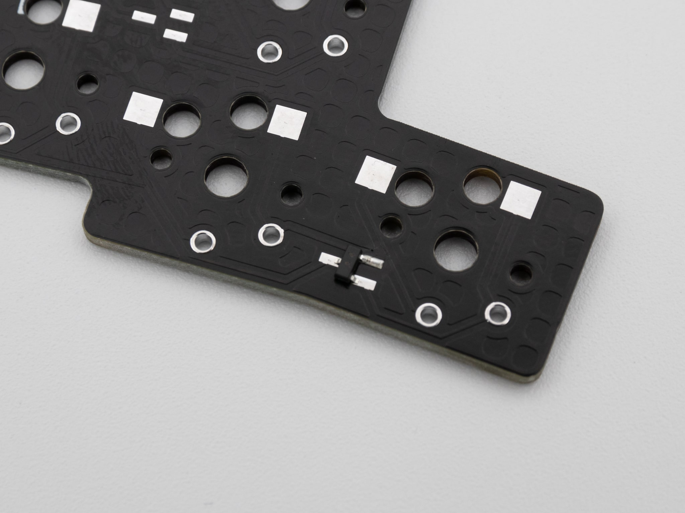

## Diodes

Here we will show you how to solder small diodes. In this example we will use a normal double diode.

Start by adding solder to one of the pads

 Then just add your component to the pad and heat up the solder again to fix it in place.

 After that just add solder to the remaining legs.
