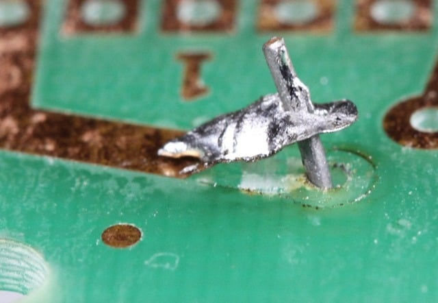
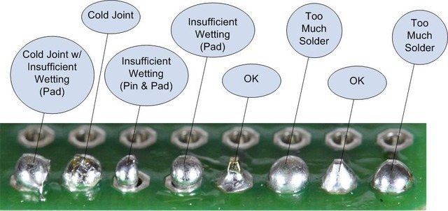
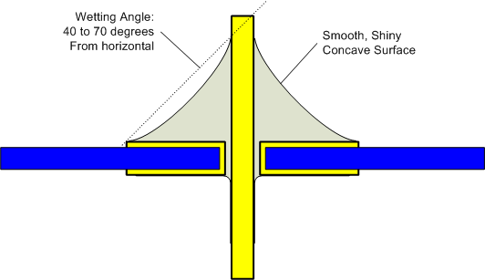

If you are completly new to soldering you might also like this [awesome guide by adafruit](https://learn.adafruit.com/adafruit-guide-excellent-soldering).

## Safety first

- wear eye protection when soldering
  - flux sometimes sputters and you don't want 350°C acid in you eye.
  - When using flush cutters the waste is nearly accelerated to earth escape velocity
    
- extract the solderfume (its really, really bad for your health)
- use lead free solder (lead...)

## It's easier with the right tools

Try to avoid cheap solder and flux as most of the time they will make your life harder.

Use some fine tipped soldering iron and not a gutter soldering iron



Flushcutters are dope!

## Use the right temperature

You might be inclined to set your soldering iron way too hot to avoid cold joints and make it easier to solder bigger joints, but don't overdo it, as you can easily damage the PCB with too much heat.

## Flux, Flux, and more Flux

Flux is your friend!

It allows the solder to flow nicely and removes+prevents oxidation at the joint.

## Use the right amount of solder

If you don't use enough solder it's hard to verify if your joint made a good connection. Likewise, is you use too much it's hard to verify that the solder has flown into the pad.

