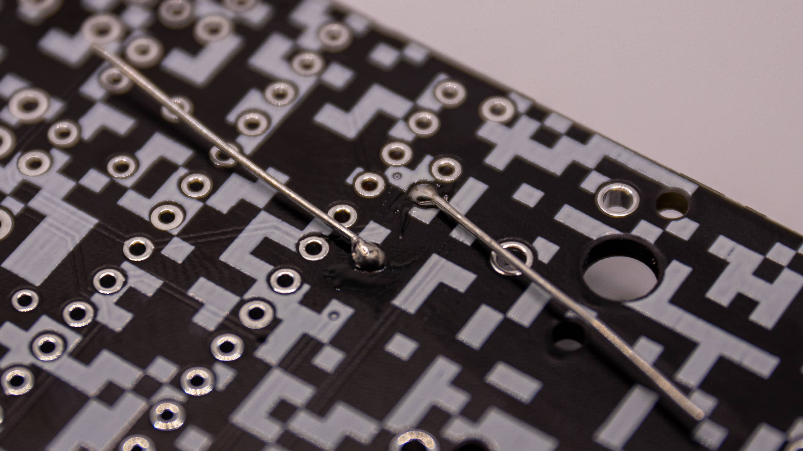

 For most through hole components you have to bend the legs first! Just look at the distance the holes on the pcb are apart and bend the components accordingly by hand.
This of course doesn't apply to all of the parts. Just take a good look at each part and see if you can fit it in without bending the legs. If so, just put them in there! If not, go ahead and bend the legs accordingly.

 Then you can just go ahead and place the component at the right spot on the PCB.

 Now flip the PCB over. It is important to note that ALL soldering will take place on the bottom of the PCB! Now bend the legs of the component to hold it in place so you can solder it easily.

 Now add a bit of solder to each solder joint of the component! If you think you added too little just add a little more. Through Hole components are really forgiving with solder. Just make sure no two solder joints are touching!

 When you are happy with your solder joints, go ahead and clip the legs off with your flush cutters.

 You are now done with your first soldered through hole component. Great job! You can repeat those steps for all basic components like the resistors, capacitors and diodes!