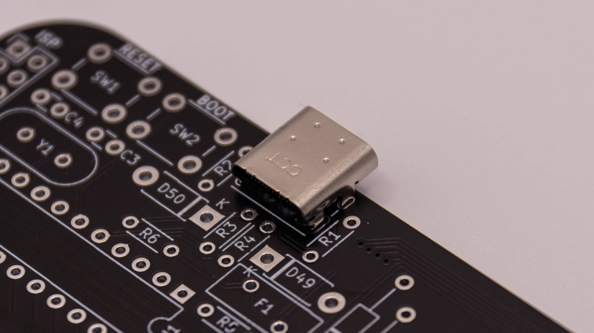
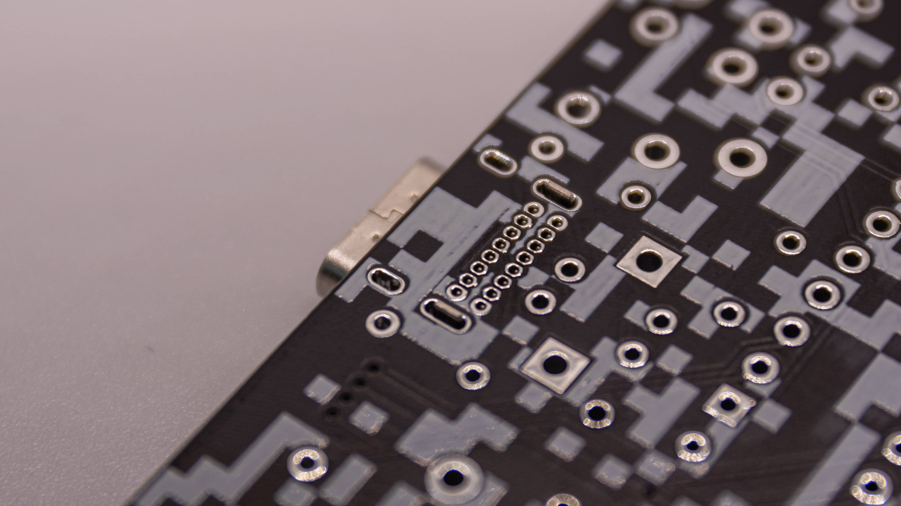
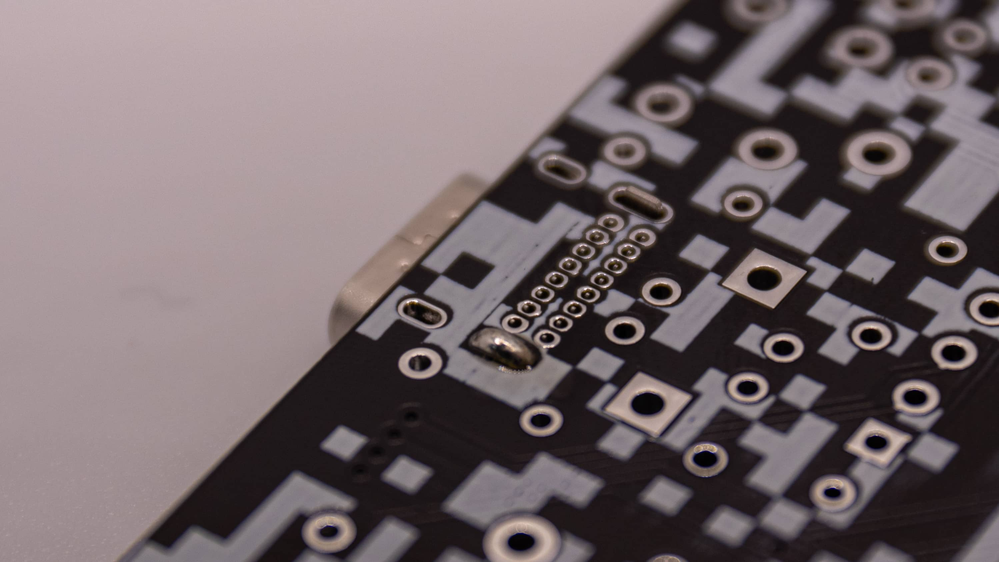
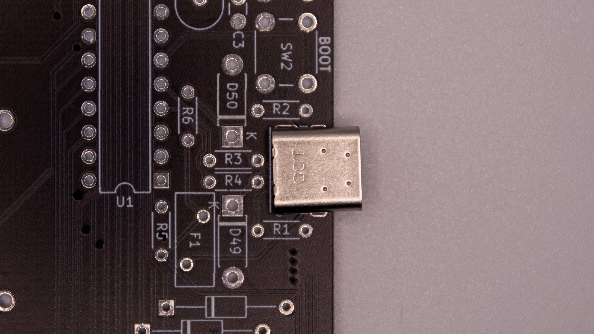
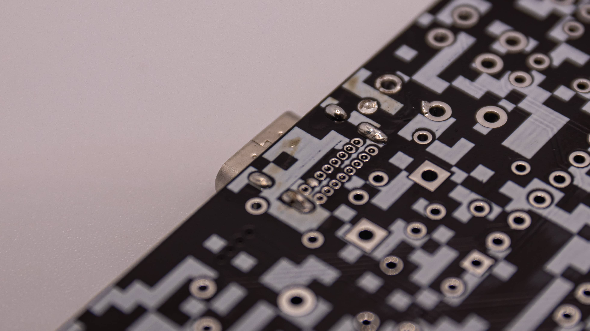
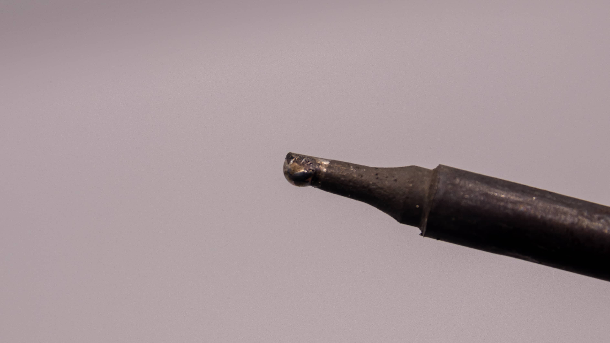
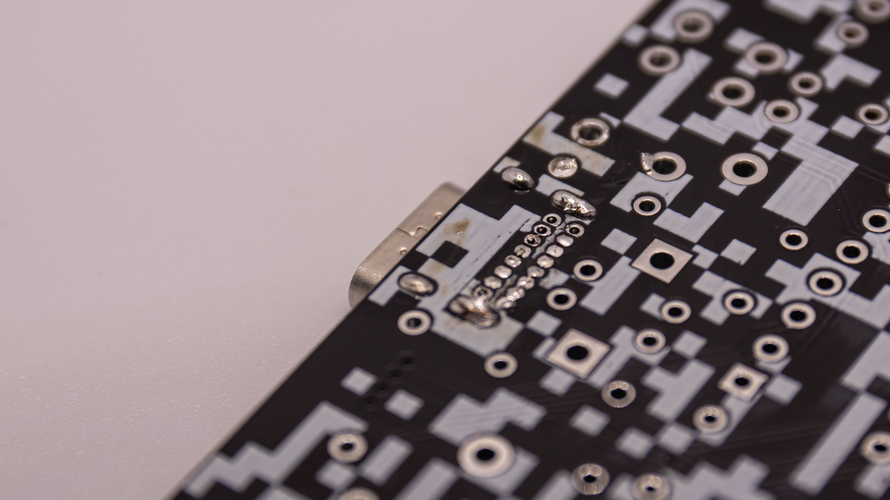
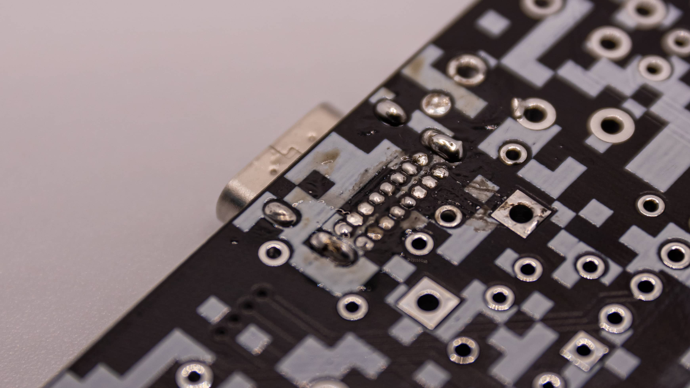
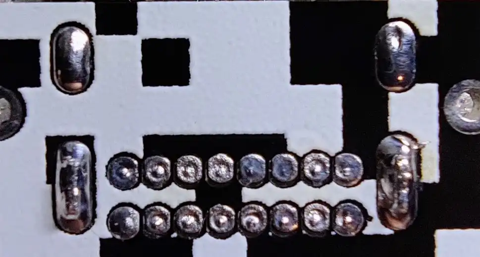

Soldering the USB Port is always the most challenging part of any build! We recommend starting your keyboard soldering with this, because it is easiest when no other component is in the PCB.

 Start by placing the USB Port in the PCB on the side, that has all the printing for the components on it. It should go in super easy. If you need to use any kind of force you are doing it wrong! Just let it slide in there.

 Now flip the board around and take a good look at the USB Port. Does it sit good in there? Are all pins looking good? You can see if the port wiggles a bit. That usually means that it sits good in there!

 Now you can add solder to one of the big pins of the USB port. Please be patient and really only do one! ;) Just hold the soldering iron on the pin for a while and then slowly add solder. If all goes well it should flow into the hole around the pin and you should be able to see a bit of solder on the other side.

 Now look at the top of the USB port if it sits straight in there. If it is not straight (Like on the pic at the bottom) you can go ahead and put the soldering iron on the joint and heat it up again. Now grab a pair of tweezers and position the USB port so that it sits straight. Don't touch it with your hands! The whole housing will get hot!

 After that you can go ahead and solder the other three big pins of the USB port. Those should go the same as the first one. Just let your soldering iron rest on the joint a bit, add solder to it and let it flow into the holes around the pins.

 If you have extra flux add that to the little pins of the USB port now! Also go ahead and add a little bit of solder to your soldering iron now. You will use it in the next step.

 Take your soldering iron and rub it over the little pins. The solder should flow nicely into the cavities. If it doesn't, add some more flux and try to direct the solder onto the pins.

 If you didn't add enough just go over the pins again with a bit of new solder. But be careful! Here it is crucial to not add a lot of solder!

 Here is a close up of an USB port. It should look like this. No pin is touching another one. If there are pins toughing each other go over there again with the soldering iron and kind of wipe the solder off of there. Before that it's also great if you have a brass sponge to clean your tip of the soldering iron!
