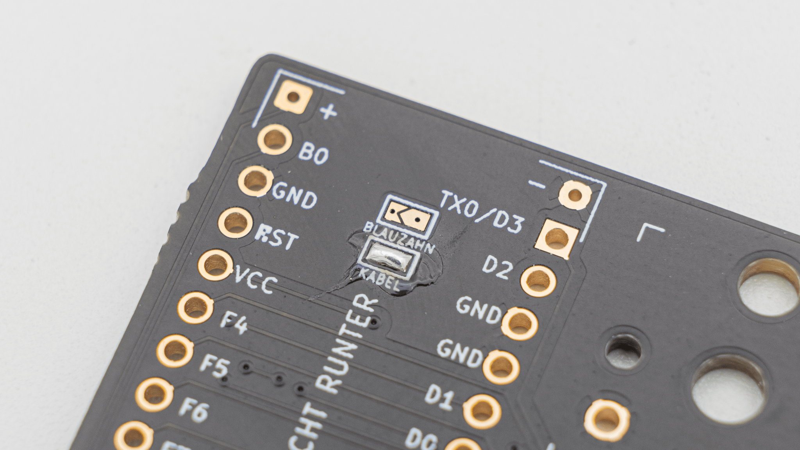
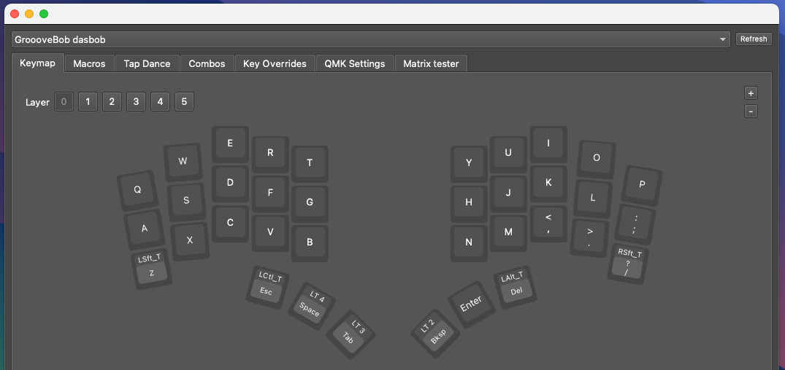
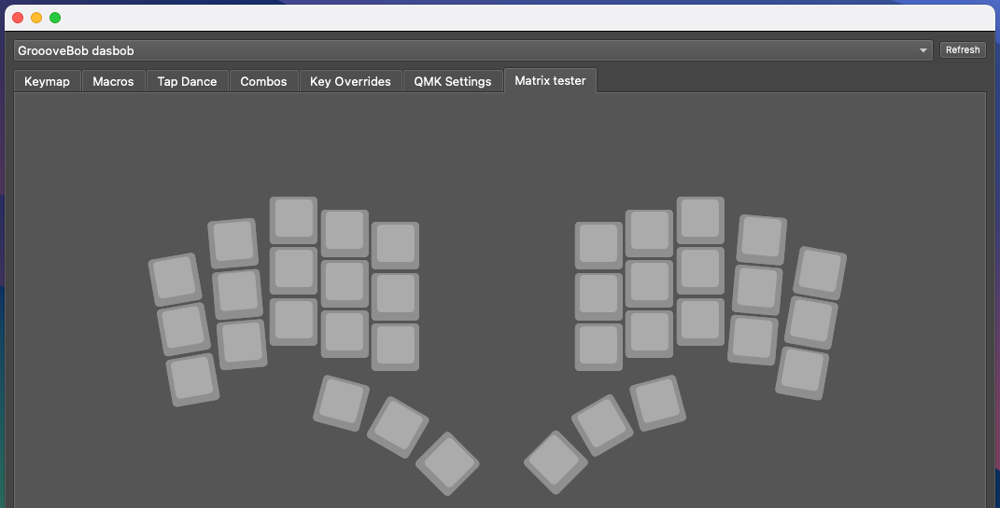
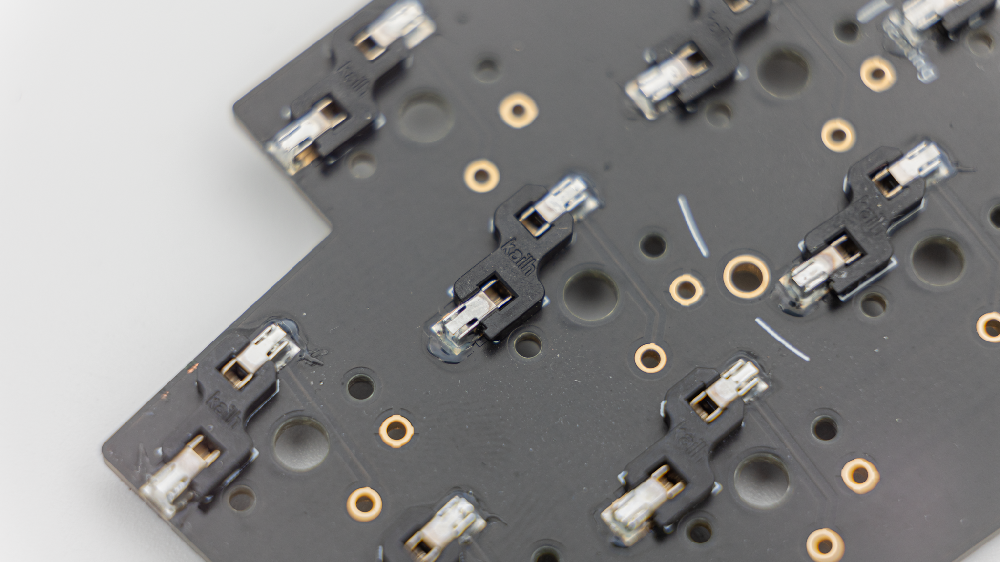
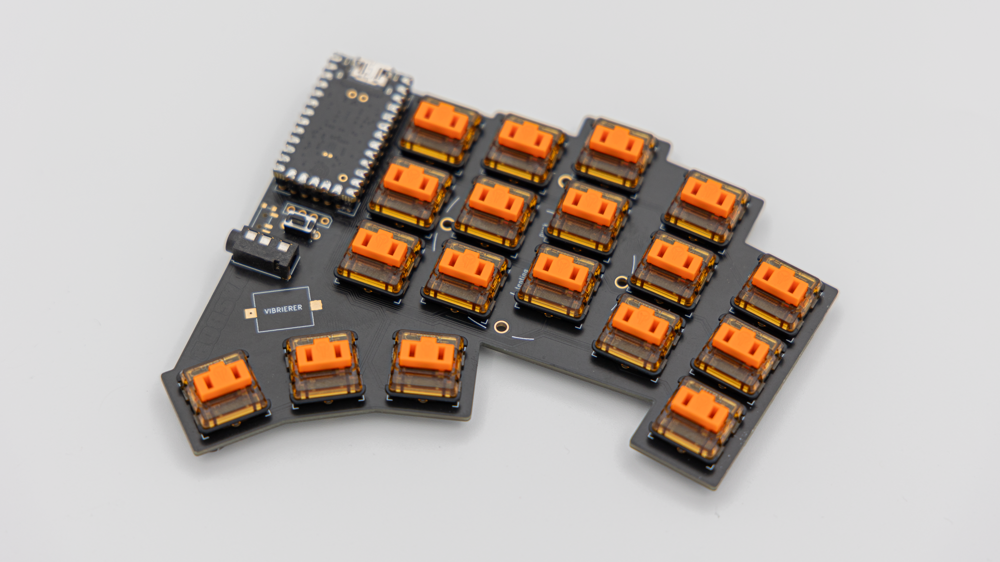
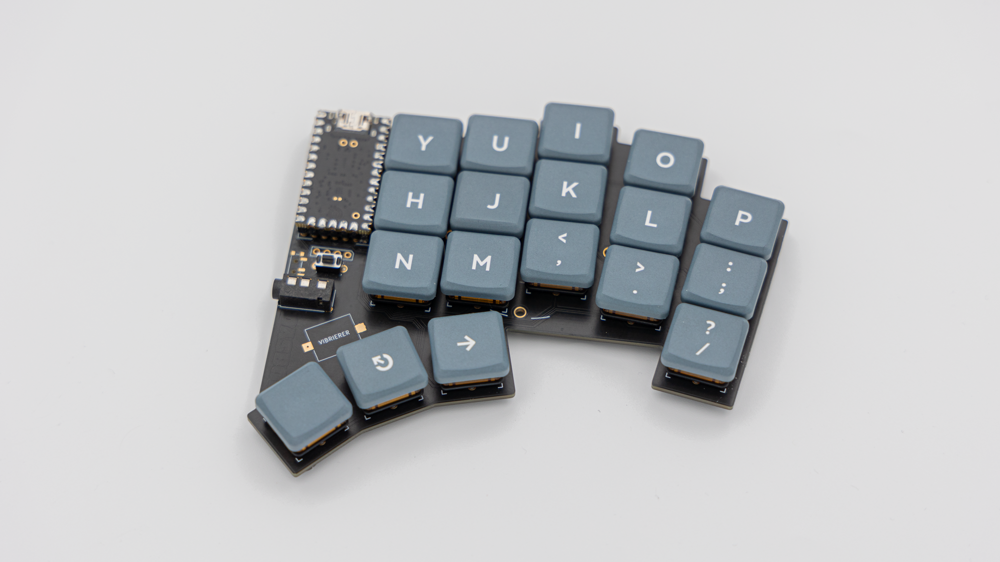
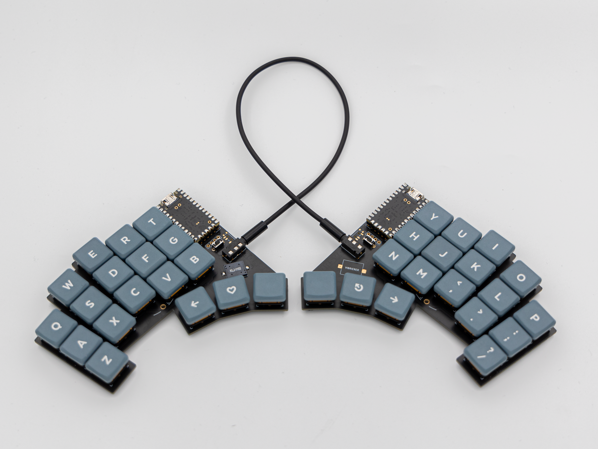

## Soldering

There are a few things you absolutely need to solder and a few which are optional. If you do not have experience with soldering, please refer to this [Quick Start guide]().

### Required

All of the steps below need to be done on the right and left half of the board.



#### Reset Buttons

Solder on the reset buttons.

#### TRRS Jacks

Solder on the TRRS Jacks.

#### Jumper

There is a jumper located below the controller. You will have to solder the wired or bluetooth jumper depending if you use a wired or wireless microcontroller.

#### Controller

Before soldering the controllers onto the PCB we should get your controller flashed.

 You can find the firmware <a href="https://files.keeb.supply/firmware/DASBOB/" >here<a>. And instructions on how to flash a controller [here](). 

  Plug in your controller now and see if it pops up in [VIAL]().

If it does you have successfully flashed your controller.

 If your controller is working, you can solder it in. Instructions on how to do that can be found [here](). When you have the PCB in front of you, the USB port should go to the top of the PCB. You should not see the components of the micro controller, when it is sitting in the PCB.


 When you have your controller soldered in, it is good practice to do a [matrix test](). Since DASBOB is a split keyboard, you need to plug in the two halves together using the TRRS Cable.


### Optional

#### HotSwap Sockets

You can solder in HotSwap Sockets. You can find instructions for that [here]().


#### Buzzer

The PCB also supports a buzzer. You can find information on speakers [here](). The speaker is located underneath the controllers. There are two buzzer footprints, but only one buzzer will work at a time.


 This is everything you need to solder for now!

## Final Assembly

Start by putting on the rubber feet. We provide 4 feet per side which you can place wherever you want.

 After that push or solder in the switches.

 As a last step put on your keycaps.

 And your DASBOB keyboard is done!

