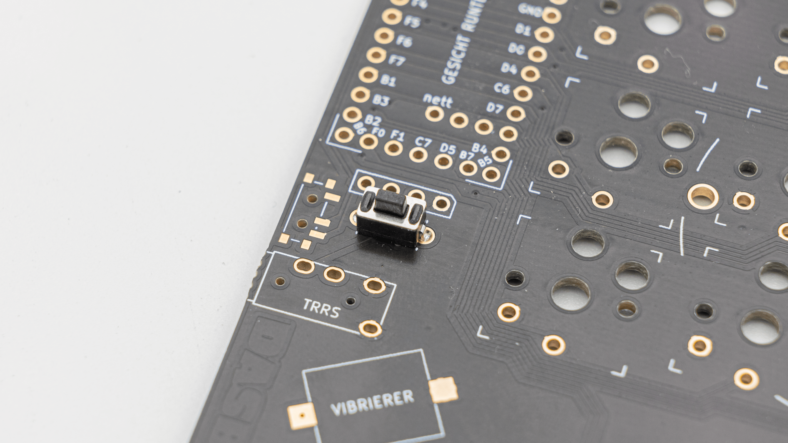
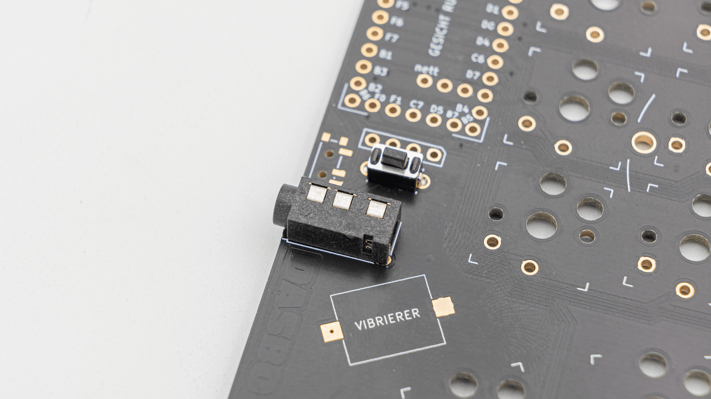
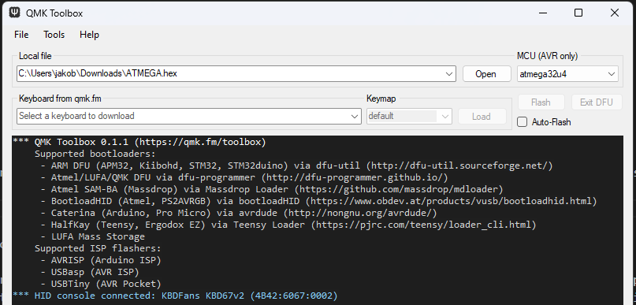
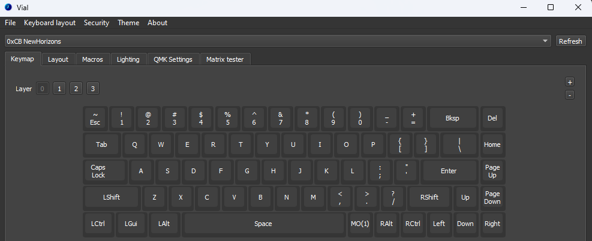
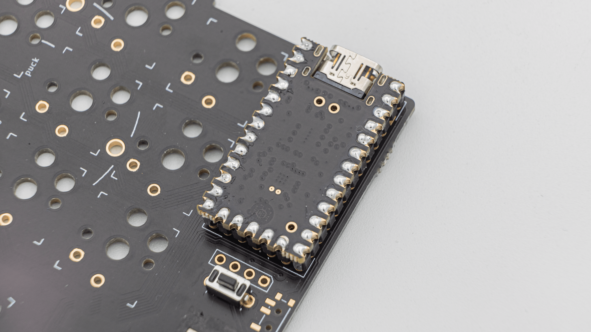
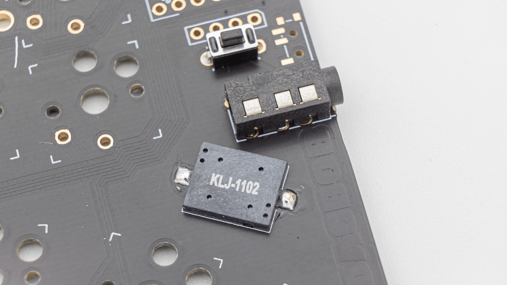

## Soldering

There are a few things you absolutely need to solder and a few which are optional. If you do not have experience with soldering, please referr to this [Quick Start guide]().

### Required

All of the steps below need to be done on the right and left half of the board.



#### Reset Buttons

Solder on the reset buttons.

#### TRRS Jacks

Solder on the TRRS Jacks.

#### Controller

Before soldering the controllers onto the PCB we should get your controller ready.

 You have to flash the controller. You can find the firmware <a href="https://files.keeb.supply/firmware/dasbob/" >here<a>. And instructions on how to flash a controller [here](). 

  Plug in your controller now and see if it pops up in [VIAL]().

 If it does you have successfully flashed your controller and can move on.

Please solder in the headers for the controller. You can find instructions for that [here]().

 If your controller is working, you can solder it in. Instructions on how to do that can be found [here](). When you have the PCB in front of you, the USB port should go to the top of the PCB. You should not see the components of the micro controller, when it is sitting in the PCB.

 When you have your controller soldered in, it is good practice to do a [matrix test](). Since DASBOB is a split keyboard, you need to plug in the two halves together using the TRRS Cable.


 You also need to solder in switches, but we will go over those once we get to the point later in the assembly process.

### Optional

#### HotSwap Sockets

You can solder in HotSwap Sockets. You can find instructions for that [here]().

#### Buzzer

 The PCB also supports a buzzer. You can find information on speakers [here](). The speaker is located underneath the controllers. There are two buzzer footprints, but only one buzzer will work at a time.

 This is everything you need to solder for now!
