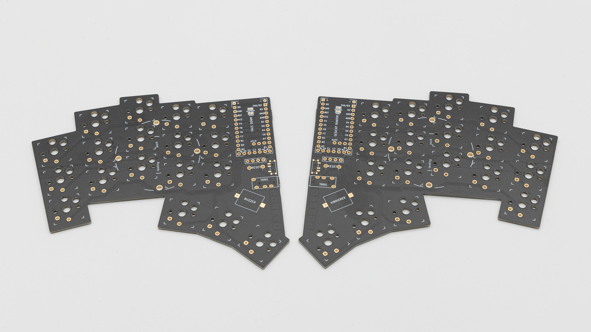
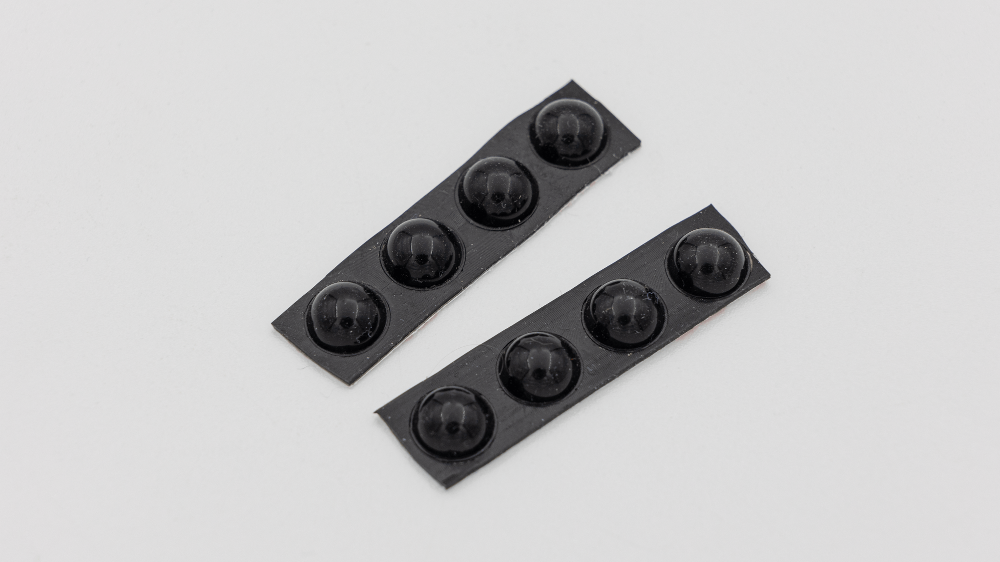
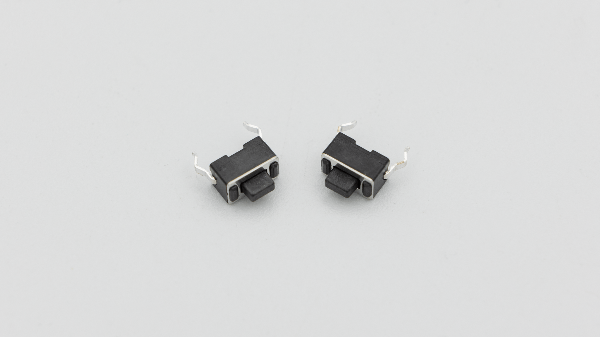
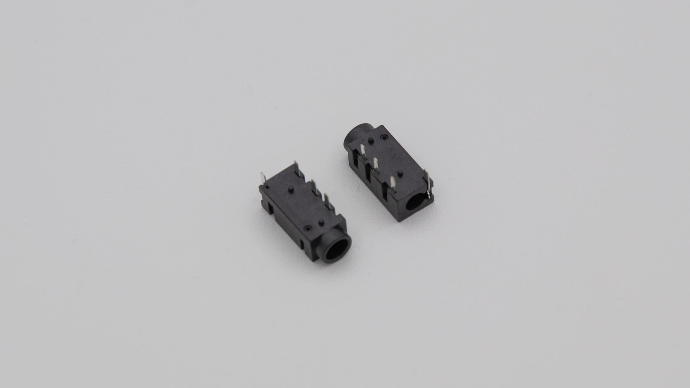
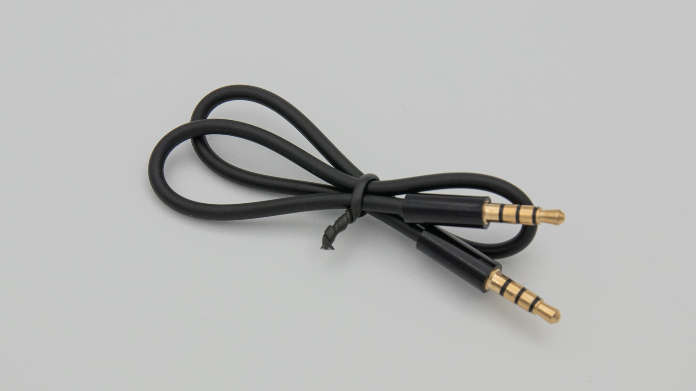
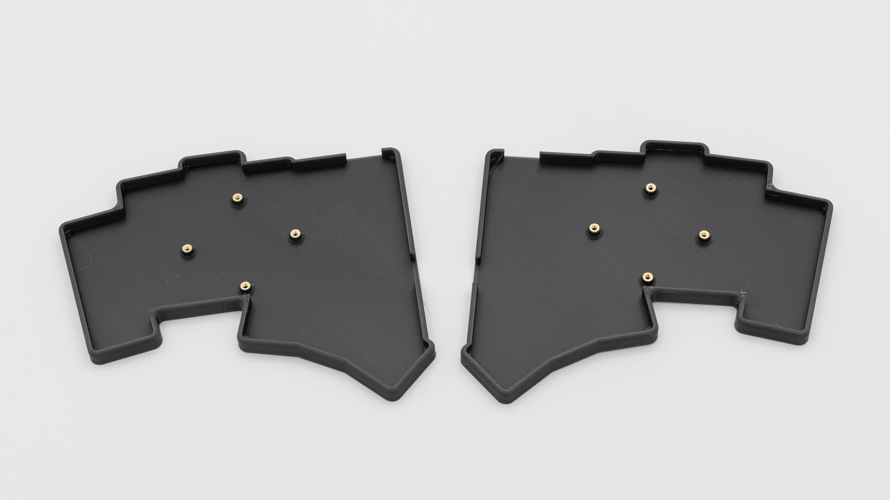

## Kit

| Image                      | Description   | Quantity |
| -------------------------- | ------------- | -------- |
|                            |
|             | PCB           | 2        |
|    | Rubber Feet   | 8        |
|  | Reset Buttons | 2        |
|      | TRRS jack     | 2        |
|    | TRRS cable    | 1        |

## Case

These components are only included, if you buy the case together with the kit.
| Image | Description | Quantity |
| ----------- | ------------------------------------------- | -------- |
| |
|  | 3DP-Case with heat set inserts preinstalled | 2 |
|  | Screws | 8 |
