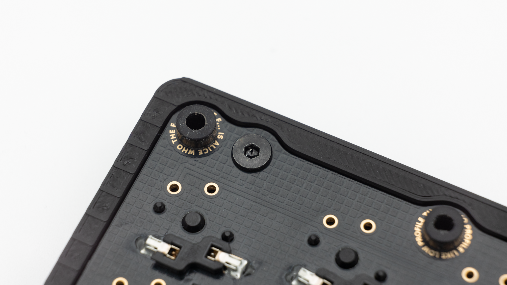

## Soldering

There are a few things you absolutely need to solder and a few which are optional. If you do not have experience with soldering, please refer to this [quick start guide]().

### Required

#### Diodes

Start with soldering all of the diodes in. If you have not soldered diodes before, you can find instructions [here]().


#### Controller

If you have bought the kit through KeebSupply, you will receive one 0xCB Gemini controller which is preflashed with the default <a href="https://files.keeb.supply/firmware/ENDGAME/" >firmware<a>.

 You can now solder it in. Instructions on how to do that can be found [here](). When you have the PCB in front of you, the USB port should sit in the cutout and the side without the USB port should be on the same side as the HotSwap sockets.

 When you have your controller soldered in, it is good practice to do a [matrix test]() in VIAL. Use tweezers or other metallic objects for this and short the pads of each key.

If all of the keys are working properly, you can go ahead and continue with the assembly!

### Optional

#### HotSwap Sockets

You can solder in HotSwap Sockets. You can find instructions for that [here]().


#### Buzzer

The PCB also supports a buzzer. You can find information on speakers [here]().

 This is everything you need to solder for now!

## Final Assembly

Start by inserting the rubber grommets into the PCB holes that have text around them. The longer end goes onto the side that also has all of the components like the hotswap sockets on there.

 After that push or solder in the switches.

 Then put on your keycaps.

 If you have decided to get the 3D printed case, place the board into the case from the bottom and screw in the 4 screws through the remaining holes.

 After that your Endgame is done!

