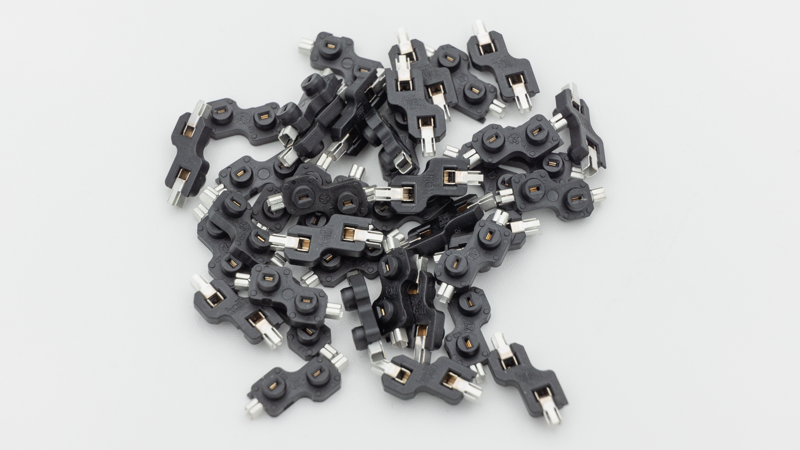

## Kit

| Image                            | Description            | Quantity |
| -------------------------------- | ---------------------- | -------- |
|                                  |
|                   | PCB                    | 1        |
|  | Rubber Grommets        | 12       |
|             | 0xCB Gemini Controller | 1        |
|     | HotSwap Sockets        | 40       |
|             | Diodes                 | 40       |

## Case

These components are only included if you buy the case.
| Image | Description | Quantity |
| ----------- | ------------------------------------------- | -------- |
| |
|  | 3DP-Case with heat set inserts preinstalled | 1 |
|  | Screws | 4 |
