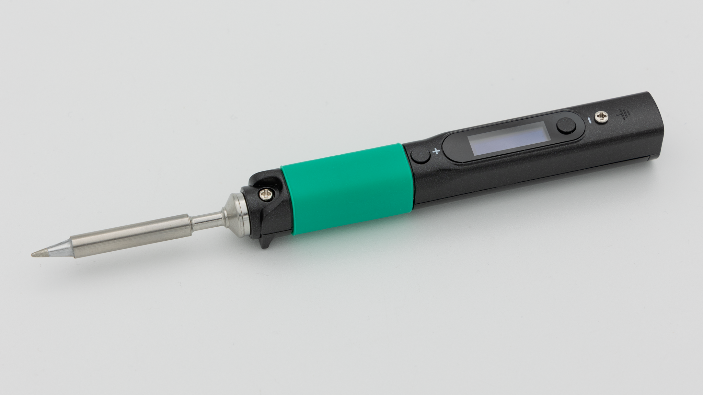
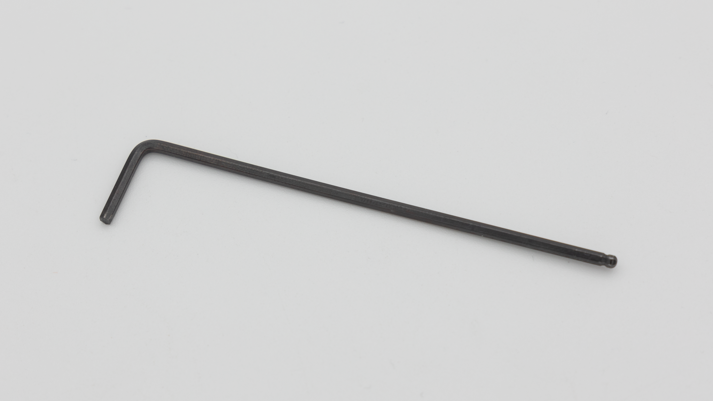

| Image                                 | Part           | Description                                                                                                           |
| ------------------------------------- | -------------- | --------------------------------------------------------------------------------------------------------------------- |
|                                       |                |                                                                                                                       |
|  | soldering iron | We recommend a good soldering iron!                                                                                   |
|                    | Allen key 2mm  | You need an allen key to screw the screws into the 3d printed case.                                                   |
|                 | solder         | Please use high quality solder (flux core or apply flux externally) to make your life easier when soldering this kit! |
