## Soldering



### HotSwap-Sockets

Solder on the hotswap sockets. You can find instructions for that [here]().
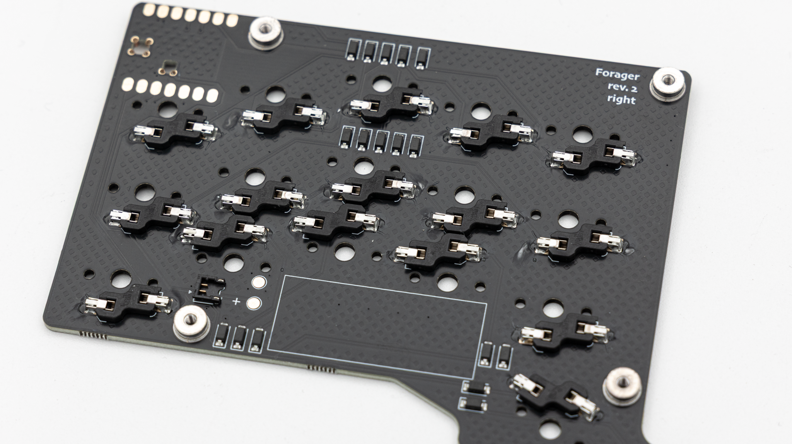

### Microcontroller



 After that you just have to solder on your controller. You can lay the Seeed XIAO directly onto the PCB and solder it on there. You can find instructions on how to solder a controller directly onto the PCB [here]().


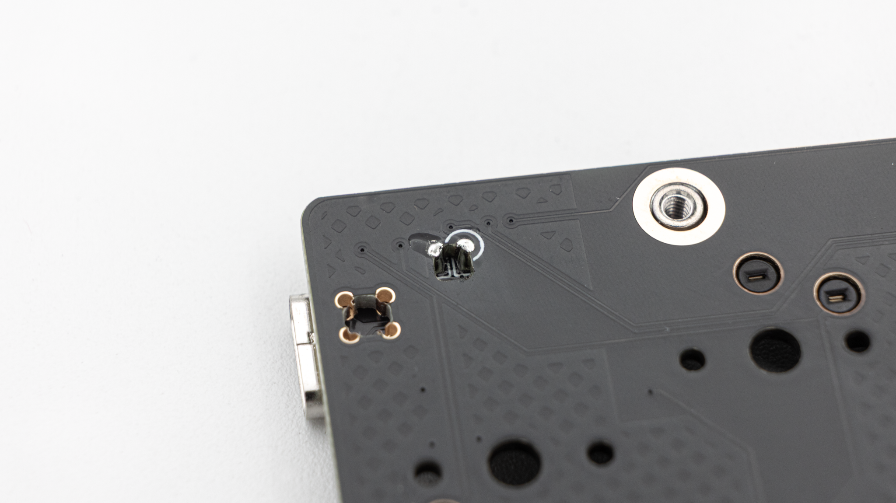

### Battery



For the Forager you can either use the ez mate push connector to easily connect the battery without soldering, or solder the battery to the two pads right next to it.

 You probably need to shorten the cables of the 401230 lithium polymer battery and tin them if you decide to solder it, since the length needs to be pretty short, to fit.
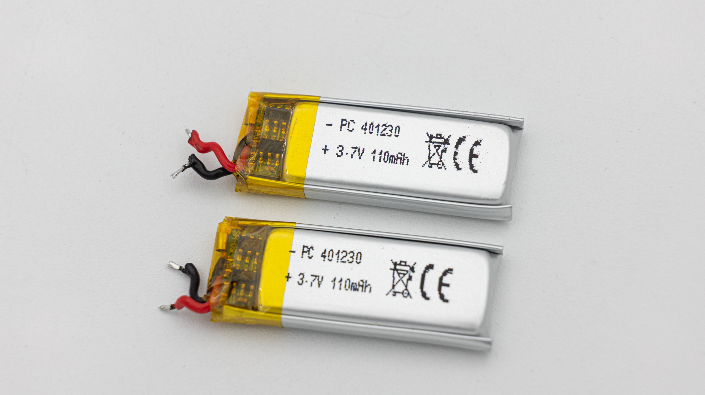

 You can see which cable needs to go onto which pad by the silkscreen. Red is + / black is -.
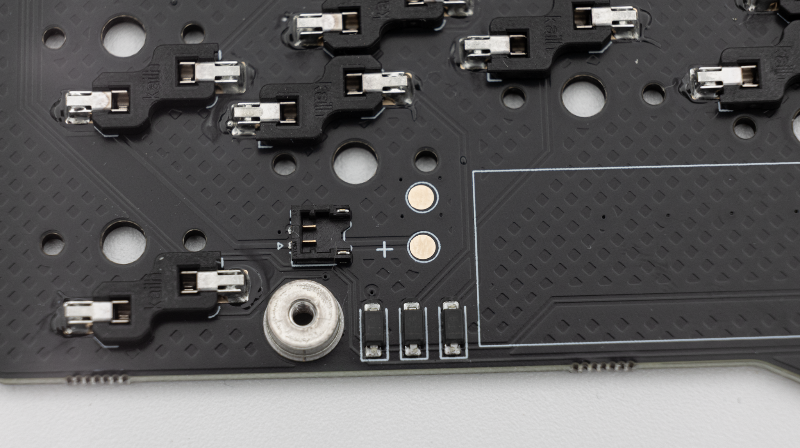

 Attach the wires of the battery to the pads and solder them in.

### Testing

Once you have soldered everything it is good practice to do a matrix test. You can do that [here](https://www.keyboardtester.com/tester.html).
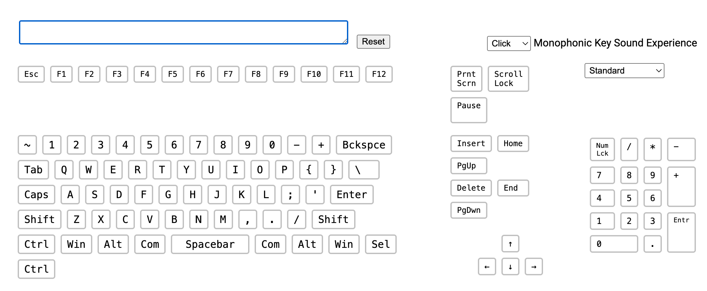

## Case

First place the switch plate on top of the side of the PCB without components. Make sure that the countersunk screw holes are at the top.
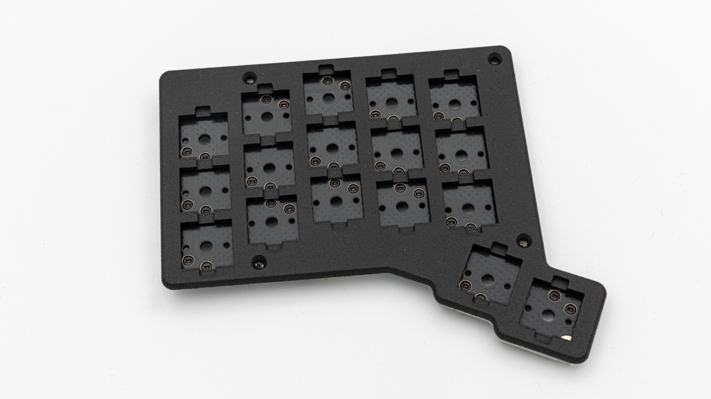

 Next push in the switches and screw in the switch plate.
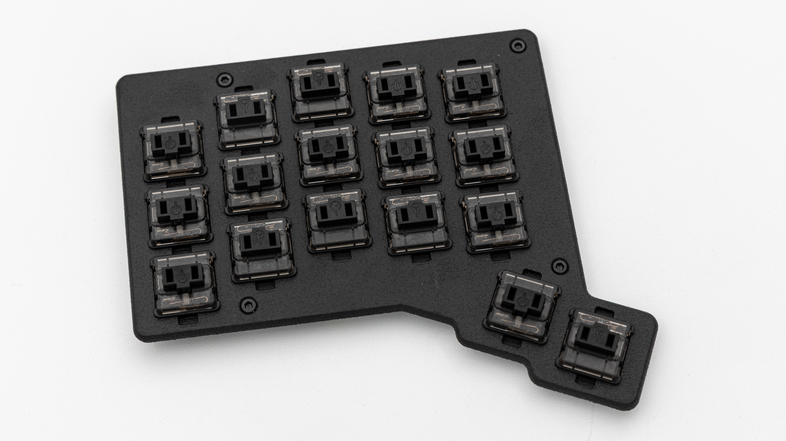

 Now put on the bottom piece of the case and screw it in.
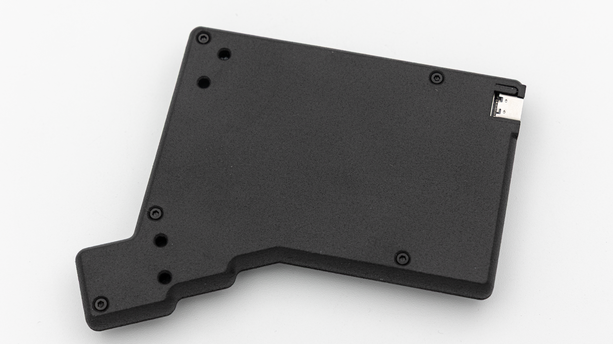

 Put in your rubber feet onto the bottom piece. Make sure to leave space for the tenting feet, if you want to use those.
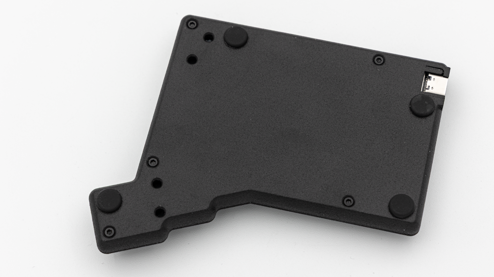

 Push on the keycaps you want to use.
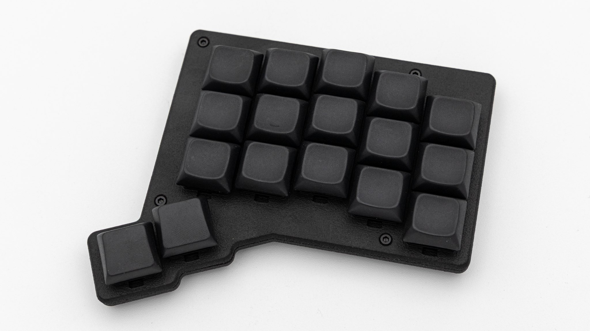

 Attach the 4 tenting feet if you want to use those.
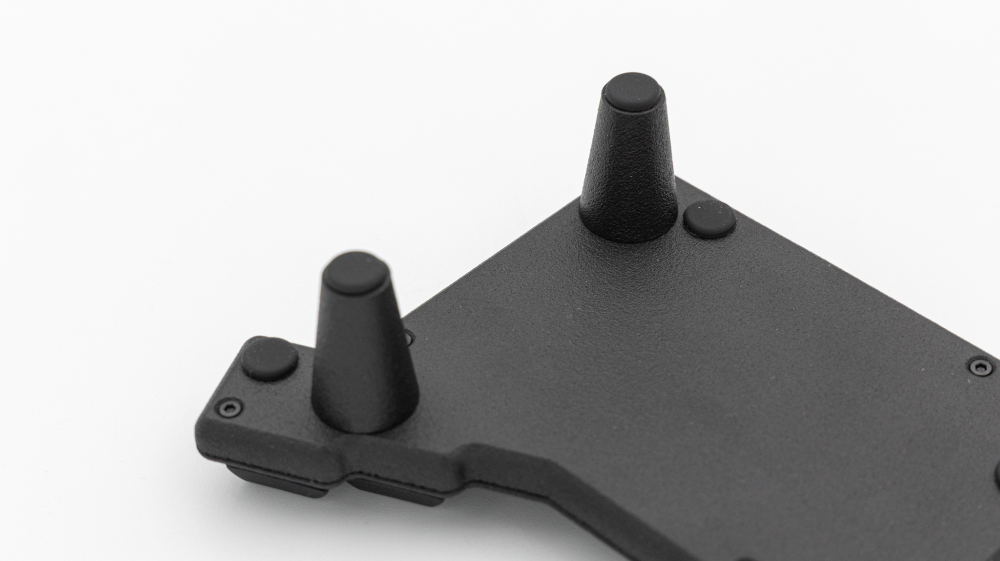

 And you are done with your forager!
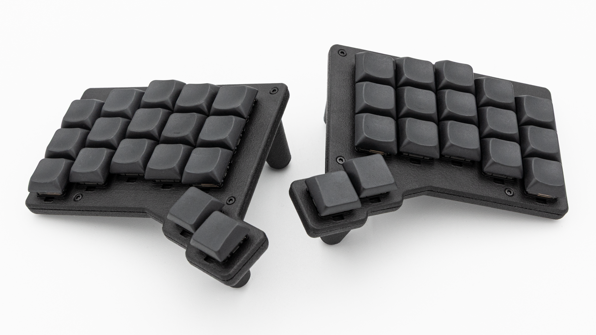
