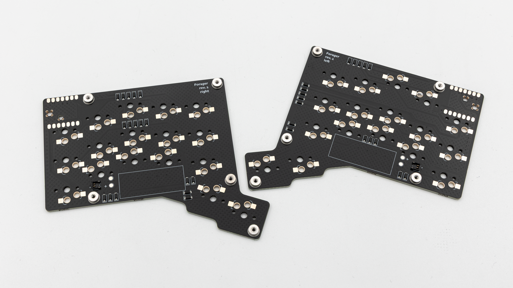
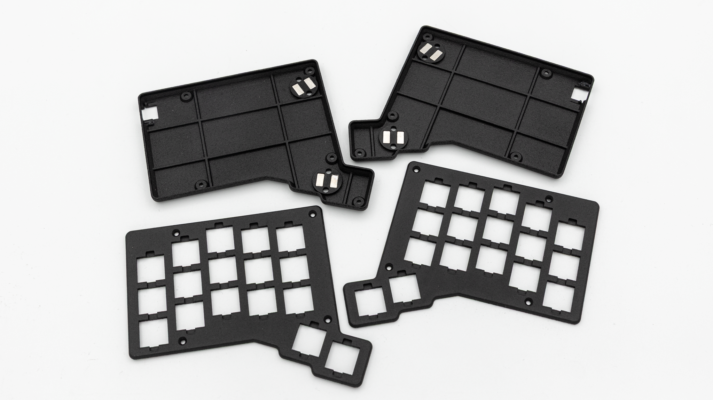
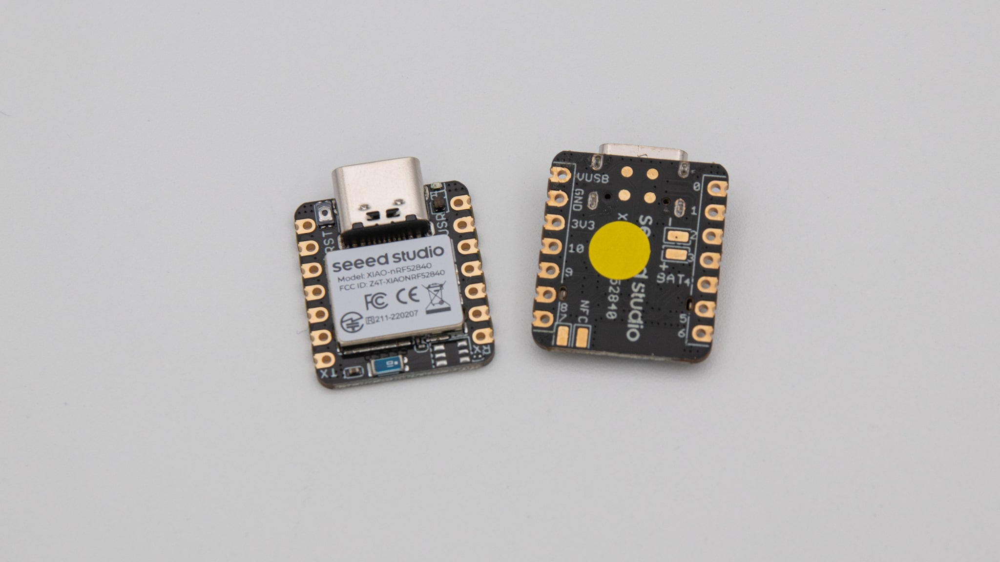
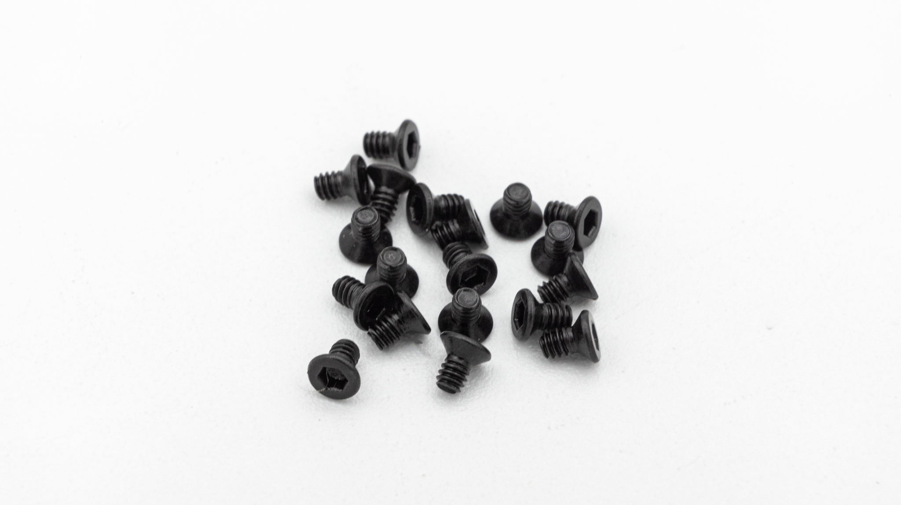
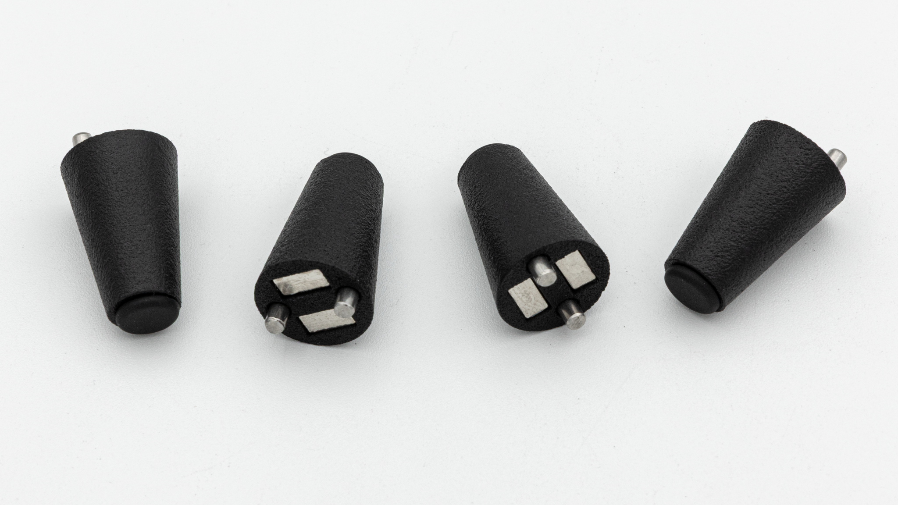

## Kit parts

| Image                      | Description                                                       | Quantity            |
| -------------------------- | ----------------------------------------------------------------- | ------------------- |
|                            |
|            | PCBs (Diodes, threaded inserts and battery connector presoldered) | 1 left 1 right |
|           | 3D-Printed MJF Case (Magnets and light pipe preinstalled)         | 1                   |
|           | Seeed XIAO wireless controller                                    | 2                   |
|  | hotswap sockets                                                   | 34                  |
|       | M2 x 3 mm countersunk screws                                      | 16                  |

## Tenting kit

| Image                     | Description                                                       | Quantity |
| ------------------------- | ----------------------------------------------------------------- | -------- |
|                           |
|  | MJF Leg with magnets, alignment pins and rubber feet preinstalled | 4        |


 If you don't have one already, try [this one](https://www.ebay.de/itm/127224424773).
