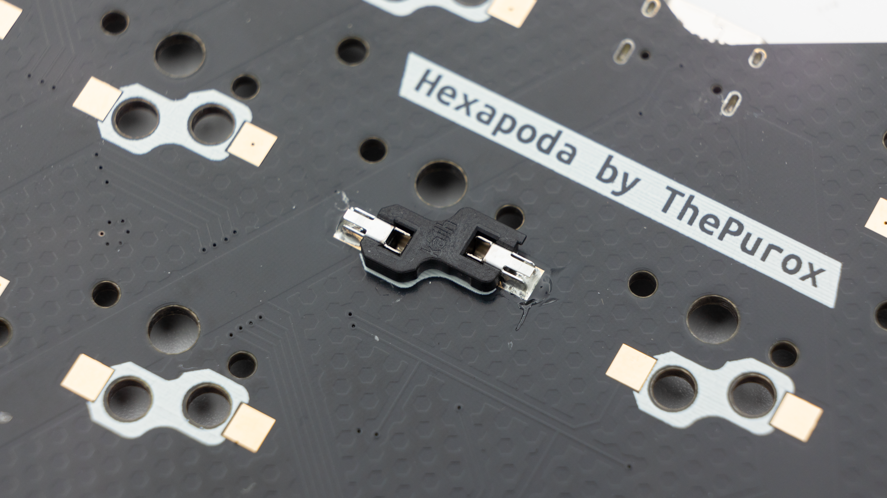
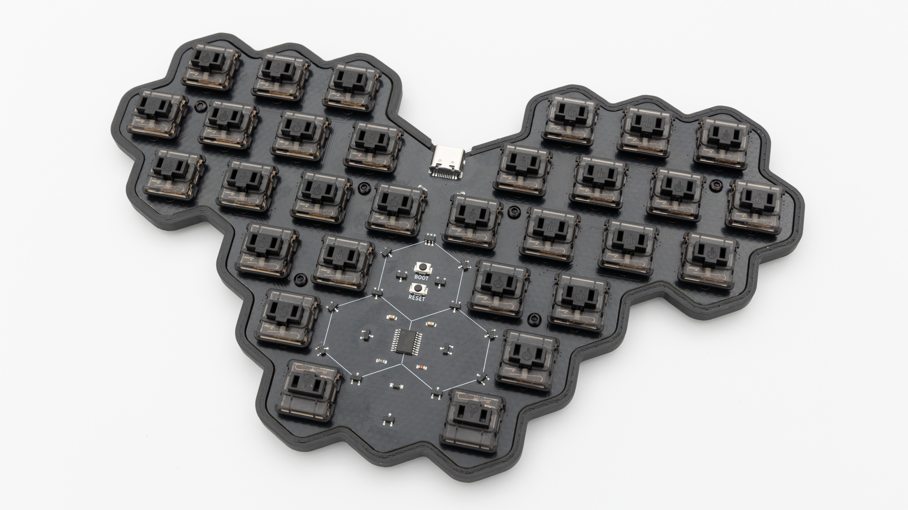

## Soldering

If you do not have experience with soldering, please refer to this [quick start guide]().

### HotSwap Sockets

The only part that you need to solder for the Hexapoda are the HotSwap sockets. You can find instructions for that [here]().

 This is everything you need to solder!

## Software

When you buy the Hexapoda kit through KeebSupply you will receive an almost fully soldered PCB. The PCB features a controller that is running [FAK](https://github.com/semickolon/fak-config). Since the Hexapoda has such a unique layout, we decided to not preflash the controllers with any firmware and layout. You will have to do that yourself. Instructions on that can be found [here]().

 When you have your keyboard flashed, it is good practice to do a matrix test with a [keytester](https://www.keyboardtester.com/tester.html). Use tweezers or other metallic objects for this and short the pads of each key.

If all of the keys are working properly, you can go ahead and continue with the assembly!

## Final Assembly

 If you have decided to get the 3D printed case, place the board into the case from the top and screw in the screws through the holes above the heat set inserts.

Place the rubber feet onto your PCB or if you use a case onto your 3D-Printed case.

 After that push in the switches.

 Then put on your keycaps.

 After that your Hexatana is done!
